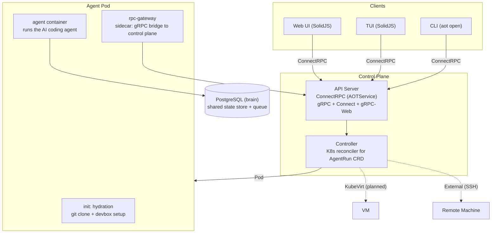
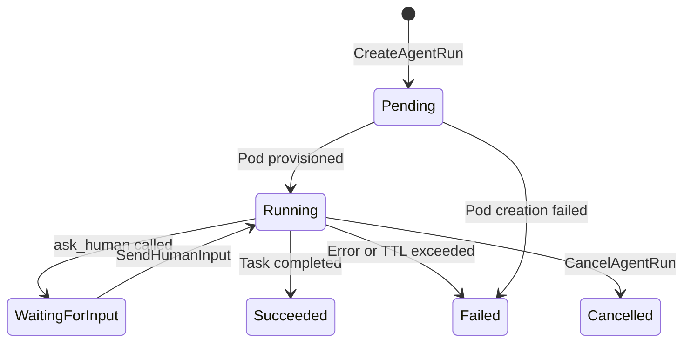

# AOT -- Agent Orchestration Tool

**A Cloud Native OS for AI Engineers.**

AOT runs AI coding agents on Kubernetes. You submit a task (a prompt + a git repo), and AOT provisions an isolated workspace, clones the repo, sets up a Nix/devbox environment, runs the agent, and streams results back to you in real time. Agents can ask humans for input, spawn sub-agents, and emit OpenTelemetry traces -- all managed through a Kubernetes CRD called `AgentRun`.

---

## Architecture



### Data flow

1. Client calls `CreateAgentRun` via gRPC (or applies a CRD with kubectl).
2. The Controller sees the new `AgentRun` and creates a Pod with three containers: hydration init-container, agent, and rpc-gateway sidecar.
3. The hydration init-container clones the repo and runs `devbox install`.
4. The agent container executes the prompt in the workspace.
5. The sidecar streams output and events back to the control plane.
6. Clients watch progress via `WatchAgentRun` (ConnectRPC server-streaming).

---

## Quick Start

### Prerequisites

- [Devbox](https://www.jetify.com/devbox) (manages Go, Node.js, protobuf, kubectl, PostgreSQL)
- Docker (for building container images)
- sudo access (for k0s local cluster)

### Setup

```bash
# Enter the Nix development shell (installs Go, Node 22, protoc, kubectl, etc.)
devbox shell

# Install all Go and Node.js dependencies
task install

# Set up a local k0s Kubernetes cluster
task k0s:setup

# Apply the AgentRun CRD
task k0s:crd

# Build all Go binaries
task build
```

### Run the Web Dashboard

```bash
task dev:web    # starts Vite dev server
```

### Screenshots

**Web Dashboard -- Agent Run List:**


**Web Dashboard -- Agent Run Detail:**


**TUI Dashboard:**

```
═══ AOT Dashboard ═══
  ● fix-login-css [Running] - Fix the login page CSS layout issues
▸ ◎ add-auth-tests [WaitingForInput] - Add unit tests for auth module
  ✓ refactor-db [Succeeded] - Refactor database connection pooling
  ✗ deploy-staging [Failed] - Deploy to staging environment
  ○ update-deps [Pending] - Update all dependencies to latest versions
─── Detail ───
  Agent: add-auth-tests
  Phase: ◎ WaitingForInput
  Backend: Pod
  Prompt: Add unit tests for auth module
q: quit | ↑/↓: navigate | Enter: select
```

### Run Tests

```bash
task test       # all unit tests (Go + Web + Extension + TUI)
task test:go    # Go tests only
task test:e2e   # E2E tests (requires running k0s cluster)
task test:web   # Playwright tests for web dashboard
task test:shared # @aot/shared package tests
```

---

## Key Concepts

### AgentRun

The core CRD. Each `AgentRun` declares:

| Field         | Description                                      |
|---------------|--------------------------------------------------|
| `backend`     | Execution backend: `Pod`, `KubeVirt`, `External` |
| `repoURL`     | Git repository for the agent to work on           |
| `branch`      | Git branch to check out                           |
| `prompt`      | Task description for the agent                    |
| `devboxConfig`| Path to devbox.json for environment setup          |
| `ttlSeconds`  | Maximum lifetime (default 3600)                    |
| `envVars`     | Additional environment variables                   |
| `image`       | Override for the agent container image             |

Lifecycle phases:



### Backends

- **Pod** (implemented) -- runs agent in a K8s pod with init-container, agent, and sidecar.
- **KubeVirt** (planned) -- runs agent in a full VM with configurable CPU/memory/disk.
- **External** (planned) -- runs agent on a remote machine via SSH.

### Multi-Agent (spawn_junior)

A senior agent can call the `spawn_junior` tool to create a child `AgentRun` for a sub-task. The child inherits the parent's backend, repo, branch, and image. Parent-child relationships are tracked via labels (`aot.uncworks.io/parent`, `aot.uncworks.io/role`).

### Human-in-the-Loop (HITL)

Agents can call the `ask_human` tool to pause and request clarification. The `AgentRun` phase transitions to `WaitingForInput`. Clients send responses via the `SendHumanInput` RPC, and the agent resumes.

### Shared Brain

PostgreSQL-backed state store (`internal/brain`) that persists agent state, metadata, and a priority queue for scheduling.

---

## Development Commands

All commands use [Task](https://taskfile.dev/) (see `Taskfile.yml`):

| Command            | Description                                 |
|--------------------|---------------------------------------------|
| `task install`     | Install all Go and Node.js dependencies     |
| `task build`       | Build all Go binaries to `./bin/`           |
| `task build:web`   | Build web dashboard (Vite)                  |
| `task proto:gen`   | Regenerate Go code from `.proto` files      |
| `task test`        | Run all unit tests                          |
| `task test:go`     | Run Go tests (unit + integration)           |
| `task test:e2e`    | Run E2E tests (requires k0s)               |
| `task test:web`    | Playwright tests for web dashboard          |
| `task test:extension` | pi-aot-extension tests                   |
| `task test:tui`    | TUI renderer tests                          |
| `task test:shared` | @aot/shared package tests                  |
| `task lint`        | Run Go vet + TypeScript type checks         |
| `task dev:web`     | Start web dashboard dev server              |
| `task k0s:setup`   | Initialize local k0s cluster (sudo)         |
| `task k0s:teardown`| Tear down local k0s cluster (sudo)          |
| `task k0s:crd`     | Apply AgentRun CRD to cluster               |

---

## Project Structure

```
cmd/
  apiserver/       -- gRPC API server binary
  controller/      -- K8s controller binary
  hydration/       -- init-container binary (git clone + devbox)
  sidecar/         -- RPC Gateway sidecar binary
  aot/             -- CLI (aot open)
api/v1alpha1/      -- AgentRun CRD Go types
internal/
  server/          -- gRPC server + WebSocket hub
  controller/      -- AgentRun reconciler + multi_agent (SpawnJunior)
  brain/           -- PostgreSQL shared state store
  hydration/       -- workspace provisioning logic
  sidecar/         -- RPC Gateway implementation
  cli/             -- aot CLI implementation
proto/
  api.proto        -- client <-> control plane gRPC API
  agent.proto      -- control plane <-> sidecar gRPC API
packages/
  shared/          -- @aot/shared TypeScript package
  pi-aot-extension/ -- agent harness extension (HITL + spawn_junior + OTel)
  tui/             -- SolidJS TUI with ANSI renderer
web/               -- SolidJS Web Dashboard (Vite)
deploy/crds/       -- AgentRun CRD YAML manifest
docker/            -- Dockerfiles (agent-base, hydration, sidecar)
hack/              -- k0s setup/teardown scripts, proto-gen
e2e/               -- system E2E tests
Taskfile.yml       -- 17 task targets
devbox.json        -- Nix development environment
```

---

## gRPC API

The client-facing API (`proto/api.proto`) exposes:

- `CreateAgentRun` -- submit a new agent run
- `GetAgentRun` -- retrieve current state
- `ListAgentRuns` -- list with optional phase filter and pagination
- `WatchAgentRun` -- server-streaming real-time updates
- `CancelAgentRun` -- cancel a running agent
- `SendHumanInput` -- provide HITL input to a paused agent

The sidecar API (`proto/agent.proto`) runs inside each agent pod:

- `StartAgent` -- initialize the agent harness
- `StreamOutput` -- stream stdout/stderr/tool-calls to the control plane
- `SendInput` -- write HITL input to agent stdin
- `GetStatus` -- query agent process state
- `StopAgent` -- gracefully terminate the agent

---

## License

See repository root for license details.
