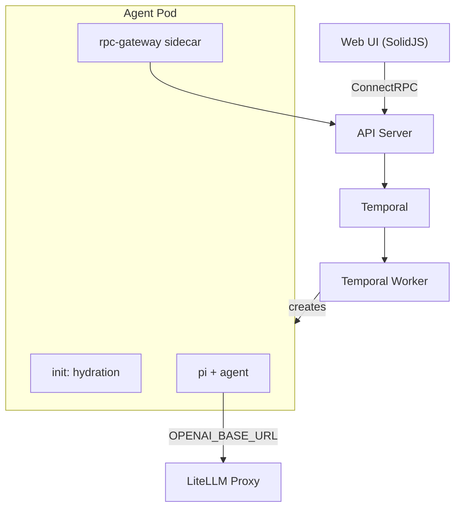

# UNCWORKS

**An agentic development environment.**

UNCWORKS is a Kubernetes-native platform that runs AI coding agents against git repositories. It uses a spec-driven pipeline (Plan, Execute, Verify) with two agent roles: **manage** (plans and verifies) and **implement** (writes code). Determinism is enforced through pi extension policies that constrain agent behavior.

---

## Key Features

- **Spec-driven pipeline** -- Plan, Execute, Verify stages with structured handoffs
- **OpenSpec integration** -- formal change proposals, designs, and task tracking
- **Agent role separation** -- manage agents plan and verify; implement agents write code
- **Determinism extension** -- pi policies constrain tool usage and model access
- **Real-time UI** -- activity feed, OpenTelemetry traces, file browser
- **LiteLLM model routing** -- centralized LLM proxy with per-agent budget and model controls
- **Workspace isolation** -- each agent run gets its own git worktree on a persistent volume

---

## Quick Start

See [docs/getting-started.md](docs/getting-started.md) for full setup instructions.

```bash
devbox shell          # enter Nix dev environment
task install          # install Go + Node.js dependencies
task k0s:setup        # initialize local k0s cluster
task k0s:crd          # apply AgentRun CRD
task build            # build all Go binaries
task dev:web          # start web dashboard
```

---

## Architecture



The control plane (API Server, Controller, Temporal Worker) manages the lifecycle of each `AgentRun` CRD. Agent pods contain three containers: a hydration init-container (git clone + devbox setup), the agent process with pi extension policies, and an rpc-gateway sidecar that bridges the agent back to the control plane.

---

## Development

All commands use [Task](https://taskfile.dev/) (see `Taskfile.yml`):

```bash
task build            # build all Go binaries
task test             # run all tests (Go + web + extension)
task lint             # golangci-lint + TypeScript type checks
task dev:web          # start Vite dev server
task k0s:setup        # initialize local k0s cluster
```

---

## Deployment

```bash
helm install aot oci://ghcr.io/uncworks/charts/aot \
  --namespace aot --create-namespace \
  --set temporal.host=temporal:7233
```

See [`deploy/helm/aot/README.md`](deploy/helm/aot/README.md) for configuration reference.

---

## License

See repository root for license details.
