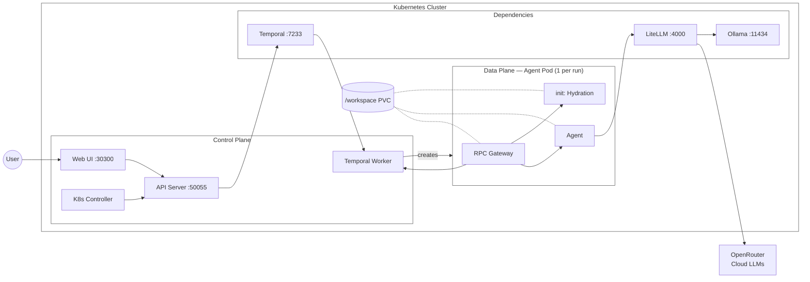
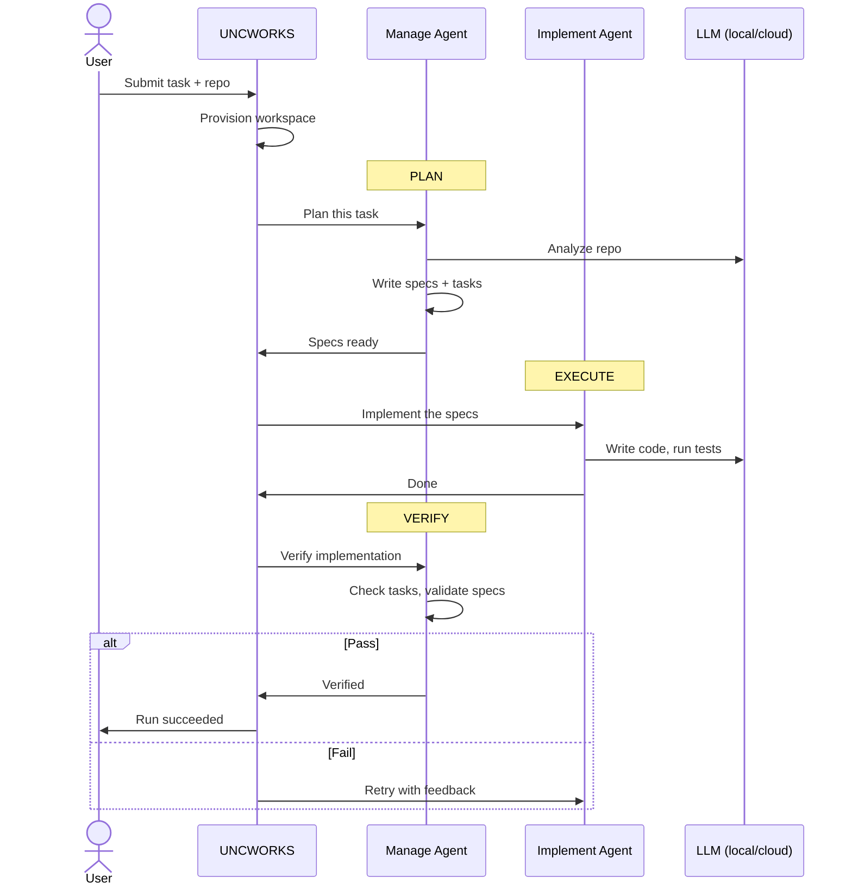

# UNCWORKS

**An agentic development environment.**

UNCWORKS is a Kubernetes-native platform that runs AI coding agents against git repositories. It uses a spec-driven pipeline (Plan, Execute, Verify) with two agent roles: **manage** (plans and verifies) and **implement** (writes code). Determinism is enforced through pi extension policies that constrain agent behavior.

---

## Key Features

- **Spec-driven pipeline** -- Plan, Execute, Verify stages with structured handoffs
- **OpenSpec integration** -- formal change proposals, designs, and task tracking
- **Agent role separation** -- manage agents plan and verify; implement agents write code
- **Determinism extension** -- pi policies constrain tool usage and model access
- **Real-time UI** -- activity feed, OpenTelemetry traces, file browser
- **LiteLLM model routing** -- centralized LLM proxy with per-agent budget and model controls
- **Workspace isolation** -- each agent run gets its own git worktree on a persistent volume

---

## Quick Start

See [docs/getting-started.md](docs/getting-started.md) for full setup instructions.

```bash
# Install the CLI (macOS / Linux)
brew install uncworks/tap/uncworks

# Deploy to your local Kubernetes cluster (Docker Desktop, OrbStack, etc.)
uncworks setup

# Open the web UI
uncworks open

# Or use the terminal UI
uncworks tui
```

**For contributors** (building from source):

```bash
devbox shell          # enter Nix dev environment
task install          # install Go + Node.js dependencies
task build            # build all Go binaries
task dev:web          # start Vite dev server
```

---

## Architecture

Everything runs inside Kubernetes, except cloud LLM providers.



| Section | Component | Description |
|---------|-----------|-------------|
| **Control Plane** | Web UI | React dashboard. Activity feed, file browser, traces, verification panel. Proxied to API via nginx. |
| | API Server | ConnectRPC endpoints: create, get, list, cancel runs. REST endpoints: structured logs, files, traces, thinking. |
| | K8s Controller | Watches `AgentRun` CRDs, triggers Temporal workflows, updates CRD status. |
| | Temporal Worker | Executes pipeline activities: provision keys, create pods, hydrate, plan, execute, verify, cleanup. |
| **Dependencies** | Temporal | Workflow orchestration with retries, compensation, signals (cancel, human input). |
| | LiteLLM | LLM proxy with model routing, budgets, fallback chains. Routes to local Ollama or cloud (OpenRouter). |
| | Ollama | Local model server (qwen3:8b, llama3.1:8b). |
| **Data Plane** | RPC Gateway | Sidecar that fronts the pod. Bridges agent to control plane: StartAgent, GetStatus, ExecCommand, SendInput. Manages agent lifecycle and streams JSONL logs to PVC. |
| | init: Hydration | Bare-clones repos, creates git worktrees at `/workspace/<repo>/`, sets up devbox. |
| | Agent | LLM coding agent with determinism extension. `PI_ROLE=manage` (plan/verify): reads repo, runs openspec CLI, writes specs. `PI_ROLE=implement` (execute): reads specs, writes code, runs tests. |
| | /workspace PVC | Persistent volume mounted into the pod. Contains repo worktrees, OpenSpec artifacts, agent logs, and traces. |

### Sequence: Spec-Driven Run



---

## Development

All commands use [Task](https://taskfile.dev/) (see `Taskfile.yml`):

```bash
task build            # build all Go binaries
task test             # run all tests (Go + web + extension)
task lint             # golangci-lint + TypeScript type checks
task dev:web          # start Vite dev server
task k0s:setup        # initialize local k0s cluster
```

---

## Deployment

```bash
helm install aot oci://ghcr.io/uncworks/charts/aot \
  --namespace aot --create-namespace \
  --set temporal.host=temporal:7233
```

See [`deploy/helm/aot/README.md`](deploy/helm/aot/README.md) for configuration reference.

---

## License

See repository root for license details.
