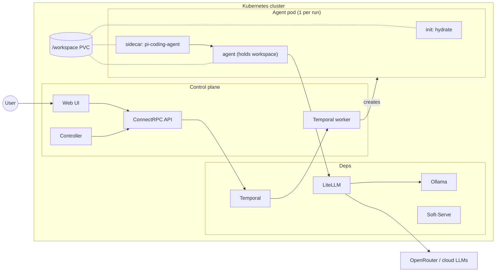
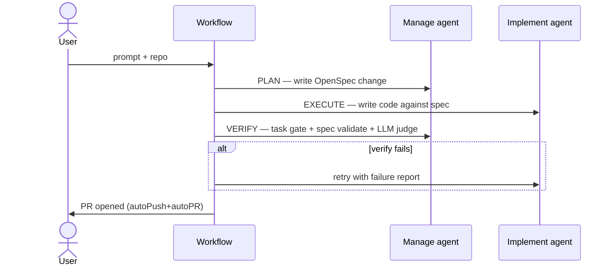

# UNCWORKS

Kubernetes-native runtime for AI coding agents. Submit a prompt + git repo; the platform spins up an isolated workspace pod, runs the agent, and streams results back over ConnectRPC.

The core abstraction is the `AgentRun` CRD. Everything else — scheduling, LLM routing, approval gates, PR creation — is built around it.

## Quick start

```bash
brew install uncworks/tap/uncworks
uncworks setup        # picks a local kube context, installs the Helm chart
uncworks open         # port-forward + open the web UI
```

Cluster requirements: any local Kubernetes (Docker Desktop, OrbStack, k3d, kind). 2 CPU / 2 GiB is the floor; 4/4 is the recommendation.

See [docs/getting-started.md](docs/getting-started.md) for the full path including remote clusters and the TUI.

## How it works



A run is one Temporal workflow driving one pod. The sidecar fronts `pi-coding-agent`; the agent reads and writes inside `/workspace`. Approval gates (LLM judge, human approval) run inside the workflow before a run is marked `Succeeded` — `hybrid` (judge + human) is the default.

## Pipeline

Spec-driven mode runs three stages with feedback:



Single mode skips Plan/Verify — agent runs once against the prompt.

## Components

| Where | What |
|------|------|
| `cmd/{apiserver,controller,worker,uncworks}` | Control plane + CLI |
| `cmd/sidecar`, `cmd/hydration` | Pod-side binaries |
| `internal/server` | ConnectRPC + REST handlers |
| `internal/temporal` | Workflow, activities, approval gates, LLM judge |
| `internal/controller` | `AgentRun` and `Project` reconcilers |
| `extensions/aot-determinism.ts` | pi extension loaded into every agent run |
| `web/` | React dashboard |
| `proto/`, `gen/` | Service definitions and generated code |
| `deploy/helm/aot/` | Helm chart |

## Development

```bash
devbox shell           # tooling
task install
task cluster:setup     # one-time: Colima + k3s + Helm install
task dev:deploy        # rebuild images into k8s.io and rollout
task dev:web           # Vite dev server
task test              # Go + web + extension
task proto:gen         # regenerate after .proto changes
```

`task --list` is the rest of the surface. See [CONTRIBUTING.md](CONTRIBUTING.md).

## Documentation

- [docs/getting-started.md](docs/getting-started.md)
- [docs/architecture/overview.md](docs/architecture/overview.md)
- [docs/guides/spec-driven.md](docs/guides/spec-driven.md) — Plan/Execute/Verify
- [docs/reference/api.md](docs/reference/api.md), [docs/reference/crd.md](docs/reference/crd.md)

## License

Apache License 2.0 — see [LICENSE](LICENSE). Contributions are welcome under the same terms; see [CONTRIBUTING.md](CONTRIBUTING.md).
