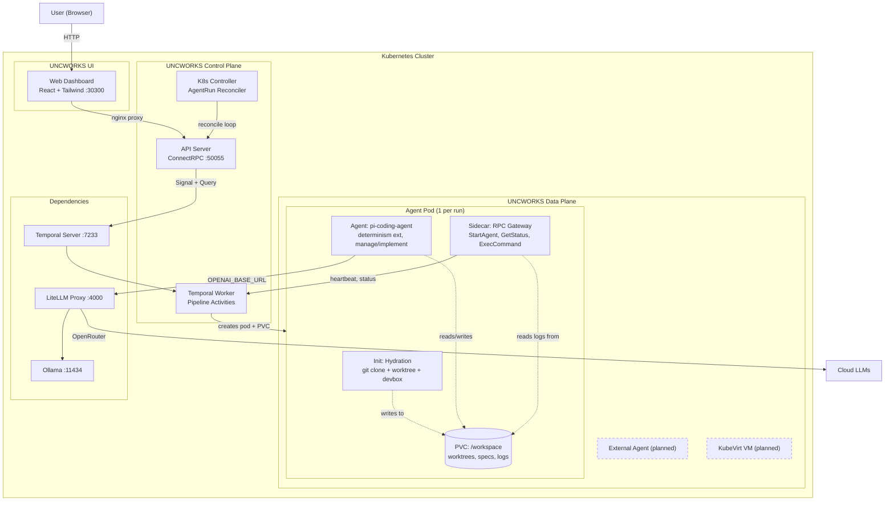
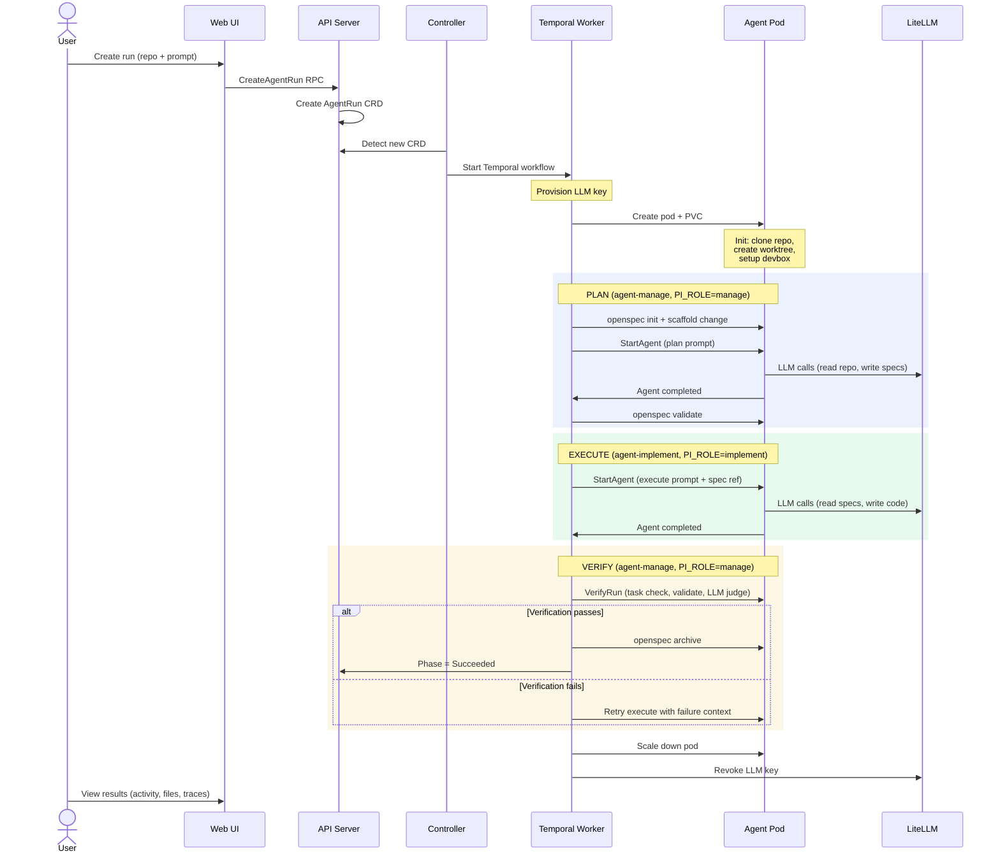

# UNCWORKS

**An agentic development environment.**

UNCWORKS is a Kubernetes-native platform that runs AI coding agents against git repositories. It uses a spec-driven pipeline (Plan, Execute, Verify) with two agent roles: **manage** (plans and verifies) and **implement** (writes code). Determinism is enforced through pi extension policies that constrain agent behavior.

---

## Key Features

- **Spec-driven pipeline** -- Plan, Execute, Verify stages with structured handoffs
- **OpenSpec integration** -- formal change proposals, designs, and task tracking
- **Agent role separation** -- manage agents plan and verify; implement agents write code
- **Determinism extension** -- pi policies constrain tool usage and model access
- **Real-time UI** -- activity feed, OpenTelemetry traces, file browser
- **LiteLLM model routing** -- centralized LLM proxy with per-agent budget and model controls
- **Workspace isolation** -- each agent run gets its own git worktree on a persistent volume

---

## Quick Start

See [docs/getting-started.md](docs/getting-started.md) for full setup instructions.

```bash
devbox shell          # enter Nix dev environment
task install          # install Go + Node.js dependencies
task k0s:setup        # initialize local k0s cluster
task k0s:crd          # apply AgentRun CRD
task build            # build all Go binaries
task dev:web          # start web dashboard
```

---

## Architecture

Everything runs inside Kubernetes.



### Sequence: Spec-Driven Run



### Control Plane

The **API Server** exposes ConnectRPC endpoints for creating, listing, and managing agent runs. It also serves REST endpoints for structured logs, file browsing, traces, and thinking state. The **K8s Controller** watches `AgentRun` CRDs and starts Temporal workflows, mapping CRD spec fields to workflow input. The **Temporal Worker** registers 16 activities covering the full agent lifecycle: key provisioning, pod creation, hydration, plan/execute/verify stages, and cleanup.

### Data Plane

Each run gets its own **pod** with a **PVC** at `/workspace`:

| Container | Role | What it does |
|-----------|------|-------------|
| **Init: Hydration** | Setup | Bare-clones repos, creates git worktrees at `/workspace/<repo>/`, composes devbox environments, writes workspace manifest |
| **pi-coding-agent** | Agent | Runs the LLM agent with the determinism extension loaded. In plan/verify stages: `PI_ROLE=manage` (can run openspec CLI, ask_user; blocked from writing code). In execute stage: `PI_ROLE=implement` (can write/edit code; blocked from modifying specs). |
| **RPC Gateway** | Sidecar | Bridges agent to control plane via ConnectRPC: StartAgent, GetStatus, ExecCommand, SendInput, NotifyEvent. Streams agent JSONL output to the PVC for the UI to read. Detects rate limit errors and auto-retries. |

**External agents** (running outside the cluster) and **KubeVirt VMs** (full VM isolation) are planned backends.

### Dependencies

**Temporal** orchestrates the spec-driven pipeline with retry logic, compensation (cleanup on failure), and signal handling (cancel, human input). **LiteLLM** proxies all LLM calls with model routing (local Ollama or cloud via OpenRouter), per-key budgets, and fallback chains. **Ollama** runs local models for zero-cost development.

---

## Development

All commands use [Task](https://taskfile.dev/) (see `Taskfile.yml`):

```bash
task build            # build all Go binaries
task test             # run all tests (Go + web + extension)
task lint             # golangci-lint + TypeScript type checks
task dev:web          # start Vite dev server
task k0s:setup        # initialize local k0s cluster
```

---

## Deployment

```bash
helm install aot oci://ghcr.io/uncworks/charts/aot \
  --namespace aot --create-namespace \
  --set temporal.host=temporal:7233
```

See [`deploy/helm/aot/README.md`](deploy/helm/aot/README.md) for configuration reference.

---

## License

See repository root for license details.
