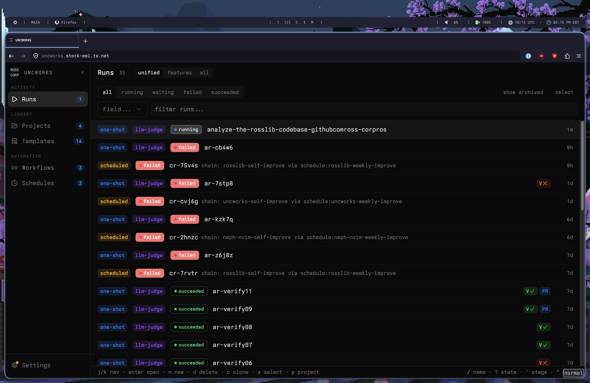
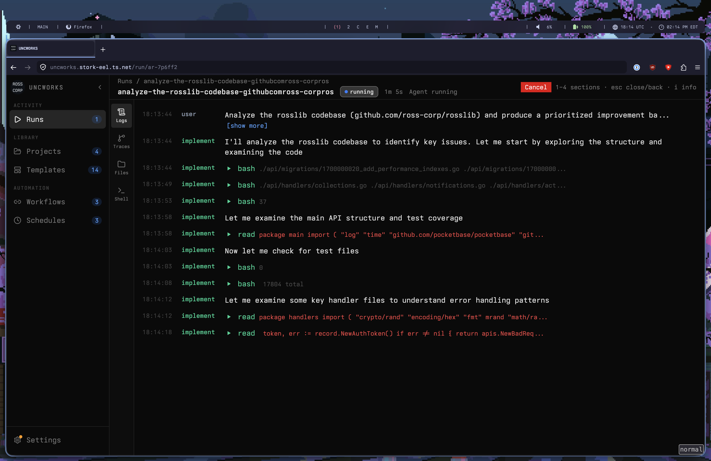
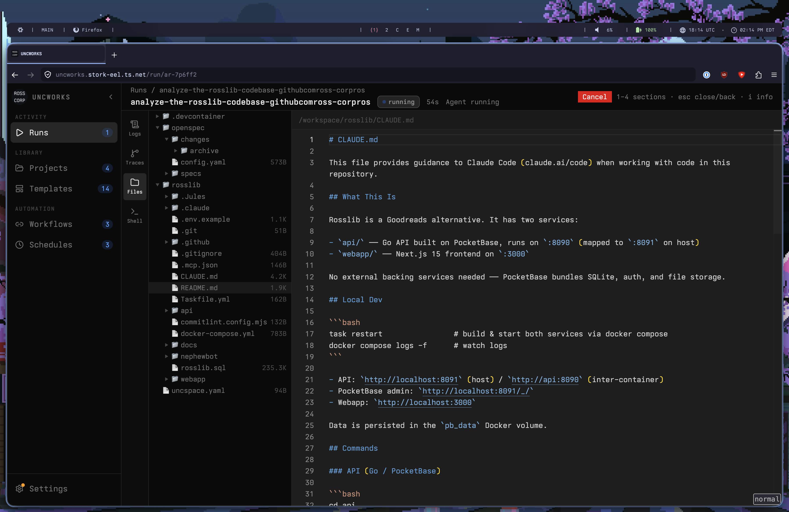
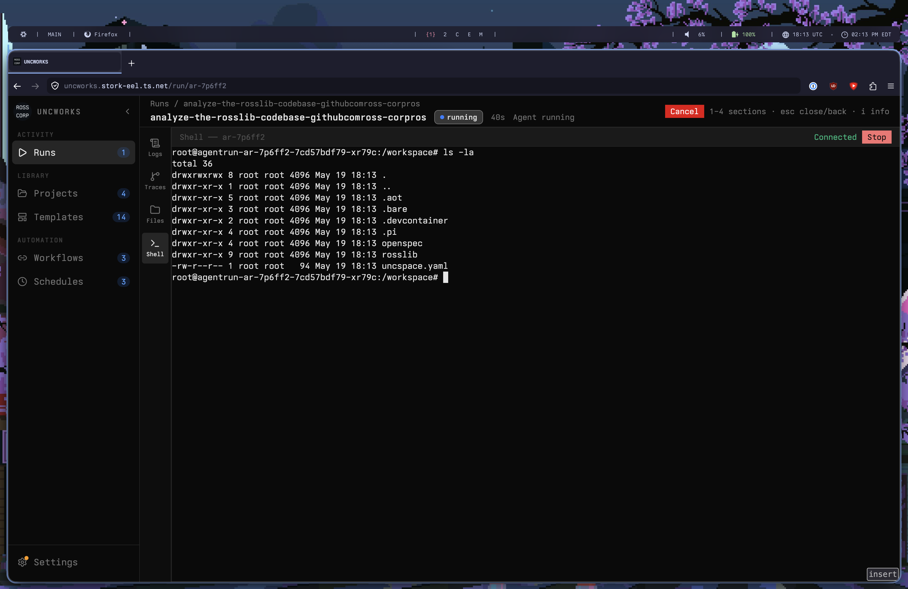
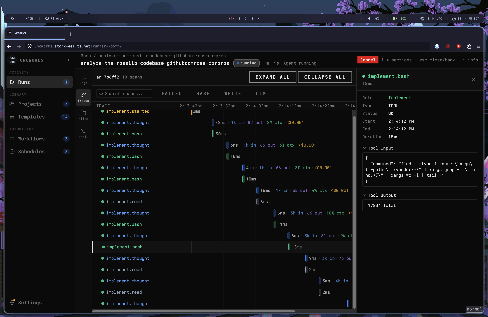
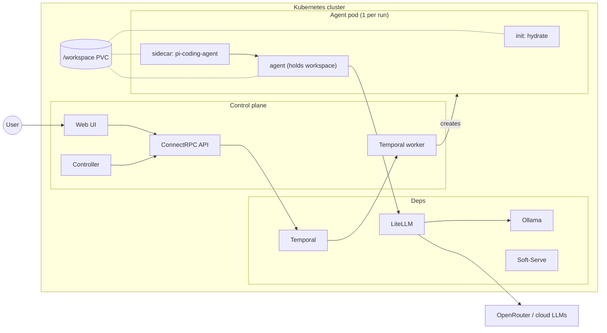
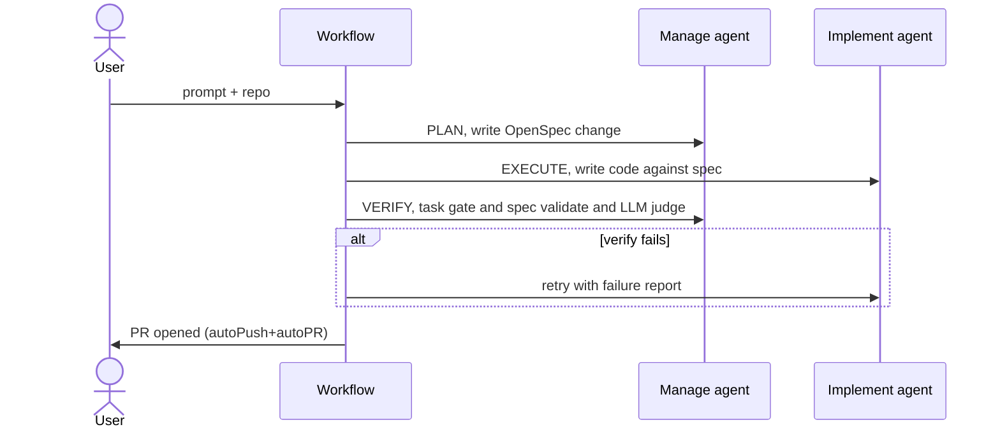

# UNCWORKS

Kubernetes-native runtime for AI coding agents. You submit a prompt and a git
repository. The platform starts an isolated workspace pod, runs the agent in it,
and streams the result back over ConnectRPC.

This is not production ready. Run it against repositories you can afford to lose.

The core abstraction is the `AgentRun` custom resource. Scheduling, LLM routing,
approval gates, and pull-request creation are all built around it.

In scope: running one agent against one workspace, on a cluster you control.

Out of scope: hosting your models, managing your cluster, and acting as a general
CI system.

## Quick start

Download the `uncworks` CLI from
[GitHub Releases](https://github.com/ross-corp/uncworks/releases), then run:

```bash
uncworks setup        # select a local kube context, install the Helm chart
uncworks open         # port-forward and open the web UI
```

The CLI works against any local Kubernetes distribution: Docker Desktop,
OrbStack, k3d, or kind. Allocate 2 CPU and 2 GiB as the minimum. Allocate 4 CPU
and 4 GiB for a usable experience.

[docs/getting-started.md](docs/getting-started.md) covers remote clusters and the
TUI.

## Screenshots

The runs list shows one row per `AgentRun`. Filter it by stage, mode, and
approval gate.



The logs tab streams the agent's actions: prompts, tool calls, file reads, and
bash output.



The files tab shows the workspace tree inside the agent pod, scoped to
`/workspace`.



The shell tab attaches to the running pod for direct inspection.



The traces tab shows a span timeline for the workflow, the agent's reasoning, and
each tool call.



## How it works


```mermaid
graph LR
    User(("User"))
    Cloud["OpenRouter / cloud LLMs"]

    subgraph K8s["Kubernetes cluster"]
        direction TB
        subgraph CP["Control plane"]
            Web["Web UI"]
            API["ConnectRPC API"]
            Ctrl["Controller"]
            TW["Temporal worker"]
        end
        subgraph Deps["Deps"]
            Temporal["Temporal"]
            LiteLLM["LiteLLM"]
            Ollama["Ollama"]
            Soft["Soft-Serve"]
        end
        subgraph DP["Agent pod (1 per run)"]
            Init["init: hydrate"]
            Agent["agent (holds workspace)"]
            Sidecar["sidecar: pi-coding-agent"]
        end
        PVC[("/workspace PVC")]
    end

    User --> Web --> API --> Temporal --> TW
    Ctrl --> API
    TW -->|creates| DP
    Sidecar --> Agent
    Agent --> LiteLLM --> Ollama
    LiteLLM --> Cloud
    PVC -.- Init
    PVC -.- Agent
    PVC -.- Sidecar
```

One run is one Temporal workflow driving one pod. The sidecar fronts
`pi-coding-agent`. The agent reads and writes inside `/workspace`. Approval gates
run inside the workflow before a run reaches `Succeeded`. The default gate is
`hybrid`, which combines an LLM judge with human approval.

## Pipeline

Spec-driven mode runs three stages and retries on failure.


```mermaid
sequenceDiagram
    actor U as User
    participant W as Workflow
    participant M as Manage agent
    participant I as Implement agent
    U->>W: prompt + repo
    W->>M: PLAN, write OpenSpec change
    W->>I: EXECUTE, write code against spec
    W->>M: VERIFY, task gate and spec validate and LLM judge
    alt verify fails
        W->>I: retry with failure report
    end
    W->>U: PR opened (autoPush+autoPR)
```

Single mode skips Plan and Verify. The agent runs once against the prompt.

## Components

| Where | What |
|------|------|
| `cmd/{apiserver,controller,temporal-worker,uncworks}` | Control plane and CLI |
| `cmd/sidecar`, `cmd/hydration` | Pod-side binaries |
| `internal/server` | ConnectRPC and REST handlers |
| `internal/temporal` | Workflow, activities, approval gates, LLM judge |
| `internal/controller` | `AgentRun` and `Project` reconcilers |
| `extensions/aot-determinism.ts` | pi extension loaded into every agent run |
| `web/` | React dashboard |
| `proto/`, `gen/` | Service definitions and generated code |
| `deploy/helm/aot/` | Helm chart |

## Development

```bash
devbox shell           # enter the toolchain
task install
task cluster:setup     # one time: Colima, k3s, and the Helm install
task dev:deploy        # rebuild images into k8s.io and roll out
task dev:web           # Vite dev server
task test              # Go, web, and extension tests
task proto:gen         # regenerate after a .proto change
```

Run `task --list` for the rest. See [CONTRIBUTING.md](CONTRIBUTING.md).

## Documentation

- [docs/getting-started.md](docs/getting-started.md)
- [docs/architecture/overview.md](docs/architecture/overview.md)
- [docs/guides/spec-driven.md](docs/guides/spec-driven.md), which covers Plan,
  Execute, and Verify
- [docs/reference/api.md](docs/reference/api.md) and
  [docs/reference/crd.md](docs/reference/crd.md)

## License

Apache License 2.0. See [LICENSE](LICENSE). Contributions are welcome under the
same terms. See [CONTRIBUTING.md](CONTRIBUTING.md).
