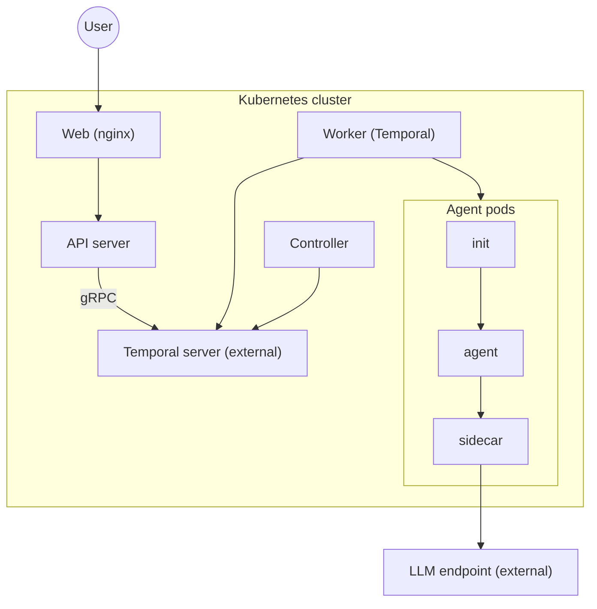

# UNCWORKS Helm Chart

Autonomous Orchestration of Tasks on Kubernetes.

## Prerequisites

- Kubernetes 1.27+
- Helm 3.12+
- [Temporal](https://temporal.io/) server accessible from the cluster
- An LLM endpoint (Ollama, LiteLLM, or OpenAI-compatible API)

## Quick Start

```bash
helm install aot oci://ghcr.io/uncworks/charts/aot \
  --namespace aot --create-namespace \
  --set temporal.host=temporal:7233
```

Or from source:

```bash
helm install aot deploy/helm/aot \
  --namespace aot --create-namespace \
  --set temporal.host=temporal:7233
```

## Architecture



The chart does not manage these external dependencies:

- Temporal Server, for workflow orchestration
- An LLM endpoint, such as Ollama, LiteLLM, or OpenAI

### Components

| Component | Description |
|-----------|-------------|
| Controller | Watches the `AgentRun` resources and reconciles their state with the Temporal workflows |
| Worker | Runs the agent workflows and spawns the agent pods |
| API Server | Serves the ConnectRPC API for creating and managing runs |
| Web Dashboard | React UI that nginx proxies to the API server |

## Configuration

| Parameter | Description | Default |
|-----------|-------------|---------|
| `temporal.host` | Temporal Frontend gRPC address **(required)** | `""` |
| `temporal.namespace` | Temporal namespace | `default` |
| `llm.baseUrl` | LLM endpoint base URL | `""` |
| `llm.apiKey` | LLM endpoint API key | `""` |
| `images.controlplane.repository` | Controlplane image | `ghcr.io/uncworks/aot-controlplane` |
| `images.controlplane.tag` | Controlplane image tag | `appVersion` |
| `images.init.repository` | Init container image | `ghcr.io/uncworks/aot-init` |
| `images.sidecar.repository` | Sidecar image | `ghcr.io/uncworks/aot-sidecar` |
| `images.agent.repository` | Agent image | `ghcr.io/uncworks/aot-agent` |
| `images.web.repository` | Web dashboard image | `ghcr.io/uncworks/aot-web` |
| `controller.replicas` | Controller replicas | `1` |
| `controller.metricsPort` | Prometheus metrics port | `8095` |
| `worker.replicas` | Worker replicas | `1` |
| `apiserver.replicas` | API server replicas | `1` |
| `apiserver.port` | API server listen port | `50055` |
| `apiserver.service.type` | API server Service type | `ClusterIP` |
| `web.enabled` | Enable web dashboard | `true` |
| `web.replicas` | Web dashboard replicas | `1` |
| `web.port` | Web dashboard port | `3000` |
| `web.service.type` | Web Service type | `ClusterIP` |
| `web.service.nodePort` | NodePort (when type is NodePort) | `""` |

## Upgrading

### CRD Updates

Helm does not upgrade CRDs after initial install. If a new version includes CRD changes, apply them manually before upgrading:

```bash
kubectl apply -f https://raw.githubusercontent.com/ross-corp/uncworks/main/deploy/crds/agentrun-crd.yaml
helm upgrade aot oci://ghcr.io/uncworks/charts/aot --namespace aot
```

### Version Compatibility

The chart's `appVersion` tracks the UNCWORKS release version. All container images (controlplane, init, sidecar, agent, web) are tagged with the same version by default.
