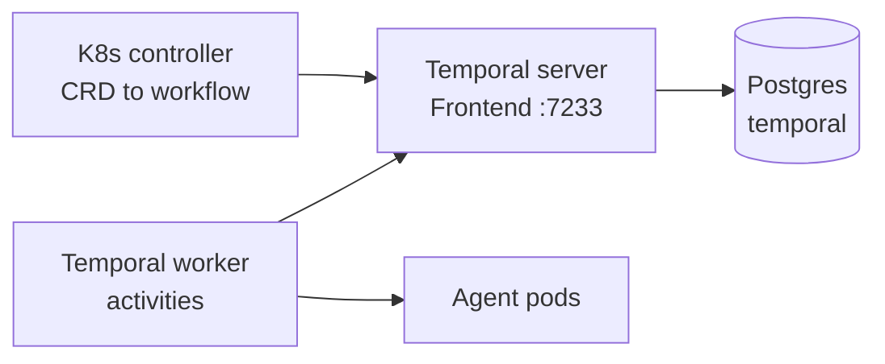

# Temporal Deployment

UNCWORKS runs its durable workflows on [Temporal](https://temporal.io/).
Temporal is an external dependency. The UNCWORKS Helm chart does not bundle it.

## Local Development

Use `temporal-cli` (included in devbox):

```bash
task temporal:dev
```

This starts a single-process Temporal server backed by SQLite with zero external dependencies. The Temporal UI is available at `http://localhost:8233`.

## k0s / Kubernetes Deployment

Deploy Temporal using the official Helm chart:

```bash
helm repo add temporal https://charts.temporal.io
helm repo update

helm install temporal temporal/temporal \
  --namespace temporal \
  --create-namespace \
  --set server.config.persistence.default.driver=sql \
  --set server.config.persistence.default.sql.driver=postgres \
  --set server.config.persistence.default.sql.host=postgres.default.svc.cluster.local \
  --set server.config.persistence.default.sql.port=5432 \
  --set server.config.persistence.default.sql.database=temporal \
  --set server.config.persistence.default.sql.user=temporal \
  --set server.config.persistence.default.sql.password=temporal \
  --set server.config.persistence.visibility.driver=sql \
  --set server.config.persistence.visibility.sql.driver=postgres \
  --set server.config.persistence.visibility.sql.host=postgres.default.svc.cluster.local \
  --set server.config.persistence.visibility.sql.port=5432 \
  --set server.config.persistence.visibility.sql.database=temporal_visibility \
  --set server.config.persistence.visibility.sql.user=temporal \
  --set server.config.persistence.visibility.sql.password=temporal \
  --set server.config.persistence.numHistoryShards=512
```

### Database Setup

Temporal requires two PostgreSQL databases. These can share the same PostgreSQL instance as UNCWORKS's brain store:

```sql
CREATE DATABASE temporal;
CREATE DATABASE temporal_visibility;
CREATE USER temporal WITH PASSWORD 'temporal';
GRANT ALL PRIVILEGES ON DATABASE temporal TO temporal;
GRANT ALL PRIVILEGES ON DATABASE temporal_visibility TO temporal;
```

### Shard Count

The `numHistoryShards` setting determines the number of history shards. This value **cannot be changed** after deployment.

| Environment | Recommended Shards |
|---|---|
| Development | 4 (default for dev server) |
| Small production | 512 |
| Large production | 2048+ |

## Environment Variables

| Variable | Default | Description |
|---|---|---|
| `TEMPORAL_HOST` | `localhost:7233` | Temporal Frontend service address |
| `TEMPORAL_NAMESPACE` | `default` | Temporal namespace |
| `TEMPORAL_TASK_QUEUE` | `aot-agent-runs` | Task queue name |

Both `cmd/controller` and `cmd/temporal-worker` read these variables.

## Architecture



The controller watches the `AgentRun` resources, and starts or cancels the
matching Temporal workflow. The worker runs the workflow logic and the activity
code, which creates pods and calls the sidecar. Temporal owns all execution
state, and the resource status is synced from the workflow.
