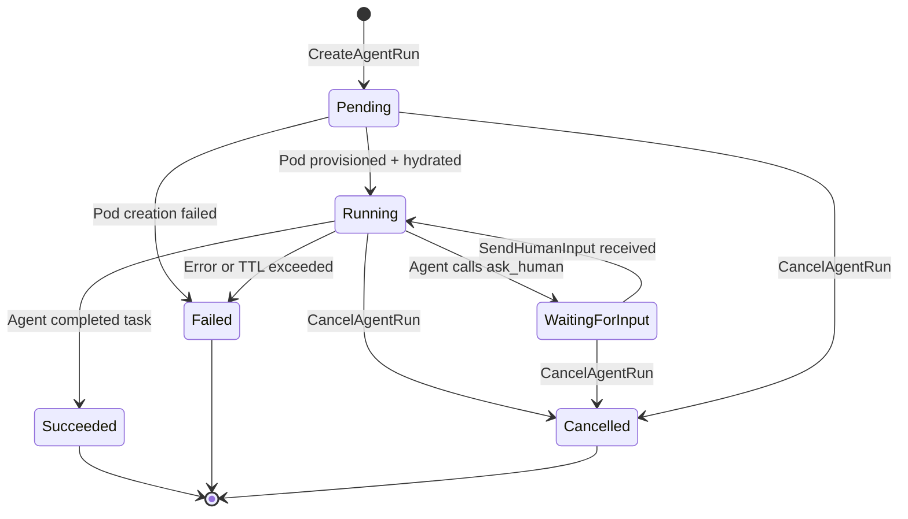
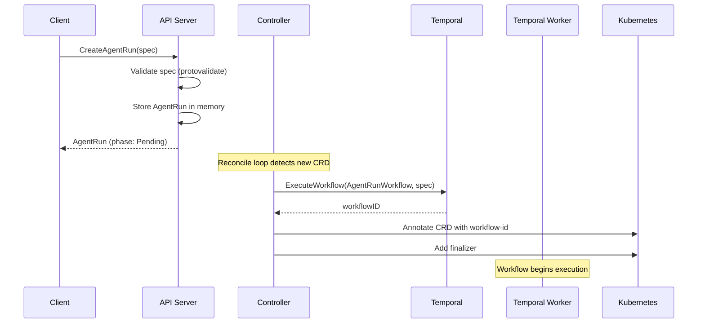
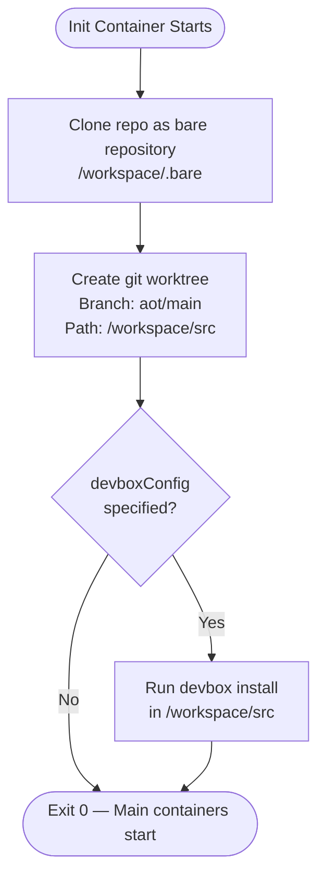
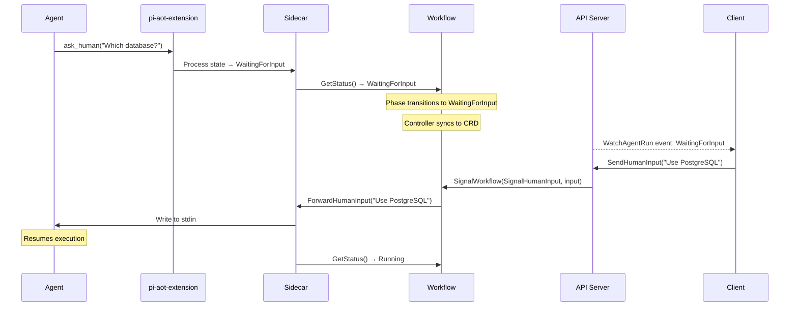
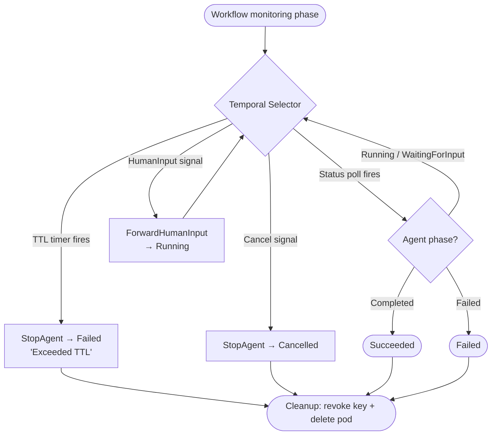
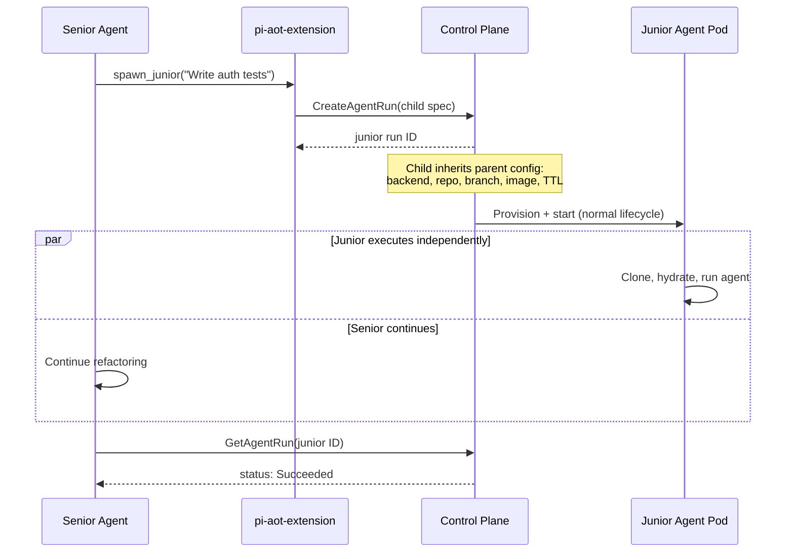
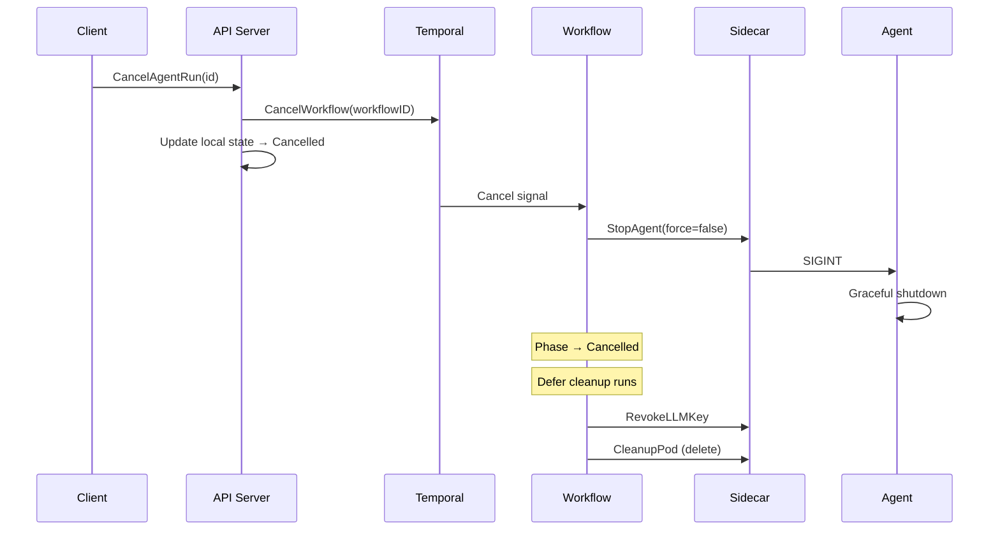
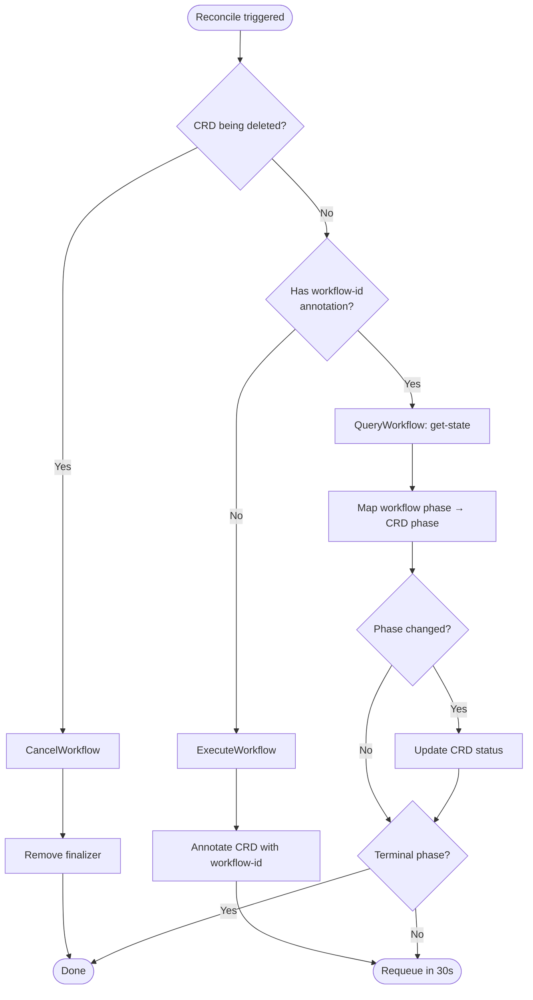

# Agent Run Lifecycle

This document covers the complete lifecycle of an agent run — from creation through execution to cleanup — including phase transitions, HITL interactions, multi-agent workflows, and failure modes.

## Phase State Machine

| Phase | Meaning | Terminal |
|-------|---------|---------|
| **Pending** | Run created, pod not yet provisioned or still hydrating | No |
| **Running** | Agent is actively executing | No |
| **WaitingForInput** | Agent paused, awaiting human response via HITL | No |
| **Succeeded** | Agent completed the task | Yes |
| **Failed** | Agent errored, init failed, or TTL expired | Yes |
| **Cancelled** | Cancelled by user | Yes |

## Creation Flow

## Workflow Execution

The Temporal workflow (`AgentRunWorkflow`) orchestrates the full lifecycle through a sequence of activities:

```mermaid
sequenceDiagram
    participant WF as Workflow
    participant LL as LiteLLM
    participant K8s as Kubernetes
    participant SC as Sidecar

    rect rgb(40, 40, 50)
        Note over WF: Step 1: Provision LLM Access
        WF->>LL: ProvisionLLMKey(tier, budget)
        LL-->>WF: virtualKey
    end

    rect rgb(40, 40, 50)
        Note over WF: Step 2: Create Pod
        WF->>K8s: CreateAgentPod(spec, key)
        K8s-->>WF: podName
    end

    rect rgb(40, 40, 50)
        Note over WF: Step 3: Wait for Hydration
        loop Poll init container (timeout: 10m)
            WF->>K8s: Get pod status
            K8s-->>WF: init container state
        end
    end

    rect rgb(40, 40, 50)
        Note over WF: Step 4: Start Agent
        WF->>SC: StartAgent(prompt)
        SC-->>WF: OK
    end

    rect rgb(40, 40, 50)
        Note over WF: Step 5: Monitor + Handle Signals
        loop Poll every 5s until terminal
            WF->>SC: GetStatus()
            SC-->>WF: phase, message
        end
    end

    rect rgb(50, 30, 30)
        Note over WF: Cleanup (always runs via defer)
        WF->>LL: RevokeLLMKey
        WF->>K8s: CleanupPod (delete)
    end
```

### Activity Timeouts

| Activity | Timeout | Retries |
|----------|---------|---------|
| ProvisionLLMKey | 5 min | 3 (exponential backoff, max 30s) |
| CreateAgentPod | 5 min | 3 |
| WaitForHydration | 10 min | 3 |
| StartAgent | 5 min | 3 |
| GetAgentStatus | 5 min | 3 |
| CleanupPod | 30 sec | 3 |
| RevokeLLMKey | 30 sec | 3 |

## Hydration

The init container provisions the workspace before the agent starts:

The bare repo pattern allows multiple agents to work on the same repository concurrently with isolated worktrees.

## Human-in-the-Loop (HITL)

When an agent needs clarification, it calls `ask_human` which triggers a signal-based pause/resume cycle:

HITL is delivered via Temporal signals, which means:
- No polling or direct routing required
- Signals are durable — they survive worker restarts
- The workflow blocks on a selector until the signal arrives or TTL expires

## TTL Enforcement

Each agent run has a TTL (default: 3600 seconds). The workflow uses a Temporal timer that races against the status polling loop:

## Multi-Agent Workflows

A senior agent can spawn junior agents via the `spawn_junior` tool exposed by the pi-aot-extension:

Child runs are labeled for tracking:
- `aot.uncworks.io/parent: <parent-name>`
- `aot.uncworks.io/role: junior`
- `aot.uncworks.io/managed: true`

## Cancellation

Cancellation is cooperative — the workflow sends SIGINT first, allowing the agent to exit gracefully:

## Failure Modes

| Failure | Detection | Recovery |
|---------|-----------|----------|
| Pod creation fails | `CreateAgentPod` activity errors | Retried 3x with backoff. Workflow transitions to Failed. |
| Init container fails | `WaitForHydration` sees non-zero exit | Workflow transitions to Failed. Pod cleaned up. |
| Agent process crashes | `GetAgentStatus` returns Failed | Workflow transitions to Failed. Pod cleaned up. |
| TTL expires | Temporal timer fires | `StopAgent` called, workflow transitions to Failed. |
| Sidecar unreachable | Activity timeout (5 min) | Retried 3x. On exhaustion, workflow fails. |
| Worker restarts | Temporal durable execution | Workflow resumes from last checkpoint. No state lost. |
| Controller restarts | Kubernetes reconcile loop | Re-syncs all non-terminal CRDs on next reconcile. |
| LiteLLM key provision fails | Activity error | Retried 3x. On exhaustion, workflow fails before pod creation. |

## Controller Reconcile Loop

The controller bridges Kubernetes CRDs and Temporal workflows on a 30-second reconcile interval:

### Phase Mapping

| Workflow Phase | CRD Phase |
|---------------|-----------|
| Pending, Creating, Hydrating | Pending |
| Running | Running |
| WaitingForInput | WaitingForInput |
| Succeeded | Succeeded |
| Failed | Failed |
| Cancelling, Cancelled | Cancelled |
