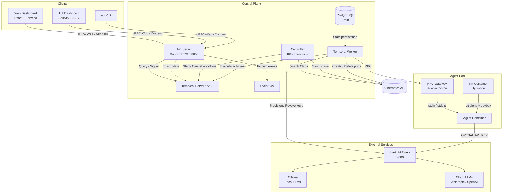
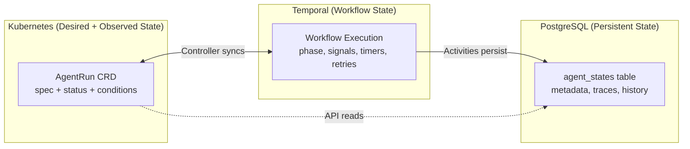
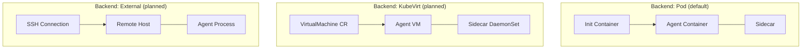
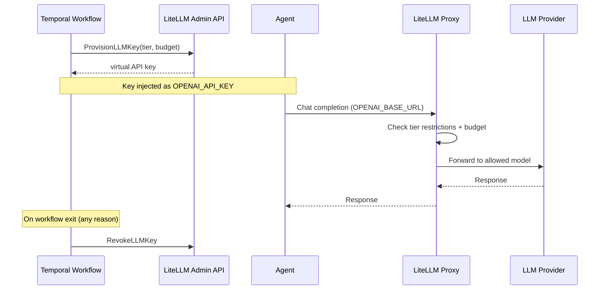
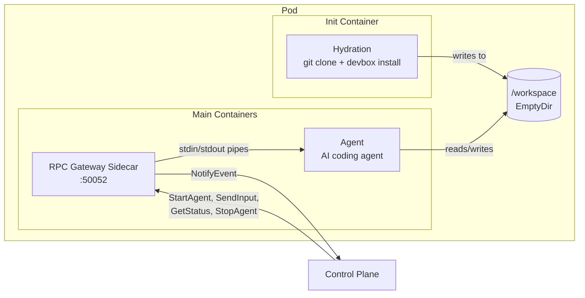
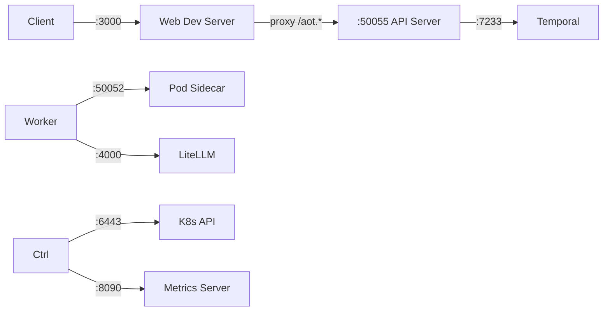

# AOT Architecture

AOT (Agent Orchestration Tool) is a Kubernetes-native platform for orchestrating AI coding agents. It provisions isolated workspaces, runs agents against git repositories, streams results in real-time, and supports human-in-the-loop interactions.

## System Overview

## Component Responsibilities

### API Server (`cmd/apiserver`)

The client-facing gRPC server. Serves ConnectRPC which supports gRPC, gRPC-Web, and Connect protocols over HTTP/2 (h2c). Validates requests with protovalidate. Enriches responses with real-time Temporal workflow state when available. Streams events to clients via `WatchAgentRun` backed by the EventBus.

Listens on `:50055` by default (`LISTEN_ADDR`).

### Controller (`cmd/controller`)

A Kubernetes controller-runtime reconciler that watches `AgentRun` CRDs. It acts as a thin bridge between Kubernetes and Temporal:

- **New CRD** — starts a Temporal workflow, annotates the CRD with `aot.uncworks.io/workflow-id`
- **Existing CRD** — queries workflow state via `QueryGetState`, syncs phase to CRD status
- **Deleted CRD** — cancels the Temporal workflow, removes finalizer

Reconciles every 30 seconds for non-terminal states.

### Temporal Worker (`cmd/temporal-worker`)

Executes the `AgentRunWorkflow` and its activities. This is where the actual orchestration logic lives — pod creation, hydration polling, agent start/stop, HITL signal handling, TTL enforcement, and cleanup. Connects to both Kubernetes (for pod operations) and LiteLLM (for key provisioning).

Task queue: `aot-agent-runs`.

### Sidecar / RPC Gateway (`cmd/sidecar`)

Runs inside each agent pod as a sidecar container. Exposes a ConnectRPC server on port 50052. Bridges control plane RPCs to the agent process — starts the agent, streams stdout/stderr, forwards stdin for HITL, reports status, and handles graceful shutdown.

### Hydration Init Container (`cmd/hydration`)

Runs as a Kubernetes init container before the agent starts. Clones the git repository as a bare repo, creates a worktree at `/workspace/src` on branch `aot/{branch}`, and optionally runs `devbox install` for environment setup.

### Brain / PostgreSQL (`internal/brain`)

Persistent state store using pgx connection pooling. Stores `agent_states` with phase, message, prompt, repo URL, trace ID, and timestamps. Supports upsert, phase updates, and filtered queries. Auto-migrates on startup.

### EventBus (`internal/eventbus`)

In-memory pub/sub for streaming events from the controller to the API server. Used by `WatchAgentRun` to deliver real-time phase changes to clients without polling.

## State Storage

State is distributed across three systems, each authoritative for different concerns:

| System | What it owns | Why |
|--------|-------------|-----|
| **Kubernetes** | CRD spec/status, pod lifecycle | Native resource management, kubectl integration |
| **Temporal** | Workflow execution state, signals, timers | Durable execution, survives restarts, handles HITL signals and TTL natively |
| **PostgreSQL** | Agent metadata, traces, event history | Queryable persistence independent of K8s and Temporal |

## Execution Backends

AOT supports three backends for running agents, selected via `spec.backend`:

| Backend | Isolation | Use case |
|---------|-----------|----------|
| **Pod** | Container-level, shared kernel | Default. Fast startup, low overhead. |
| **KubeVirt** | VM-level, dedicated kernel | Untrusted workloads, full OS access. Configurable CPU/memory/disk. |
| **External** | SSH to remote host | Local development, existing infrastructure. |

## LLM Routing

All agent LLM calls are routed through LiteLLM, which provides model routing, budget enforcement, and spend tracking per agent run.

### Model Tiers

| Tier | Models | Cost |
|------|--------|------|
| `default` | Ollama local models | Free |
| `default-cloud` | Ollama + OpenRouter free tier | Free |
| `premium` | All of above + Anthropic Claude, OpenAI | Pay-per-use |

## Pod Architecture

Each agent runs in a Kubernetes pod with three containers sharing an EmptyDir volume at `/workspace`:

### Environment Variables Injected

| Variable | Source | Purpose |
|----------|--------|---------|
| `AOT_REPO_URL` | spec.repoURL | Git repository to clone |
| `AOT_BRANCH` | spec.branch | Branch to check out |
| `AOT_PROMPT` | spec.prompt | Task description |
| `AOT_DEVBOX_CONFIG` | spec.devboxConfig | Devbox configuration path |
| `OPENAI_BASE_URL` | LiteLLM proxy URL | LLM routing endpoint |
| `OPENAI_API_KEY` | Provisioned virtual key | Scoped, budget-limited API key |

## Networking

| Port | Service | Protocol |
|------|---------|----------|
| 3000 | Web dashboard (Vite) | HTTP |
| 50055 | API server | ConnectRPC (gRPC + gRPC-Web + Connect) |
| 7233 | Temporal server | gRPC |
| 50052 | Sidecar (per pod) | ConnectRPC |
| 4000 | LiteLLM proxy | HTTP (OpenAI-compatible) |
| 6443 | Kubernetes API | HTTPS |
| 8090 | Controller metrics | HTTP |
