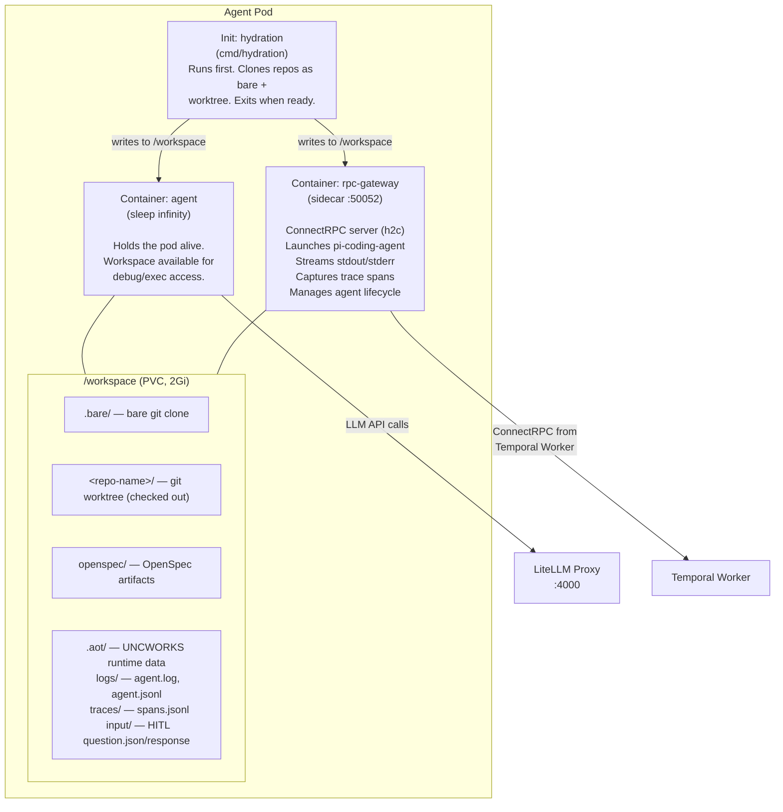

# Agent Pods

Each agent run provisions a Kubernetes Deployment with a PersistentVolumeClaim (PVC) at `/workspace`. The pod contains three containers sharing this volume. The Temporal Worker controls the agent lifecycle through ConnectRPC calls to the sidecar.

## Pod Architecture



## Container Details

### Init Container: hydration

Built from `docker/Dockerfile.hydration`. A Go binary (`cmd/hydration`) that:

1. Clones each repository in `spec.repos[]` as a bare clone into `/workspace/.bare/`
2. Creates a git worktree for each repo at `/workspace/<repo-name>/`
3. Checks out the specified branch (or default branch)
4. If `devboxConfig` is set, installs devbox packages
5. If `specContent` is provided, writes it to the workspace as an OpenSpec artifact
6. Exits with code 0 when hydration is complete

The Temporal Worker polls init container status via the Kubernetes API until it terminates successfully.

### Container: agent

Uses the agent base image (`docker/Dockerfile.agent-base`). Runs `sleep infinity` to keep the pod alive. The workspace volume is mounted at `/workspace` for debug access via `kubectl exec`. This container does not run the agent process -- the sidecar handles that.

### Container: rpc-gateway (sidecar)

Built from `docker/Dockerfile.sidecar`. Contains:

- **sidecar binary** (`cmd/sidecar`) -- ConnectRPC server (h2c on port 50052)
- **pi-coding-agent** (`@mariozechner/pi-coding-agent`) -- LLM coding agent (Node.js)
- **openspec CLI** (`@fission-ai/openspec`) -- Spec management tool
- **pi-compaxxt extension** (`@ssweens/pi-compaxxt`) -- Context compression
- **pi-dcp extension** (`zenobi-us/pi-dcp`) -- Dynamic context pruning
- **aot-determinism extension** (`/opt/aot/extensions/aot-determinism.ts`) -- Policy enforcement

Environment variables set on this container:

| Variable | Source | Purpose |
|----------|--------|---------|
| `AOT_AGENT_RUN_ID` | Run name | Links sidecar to its AgentRun |
| `PI_MODEL` | `modelIDFromTier(modelTier)` | Model selection for pi (e.g., `litellm/default-cloud`) |
| `PI_ACCEPT_TOS` | `1` | Skip interactive TOS prompt |
| `OPENAI_API_KEY` | LiteLLM virtual key | Authenticates LLM calls |
| `OPENAI_BASE_URL` | LiteLLM base URL | Routes LLM calls through proxy |

## Workspace Layout

```
/workspace/
  .bare/                          Bare git clone (shared across worktrees)
  <repo-name>/                    Git worktree (checked-out working copy)
    .git                          Worktree link file
    <source files>
  openspec/                       OpenSpec workspace (spec-driven mode)
    changes/
      <change-name>/
        proposal.md
        design.md
        tasks.md
        specs/
          <spec-name>/
            spec.md
  .aot/                           UNCWORKS runtime directory
    logs/
      agent.log                   Human-readable agent output
      agent.jsonl                 Raw JSONL events from pi
    traces/
      spans.jsonl                 Trace spans (tool calls, stage transitions)
    input/
      question.json               HITL question from agent (ask_user tool)
      response.txt                Human response (written by SendInput RPC)
    subagents/                    Delegation markers (delegate_task tool)
```

## Git Checkpoint System

The sidecar tracks git state for trace span diffs:

1. On each `StartAgent` call, the sidecar records the current HEAD SHA as the checkpoint baseline
2. When a tool call completes (detected via pi JSONL events), the sidecar:
   - Runs `git diff` against the last checkpoint SHA
   - If files changed, creates a `TraceSpan` with the diff attached
   - Updates the checkpoint SHA to current HEAD
3. This produces per-tool-call diffs visible in the trace timeline UI

The git user is configured as `aot-agent <agent@aot.uncworks.io>` for any commits made in the workspace.

## Pi Extensions

### aot-determinism

The primary policy enforcement extension (`/opt/aot/extensions/aot-determinism.ts`). Loaded via `--extension` flag on every pi invocation.

**Loop detection:**
- Blocks after 3 identical consecutive tool calls (resets counter after blocking)
- Sidecar-level backup: kills agent after 5 identical consecutive tool call signatures

**Turn limit:**
- Kills agent after 50 turns to prevent runaway execution

**Write validation (plan stage):**
- Spec files must contain `SHALL` or `MUST` keywords in requirements
- `tasks.md` limited to 30 checkboxes maximum

**Protected paths:**
- All writes blocked outside `/workspace`

**Role-based policies:**

| Role | Stage | Restrictions |
|------|-------|-------------|
| `manage` | plan, verify | Cannot write files outside `/workspace/openspec/` and `/workspace/.aot/` |
| `implement` | execute | Cannot use the `ask_user` tool (must surface questions in output) |

**Custom tools provided:**

| Tool | Description |
|------|-------------|
| `ask_user` | Writes question JSON to `/workspace/.aot/input/question.json`, polls for `/workspace/.aot/input/response.txt`. Times out after 5 minutes. Available to manage agents only. |
| `delegate_task` | Records a delegation marker file in `/workspace/.aot/subagents/` for dashboard visibility. |

### pi-compaxxt

Third-party extension (`@ssweens/pi-compaxxt`). Compresses context to reduce token usage.

### pi-dcp

Third-party extension (`zenobi-us/pi-dcp`). Dynamic context pruning -- intelligently removes irrelevant context from the agent's window.

## Trace Span Capture

The sidecar captures trace spans from two sources:

**1. Pi JSONL events (stdout):**

Pi streams all events as JSONL to stdout in `--mode json`. The sidecar parses each line and detects:
- Tool call start/end events -- creates a span per tool invocation
- Text response events -- accumulates for human-readable log

When a tool call completes, the sidecar:
1. Generates a span ID (UUID)
2. Records start/end timestamps
3. Captures a git diff against the last checkpoint (if files changed)
4. Appends the span to `/workspace/.aot/traces/spans.jsonl`

**2. Workflow-level stage spans:**

The Temporal workflow writes stage-level trace spans (PLAN, EXECUTE, VERIFY) via the `WriteTraceSpan` activity. These are appended to the same `spans.jsonl` file and provide the top-level timeline structure.

**Span schema:**

```json
{
  "id": "uuid",
  "traceId": "uuid",
  "parentId": "uuid (optional)",
  "name": "tool name or stage name",
  "type": "tool_call | stage | input",
  "startTime": "RFC3339Nano",
  "endTime": "RFC3339Nano",
  "status": "ok | error | unset",
  "metadata": { "stage": "execute", "model": "...", ... },
  "hasDiff": true,
  "diff": {
    "files": [
      { "path": "src/main.go", "patch": "@@ -1,3 +1,5 @@\n ..." }
    ]
  }
}
```

## Agent Lifecycle

```mermaid
sequenceDiagram
    participant TW as Temporal Worker
    participant SG as Sidecar Gateway
    participant PI as pi-coding-agent

    TW->>SG: StartAgent(prompt, stage, model)
    SG->>PI: exec pi -p --mode json<br/>--no-session<br/>--extension aot-det...<br/>--system-prompt &lt;stage&gt;<br/>--model litellm/&lt;tier&gt;<br/>&lt;prompt&gt;
    SG-->>TW: Started: true

    TW->>SG: GetStatus()
    SG-->>TW: RUNNING
    Note over SG,PI: poll every 5s
    Note right of PI: agent reads/writes<br/>files in /workspace

    TW->>SG: GetStatus()
    SG-->>TW: RUNNING
    Note over SG,PI: tool call detected via JSONL parsing:<br/>capture git diff, write trace span

    PI-->>SG: exit 0
    TW->>SG: GetStatus()
    SG-->>TW: COMPLETED

    Note over TW: workflow continues<br/>to next stage or cleanup
```

**Rate limit handling:** HTTP 429 errors from the LLM provider trigger automatic retry of the agent process up to 3 times with a 10-second delay between attempts.

## Sidecar RPC Services

### AgentSidecarService

| RPC | Description |
|-----|-------------|
| `StartAgent` | Spawns the `pi` process with prompt, repo path, stage, env vars, and model. Kills any previously running agent first. Starts pipe readers, records initial trace span, configures git identity. |
| `GetStatus` | Returns process state: `RUNNING`, `COMPLETED`, `FAILED`, `WAITING_FOR_INPUT`, or `UNSPECIFIED`. Includes the pending question payload when waiting. |
| `ExecCommand` | Executes an arbitrary shell command in the pod with configurable working directory and timeout. Used by Plan/Verify activities to run `openspec` CLI commands. Returns stdout, stderr, and exit code. |
| `SendInput` | Writes the human's response to `/workspace/.aot/input/response.txt`, which the `ask_user` tool polls for. |
| `StopAgent` | Sends SIGINT to the agent process for graceful shutdown. Falls back to SIGKILL after 5 seconds. |
| `StreamOutput` | Server-streaming RPC that subscribes to the agent's stdout/stderr channels and forwards output in real time. |

### AgentNotificationService

Used by the agent (via the extension) to notify the sidecar of events like tool calls starting/ending. Enables more precise trace span capture.
