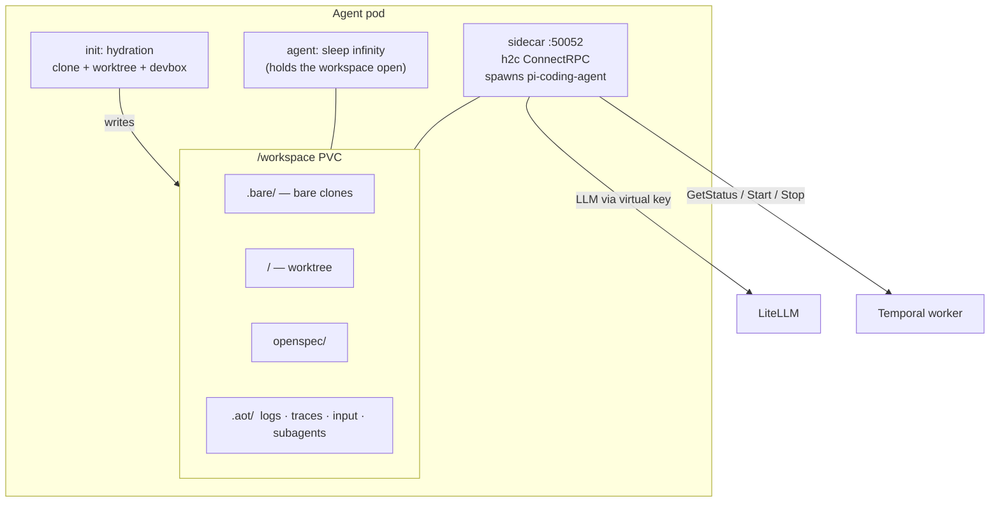

# Agent pods

One Deployment per run, with a PVC at `/workspace`. Three containers share the volume. The Temporal worker drives the pod through the sidecar's ConnectRPC surface.



## Containers

| Container | Image | Role |
|-----------|-------|------|
| init `hydration` | `docker/Dockerfile.hydration` | `cmd/hydration` Go binary. Bare-clones repos into `.bare/`, creates a worktree at `/workspace/<repo>/` on a new `aot/<branch>`, runs `devbox install`. Writes `.aot/metadata.json`, `uncspace.yaml`. Exits 0. |
| `agent` | `docker/Dockerfile.agent-base` | `sleep infinity`. Holds the pod and workspace alive for `kubectl exec`. Doesn't run the agent process. |
| `rpc-gateway` (sidecar) | `docker/Dockerfile.sidecar` | `cmd/sidecar` + `pi-coding-agent` + `openspec` CLI + extensions. Spawns `pi`, captures events, exposes ConnectRPC. |

The sidecar holds:

- `pi-coding-agent` (`@mariozechner/pi-coding-agent`) — the agent runtime.
- `openspec` CLI (`@fission-ai/openspec`).
- `pi-compaxxt` (`@ssweens/pi-compaxxt`) — context compression.
- `pi-dcp` (`zenobi-us/pi-dcp`) — dynamic context pruning.
- `aot-determinism.ts` at `/opt/aot/extensions/` — policy enforcement, loaded via `--extension`.

### Sidecar env

| Var | Source | Purpose |
|-----|--------|---------|
| `AOT_AGENT_RUN_ID` | run name | Links sidecar to its `AgentRun` |
| `PI_MODEL` | `modelIDFromTier(modelTier)` | Model name passed to `pi` (e.g. `litellm/default-cloud`) |
| `PI_ACCEPT_TOS` | `1` | Skip TOS prompt |
| `OPENAI_API_KEY` | LiteLLM virtual key | Per-run scoped key |
| `OPENAI_BASE_URL` | LiteLLM base URL | Routes through the proxy |

## Workspace layout

```
/workspace/
  <repo>/                          worktree (checked out on aot/<branch>)
  .bare/<repo>/                    bare clone (single source of git objects)
  openspec/
    changes/<change>/
      proposal.md  design.md  tasks.md
      specs/<capability>/spec.md
      verification-result.json
    changes/archive/               completed changes
  .aot/
    metadata.json                  run id, repos, prompt, model
    logs/agent.log                 human-readable
    logs/agent.jsonl               raw pi events
    traces/spans.jsonl             tool-call + stage spans (+ per-span diffs)
    input/question.json            HITL question from ask_user
    input/response.txt             HITL response (written by SendInput)
    subagents/delegate-*.json      delegation markers
  .devcontainer/devcontainer.json
  uncspace.yaml                    repos ↔ worktree paths
  devbox.json                      root config (auto-composed from repo configs)
```

## Why bare + worktree

`git clone --bare` into `.bare/<repo>/` holds the git objects. `git worktree add -b aot/<branch>` creates the working copy at `/workspace/<repo>/` on a new branch. Two reasons:

1. The agent's branch is isolated from the source — pushes go to `aot/<run-id>`, source branches stay clean.
2. Additional worktrees from the same bare clone are cheap if multi-worktree workflows are added later.

## Devbox

Explicit: `AOT_DEVBOX_CONFIG` path → `devbox install` against that file.

Auto-compose: hydrator scans each repo for `devbox.json` and writes a root `/workspace/devbox.json` with `include` directives. One `devbox install` from the root pulls all repos' deps.

## Git checkpoint

The sidecar tracks git state to produce per-tool-call diffs:

1. `StartAgent` records the current HEAD as the checkpoint baseline.
2. Each pi tool-call-complete event triggers `git diff` against the checkpoint.
3. If files changed, a `TraceSpan` is appended to `.aot/traces/spans.jsonl` with the diff embedded; the checkpoint advances to current HEAD.

Commits made in the workspace use `aot-agent <agent@aot.uncworks.io>`.

## Trace spans

Two sources, same file (`.aot/traces/spans.jsonl`):

- Pi JSONL events on stdout → one span per tool call (with diff if dirty).
- Workflow-level → PLAN / EXECUTE / VERIFY stage spans written via `WriteTraceSpan`.

```json
{
  "id": "uuid", "traceId": "uuid", "parentId": "uuid|null",
  "name": "tool name | stage name",
  "type": "tool_call | stage | input",
  "startTime": "rfc3339nano", "endTime": "rfc3339nano",
  "status": "ok | error | unset",
  "metadata": { "stage": "execute", "model": "..." },
  "hasDiff": true,
  "diff": { "files": [{ "path": "...", "patch": "..." }] }
}
```

## Sidecar RPCs

### `AgentSidecarService`

| RPC | Purpose |
|-----|---------|
| `StartAgent` | Spawn `pi` with prompt, stage, role, model, env, repo path. Kills any prior agent. Records initial span, sets git identity. |
| `GetStatus` | `RUNNING` / `COMPLETED` / `FAILED` / `WAITING_FOR_INPUT` / `UNSPECIFIED`. Includes the pending question payload when waiting. |
| `ExecCommand` | Arbitrary shell command in the pod. Used by Plan/Verify for `openspec` invocations. Returns stdout/stderr/exit. |
| `SendInput` | Writes the human's response to `.aot/input/response.txt`. |
| `StopAgent` | SIGINT → SIGKILL after 5s. |
| `StreamOutput` | Server-stream of stdout/stderr from the agent process. |

### `AgentNotificationService`

Used by the extension (when loaded) to push tool-call start/end events to the sidecar over Connect-RPC for more precise span timing.

## Resilience

429 from the LLM provider → up to 3 retries with a 10s backoff.

50-turn cap kills the agent — configured in the determinism extension.

PVC outlives the pod for debug access; cleanup activity only scales the deployment to 0.
