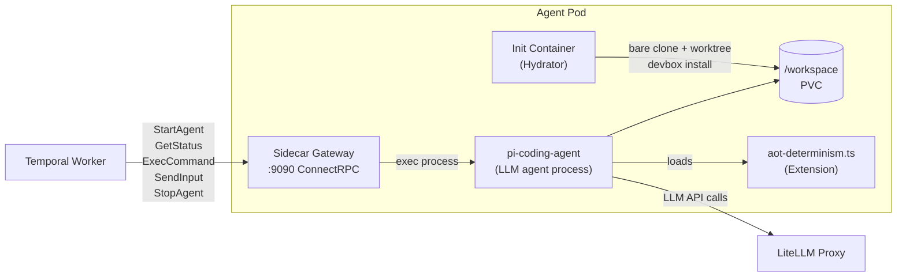
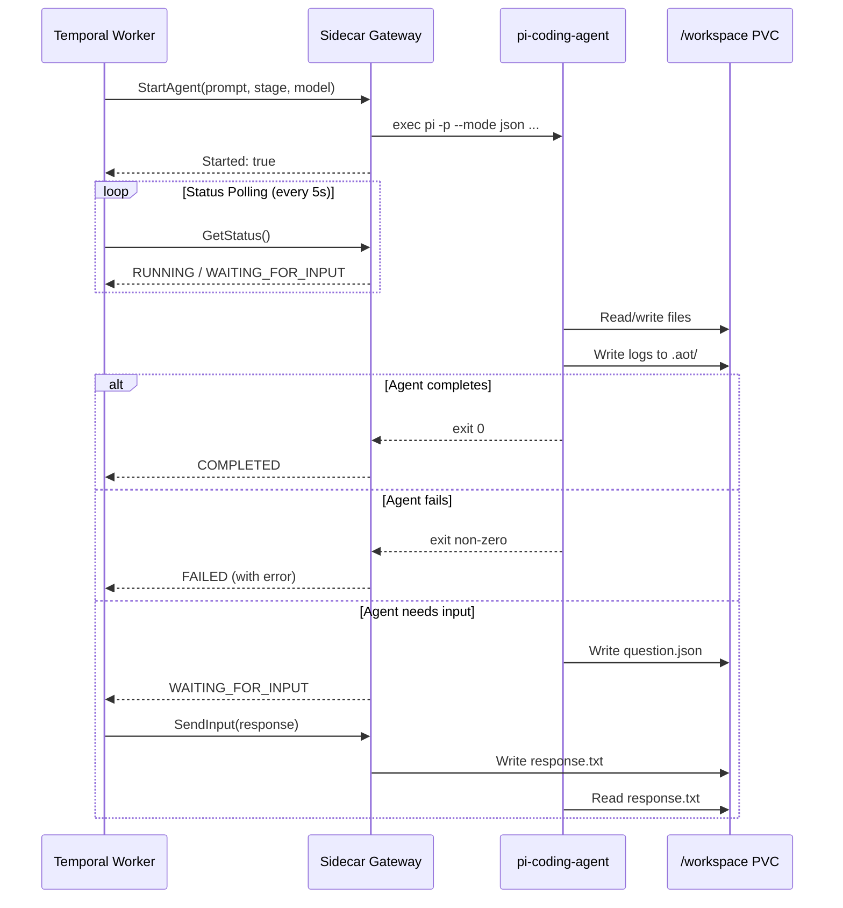

# Agent Pods

Each agent run provisions a Kubernetes Deployment containing an agent pod with a shared PVC. The pod runs two processes: the `pi-coding-agent` LLM agent and the sidecar RPC gateway.

## Pod Architecture

## pi-coding-agent

`pi` is an open-source LLM coding agent (from `@mariozechner/pi-coding-agent`). It runs in non-interactive mode (`-p --mode json --no-session`) and streams all events (tool calls, tool results, text responses) as JSONL to stdout. The sidecar captures this output and writes it to `agent.log` (human-readable) and `agent.jsonl` (machine-parseable).

Key flags set by the sidecar:
- `--extension /opt/aot/extensions/aot-determinism.ts` -- loads the UNCWORKS determinism extension
- `--system-prompt <stage-prompt>` -- injects stage-specific instructions (plan/execute/verify)
- `--model <model>` -- model selection via `PI_MODEL` environment variable

Environment variables:
- `PI_ROLE`: `manage` or `implement` (controls extension policy enforcement)
- `PI_STAGE`: `plan`, `execute`, or `verify`
- `PI_LOG_LEVEL=debug`, `PI_ACCEPT_TOS=1`

## Sidecar RPC Gateway

The sidecar is a ConnectRPC server (h2c on port 9090) that bridges the Temporal worker to the agent process running inside the pod. It implements two services:

### AgentSidecarService

| RPC | Description |
|-----|-------------|
| `StartAgent` | Spawns the `pi` process with the given prompt, repo path, stage, and env vars. Kills any previously running agent first. Starts pipe readers and records an initial trace span. |
| `GetStatus` | Returns the agent's current process state: `RUNNING`, `COMPLETED`, `FAILED`, `WAITING_FOR_INPUT`, or `UNSPECIFIED`. Includes the pending question payload when waiting. |
| `ExecCommand` | Executes an arbitrary shell command in the pod with a configurable working directory and timeout. Used by Plan/Verify activities to run `openspec` CLI commands. Returns stdout, stderr, and exit code. |
| `SendInput` | Writes the human's response to `/workspace/.aot/input/response.txt`, which the `ask_user` tool polls for. |
| `StopAgent` | Sends SIGINT to the agent process for graceful shutdown. Falls back to SIGKILL after 5 seconds. |
| `StreamOutput` | Server-streaming RPC that subscribes to the agent's stdout/stderr channels and forwards output in real time. |

### AgentNotificationService

Used by the agent (via the extension) to notify the sidecar of events like tool calls starting/ending. Enables trace span capture.

### Loop Detection (Sidecar-Level)

The sidecar monitors stdout for repeated identical tool call signatures. If the same tool call appears 5 times consecutively, the agent process is killed to prevent infinite loops. This is a safety net complementing the extension-level loop detection.

## Determinism Extension

The `aot-determinism.ts` extension is loaded into `pi` at startup. It enforces deterministic behavior through event hooks:

### Policies

| Policy | Rule |
|--------|------|
| Loop detection | Blocks after 3 identical consecutive tool calls (resets after block) |
| Turn limit | Kills agent after 50 turns to prevent runaway execution |
| Write validation | Plan-stage spec files must contain `SHALL` or `MUST` in requirements |
| Task count guard | Plan-stage `tasks.md` limited to 30 checkboxes maximum |
| Protected paths | All writes blocked outside `/workspace` |
| Role: manage | Cannot write/edit files outside `/workspace/openspec/` and `/workspace/.aot/` |
| Role: implement | Cannot use `ask_user` tool (must surface questions in output) |

### Custom Tools

| Tool | Description |
|------|-------------|
| `ask_user` | Writes a question JSON to `/workspace/.aot/input/question.json` and polls for `/workspace/.aot/input/response.txt`. Times out after 5 minutes. Available to manage agents only. |
| `delegate_task` | Records a delegation marker file in `/workspace/.aot/subagents/` for dashboard visibility. The subtask is handled inline by the current agent. |

## Agent Lifecycle

Rate limit errors (HTTP 429) from the LLM provider trigger automatic retry of the agent process up to 3 times with a 10-second delay between attempts.
