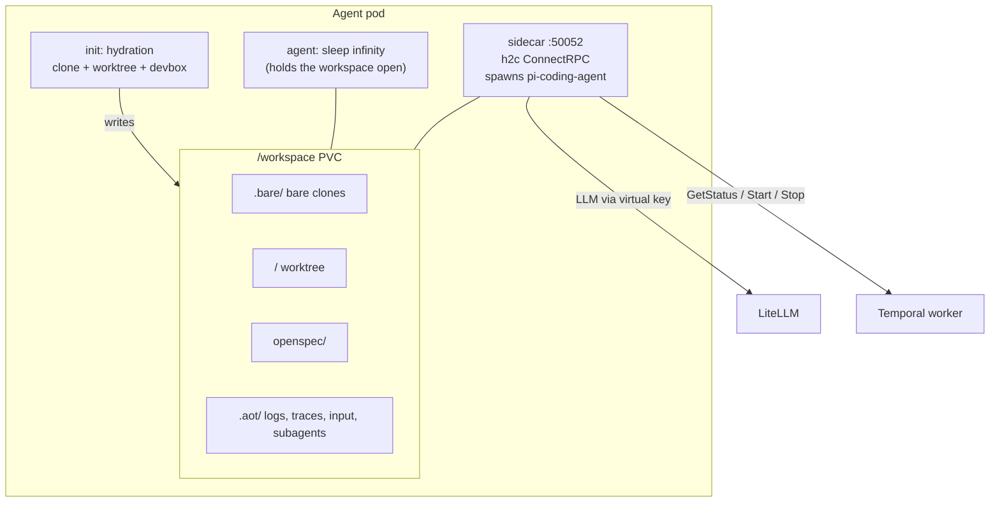

# Agent pods

Each run gets one Deployment and one PVC mounted at `/workspace`. Three
containers share the volume. The Temporal worker drives the pod through the
sidecar's ConnectRPC surface.


```mermaid
flowchart TD
    subgraph pod["Agent pod"]
        init["init: hydration\nclone + worktree + devbox"]
        agent["agent: sleep infinity\n(holds the workspace open)"]
        side["sidecar :50052\nh2c ConnectRPC\nspawns pi-coding-agent"]
        subgraph pvc["/workspace PVC"]
            bare[".bare/ bare clones"]
            repo["<repo>/ worktree"]
            os["openspec/"]
            aot[".aot/ logs, traces, input, subagents"]
        end
        init -- writes --> pvc
        agent --- pvc
        side --- pvc
    end
    side -->|LLM via virtual key| litellm["LiteLLM"]
    side -->|GetStatus / Start / Stop| tw["Temporal worker"]
```

## Containers

| Container | Image | Role |
|-----------|-------|------|
| init `hydration` | `docker/Dockerfile.hydration` | The `cmd/hydration` binary. It bare-clones each repo into `.bare/`, creates a worktree at `/workspace/<repo>/` on a new `aot/<branch>`, and runs `devbox install`. It writes `.aot/metadata.json` and `uncspace.yaml`, then exits zero |
| `agent` | `docker/Dockerfile.agent-base` | Runs `sleep infinity`. It holds the pod and the workspace open for `kubectl exec`. It does not run the agent process |
| `rpc-gateway`, the sidecar | `docker/Dockerfile.sidecar` | Holds `cmd/sidecar`, `pi-coding-agent`, the `openspec` CLI, and the extensions. It spawns `pi`, captures the events, and serves ConnectRPC |

The sidecar image holds:

- `pi-coding-agent` (`@mariozechner/pi-coding-agent`), the agent runtime.
- The `openspec` CLI (`@fission-ai/openspec`).
- `pi-compaxxt` (`@ssweens/pi-compaxxt`), which compresses context.
- `pi-dcp` (`zenobi-us/pi-dcp`), which prunes context dynamically.
- `aot-determinism.ts` at `/opt/aot/extensions/`, which enforces policy. `pi`
  loads it through `--extension`.

### Sidecar environment variables

| Variable | Source | Purpose |
|-----|--------|---------|
| `AOT_AGENT_RUN_ID` | run name | Links the sidecar to its `AgentRun` |
| `PI_MODEL` | `modelIDFromTier(modelTier)` | Model name passed to `pi`, such as `litellm/default-cloud` |
| `PI_ACCEPT_TOS` | `1` | Skips the terms-of-service prompt |
| `OPENAI_API_KEY` | LiteLLM virtual key | One scoped key per run |
| `OPENAI_BASE_URL` | LiteLLM base URL | Routes every call through the proxy |

## Workspace layout

```
/workspace/
  <repo>/                          worktree (checked out on aot/<branch>)
  .bare/<repo>/                    bare clone (single source of git objects)
  openspec/
    changes/<change>/
      proposal.md  design.md  tasks.md
      specs/<capability>/spec.md
      verification-result.json
    changes/archive/               completed changes
  .aot/
    metadata.json                  run id, repos, prompt, model
    logs/agent.log                 human-readable
    logs/agent.jsonl               raw pi events
    traces/spans.jsonl             tool-call + stage spans (+ per-span diffs)
    input/question.json            HITL question from ask_user
    input/response.txt             HITL response (written by SendInput)
    subagents/delegate-*.json      delegation markers
  .devcontainer/devcontainer.json
  uncspace.yaml                    repos ↔ worktree paths
  devbox.json                      root config (auto-composed from repo configs)
```

## Why bare + worktree

`git clone --bare` into `.bare/<repo>/` holds the git objects.
`git worktree add -b aot/<branch>` creates the working copy at
`/workspace/<repo>/` on a new branch. There are two reasons for this.

1. The agent's branch is isolated from the source. Pushes go to `aot/<run-id>`,
   so the source branches stay clean.
2. Another worktree from the same bare clone costs almost nothing, so a
   multi-worktree workflow stays cheap to add later.

## Devbox

Set `AOT_DEVBOX_CONFIG` to a path to run `devbox install` against that file.

Leave it unset to compose the config automatically. The hydrator scans each repo
for a `devbox.json` and writes a root `/workspace/devbox.json` with `include`
directives. One `devbox install` from the root then installs every repo's
dependencies.

## Git checkpoint

The sidecar tracks git state so it can produce one diff per tool call.

1. `StartAgent` records the current HEAD as the checkpoint baseline.
2. Every pi tool-call-complete event runs `git diff` against the checkpoint.
3. When a file changed, the sidecar appends a `TraceSpan` with the embedded diff
   to `.aot/traces/spans.jsonl`, then advances the checkpoint to the current
   HEAD.

Commits made in the workspace use `aot-agent <agent@aot.uncworks.io>`.

## Trace spans

Two sources write to `.aot/traces/spans.jsonl`.

- The pi JSONL events on stdout produce one span per tool call, and carry a diff
  when the worktree changed.
- The workflow writes one span per PLAN, EXECUTE, and VERIFY stage through
  `WriteTraceSpan`.

```json
{
  "id": "uuid", "traceId": "uuid", "parentId": "uuid|null",
  "name": "tool name | stage name",
  "type": "tool_call | stage | input",
  "startTime": "rfc3339nano", "endTime": "rfc3339nano",
  "status": "ok | error | unset",
  "metadata": { "stage": "execute", "model": "..." },
  "hasDiff": true,
  "diff": { "files": [{ "path": "...", "patch": "..." }] }
}
```

## Sidecar RPCs

### `AgentSidecarService`

| RPC | Purpose |
|-----|---------|
| `StartAgent` | Spawns `pi` with the prompt, stage, role, model, environment, and repo path. Kills any earlier agent, records the first span, and sets the git identity |
| `GetStatus` | Returns `RUNNING`, `COMPLETED`, `FAILED`, `WAITING_FOR_INPUT`, or `UNSPECIFIED`. A waiting status carries the pending question |
| `ExecCommand` | Runs a shell command in the pod, and returns stdout, stderr, and the exit code. Plan and Verify use it to call `openspec` |
| `SendInput` | Writes the human's response to `.aot/input/response.txt` |
| `StopAgent` | Sends SIGINT, then SIGKILL after 5 seconds |
| `StreamOutput` | Streams stdout and stderr from the agent process |

### `AgentNotificationService`

The extension calls this service, when it is loaded, to push tool-call start and
end events to the sidecar over ConnectRPC. This gives the spans more precise
timing than parsing stdout alone.

## Resilience

A 429 from the LLM provider retries up to 3 times, with a 10 second backoff.

The agent stops after 50 turns. The determinism extension holds the cap.

The PVC outlives the pod so you can still read the workspace. The cleanup
activity only scales the deployment to zero replicas.
