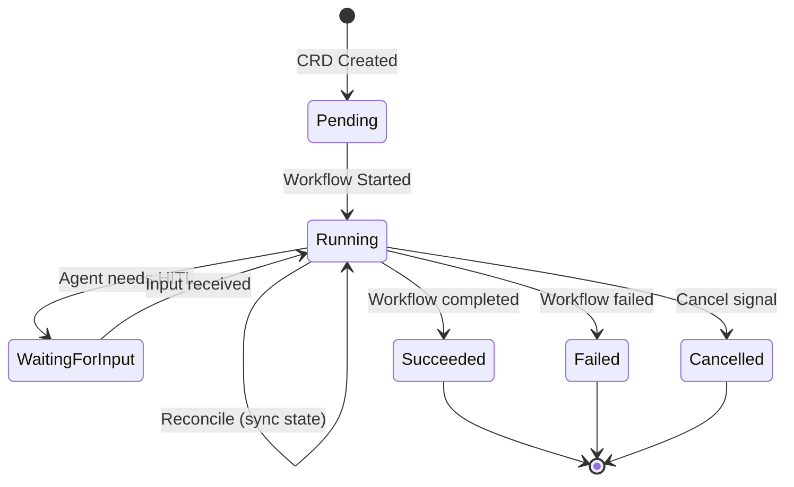

# Control Plane

The control plane consists of three services: the API Server, the K8s Controller, and the Temporal Worker. Together they accept user requests, provision agent infrastructure, and orchestrate the agent lifecycle.

## API Server (ConnectRPC)

The API Server is a Go HTTP server exposing the `AOTService` via ConnectRPC (gRPC-compatible, browser-friendly). It is the only external-facing backend component.

### Service Methods

| Method | Type | Description |
|--------|------|-------------|
| `CreateAgentRun` | Unary | Creates an `AgentRun` CRD. Generates a random name (`ar-XXXXXX`) and an LLM-derived display name. |
| `GetAgentRun` | Unary | Reads the CRD and enriches it with real-time Temporal workflow state via query. Populates child run IDs. |
| `ListAgentRuns` | Unary | Lists CRDs with filters: phase, parent run ID, spec run ID, stage. Sorted newest-first. |
| `WatchAgentRun` | Server Stream | SSE stream of `AgentRunEvent` messages. Sends current state immediately, then subscribes to the event bus. |
| `CancelAgentRun` | Unary | Sends a cancel signal to the Temporal workflow via `CancelWorkflow`. |
| `SendHumanInput` | Unary | Signals the Temporal workflow with `HumanInputSignal` to relay human answers to a waiting agent. |
| `GetRunGraph` | Unary | Returns a DAG of parent/child runs for orchestrated executions, using `spec-run-id` labels. |
| `SearchPastWork` | Unary | Vector similarity search over past run artifacts using embeddings (optional brain/embedder subsystem). |

### REST Endpoints (FileHandler)

The API Server also registers REST endpoints for file access, served alongside ConnectRPC on the same mux:

| Endpoint | Description |
|----------|-------------|
| `GET /api/v1/runs/{id}/files` | Directory listing via kubectl exec or PVC host path |
| `GET /api/v1/runs/{id}/files/content` | File content with syntax highlighting hints |
| `GET /api/v1/runs/{id}/logs` | Human-readable agent log (`agent.log`) |
| `GET /api/v1/runs/{id}/logs/structured` | Raw JSONL event stream (`agent.jsonl`) |
| `GET /api/v1/runs/{id}/logs/thinking` | LLM thinking/reasoning blocks extracted from JSONL |
| `GET /api/v1/runs/{id}/verification` | Structured verification result JSON |

### Configuration

- `LITELLM_BASE_URL`: LiteLLM proxy endpoint (default: `http://litellm.aot.svc.cluster.local:4000`)
- CORS is configured to allow the Web UI origin

## Controller (K8s Reconciler)

The controller watches `AgentRun` CRDs and bridges them to Temporal workflows. It is intentionally thin -- all business logic lives in the Temporal workflow.

### Reconcile Logic

1. **New CRD (no workflow annotation)**: Build `WorkflowInput` from CRD spec, start a Temporal workflow via `ExecuteWorkflow`, annotate the CRD with the workflow ID, set phase to Running.
2. **Existing CRD (has workflow annotation)**: Query the workflow state via `QueryWorkflow("get-state")`, map the workflow phase to the CRD status, update if changed. If query fails, fall back to `DescribeWorkflowExecution` for terminal state detection.
3. **Deleted CRD**: The `aot.uncworks.io/workflow-cleanup` finalizer cancels the Temporal workflow before allowing deletion.

### Orchestration Labels

| Label/Annotation | Purpose |
|------------------|---------|
| `aot.uncworks.io/spec-run-id` | Groups parent + child runs |
| `aot.uncworks.io/run-role` | `senior` or `junior` |
| `aot.uncworks.io/parent-run` | Links child to parent |
| `aot.uncworks.io/workflow-id` | Temporal workflow ID |

Reconcile interval: 30 seconds.

## Temporal Worker

The worker registers the `AgentRunWorkflow` and all activities on the `aot-agent-runs` task queue.

### Activities

| Activity | Description |
|----------|-------------|
| `ProvisionLLMKey` | Creates a scoped API key in LiteLLM with budget limits |
| `RevokeLLMKey` | Revokes the key on workflow exit (deferred cleanup) |
| `CreateAgentDeployment` | Creates a K8s Deployment + PVC for the agent pod |
| `ScaleDownDeployment` | Scales the Deployment to 0 on workflow exit (deferred cleanup) |
| `WaitForHydration` | Polls the pod until the init container completes and the sidecar is reachable |
| `StartAgent` | Calls sidecar `StartAgent` RPC with prompt, model, and stage |
| `GetAgentStatus` | Calls sidecar `GetStatus` RPC to check agent process state |
| `ForwardHumanInput` | Calls sidecar `SendInput` RPC to relay human answers |
| `StopAgent` | Calls sidecar `StopAgent` RPC for graceful shutdown |
| `PlanRun` | Spec-driven: runs the planning stage via sidecar |
| `VerifyRun` | Spec-driven: runs the verification stage via sidecar |
| `PersistRunData` | Archives run artifacts to the knowledge store |
| `EmbedRunData` | Generates embeddings for run artifacts |
| `HydrateContext` | Retrieves relevant past work for context injection |

### Compensation

The workflow uses a deferred cleanup pattern: `llmKey` and `deploymentName` are captured in the workflow scope, and a `defer` block ensures `RevokeLLMKey` and `ScaleDownDeployment` run on any exit path (success, failure, or cancellation) using a disconnected context.
