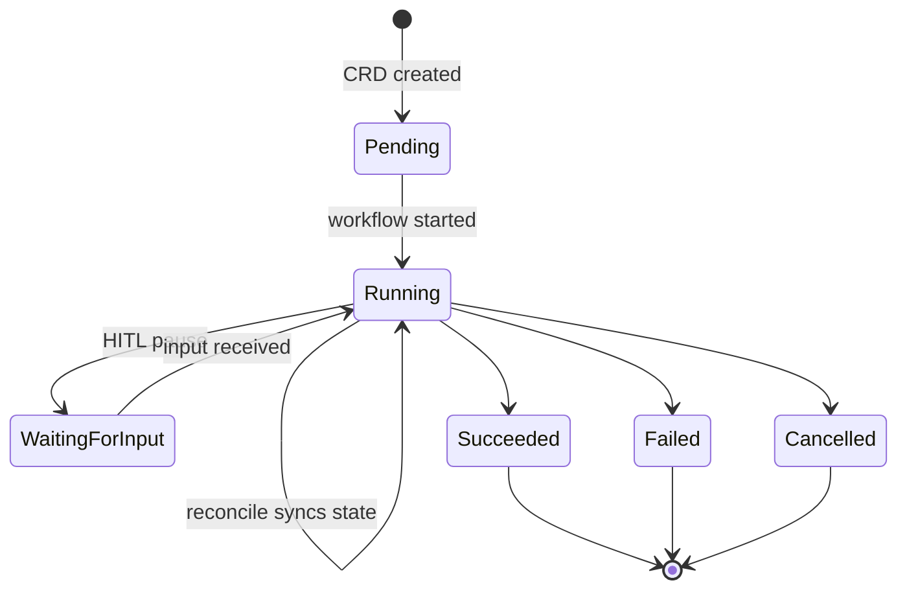

# Control plane

Three services: API server, controller, Temporal worker. The controller is intentionally thin — all business logic lives in the workflow.

## API server

ConnectRPC + REST on `:50055`. Same mux serves both. Browser-friendly (HTTP/JSON callable).

### `AOTService` RPCs

| Method | Kind | Notes |
|--------|------|-------|
| `CreateAgentRun` | unary | Creates the CRD. Generates `ar-XXXXXX` ID + LLM-derived display name. |
| `GetAgentRun` | unary | CRD + live Temporal query state. Populates children for orchestrated runs. |
| `ListAgentRuns` | unary | Filters: phase, parent, spec-run, stage, project, feature, tag. Newest-first. Archived excluded unless `X-Include-Archived: true`. |
| `WatchAgentRun` | server stream | Emits current state, then live `AgentRunEvent`s until terminal. |
| `CancelAgentRun` | unary | Cancels the Temporal workflow. |
| `SendHumanInput` | unary | Signals the workflow with the user's answer (HITL question, or approve/reject). |
| `GetRunGraph` | unary | DAG of parent/child runs via `aot.uncworks.io/spec-run-id`. |
| `SearchPastWork` | unary | Vector similarity over the knowledge store (requires PG + embedder). |

### REST

| Path | Purpose |
|------|---------|
| `GET /api/v1/runs/{id}/files` | Directory listing |
| `GET /api/v1/runs/{id}/files/content?path=` | File content |
| `GET /api/v1/runs/{id}/logs` | Human-readable `agent.log` |
| `GET /api/v1/runs/{id}/logs/structured` | `agent.jsonl` |
| `GET /api/v1/runs/{id}/logs/thinking` | Reasoning blocks extracted from JSONL |
| `GET /api/v1/runs/{id}/verification` | Verify JSON |
| `GET /api/v1/runs/{id}/traces` | Trace spans |
| `GET /api/v1/runs/{id}/traces/{spanId}/diff` | Per-span diff |
| `GET /api/v1/runs/{id}/traces/watch` | SSE stream |
| `POST /api/v1/runs/{id}/archive`, `/bulk-archive` | Archive |
| `POST/DELETE /api/v1/runs/{id}/debug` | Debug session (scales pod to 1) |
| `GET /api/v1/runs/{id}/exec`, `/connect` | WebSocket shell / pod connect |
| `/api/v1/projects/...` | Project CRUD + config repo files |
| `POST /api/v1/specs/push`, `GET /api/v1/specs/pull` | GitHub spec round-trip |
| `POST /api/v1/classify` | LLM-based project/feature/tag classification |
| `POST /api/v1/webhooks/github` | GitHub webhook |

### Env

| Variable | Purpose |
|----------|---------|
| `LITELLM_BASE_URL` | LiteLLM proxy (default `http://litellm.aot.svc.cluster.local:4000`) |
| `AOT_API_KEY` | Required header for client calls when set |
| Allowed origins | CORS, configured via Helm |

## Controller

Reconcile:

1. CRD without workflow annotation → build `WorkflowInput`, `ExecuteWorkflow`, annotate, set phase `Running`.
2. CRD with annotation → `QueryWorkflow("get-state")`, map phase to CRD status, update if changed. Falls back to `DescribeWorkflowExecution` for terminal detection if query fails.
3. Deletion → finalizer `aot.uncworks.io/workflow-cleanup` cancels the workflow first.

Reconcile interval: 30s.

| Label / annotation | Use |
|--------------------|-----|
| `aot.uncworks.io/spec-run-id` | Groups parent + children |
| `aot.uncworks.io/run-role` | `senior` / `junior` |
| `aot.uncworks.io/parent-run` | Child → parent link |
| `aot.uncworks.io/workflow-id` | Temporal handle |

## Temporal worker

One queue: `aot-agent-runs`. One workflow: `AgentRunWorkflow`. Activities, grouped:

| Lifecycle | LLM | Sidecar | Pipeline | Persist |
|-----------|-----|---------|----------|---------|
| `CreateAgentDeployment` | `ProvisionLLMKey` | `StartAgent` | `PlanRun` | `PersistRunData` |
| `WaitForHydration` | `RevokeLLMKey` (deferred) | `GetAgentStatus` | `VerifyRun` | `EmbedRunData` |
| `ScaleDownDeployment` (deferred) | | `ForwardHumanInput` | `LLMJudgeChanges` | `HydrateContext` |
| | | `StopAgent` | | `EnrichRunTags` |

Deferred cleanup pattern: `llmKey` and `deploymentName` are captured; a `defer` block with a disconnected context guarantees `RevokeLLMKey` + `ScaleDownDeployment` run on success, failure, or cancel.
