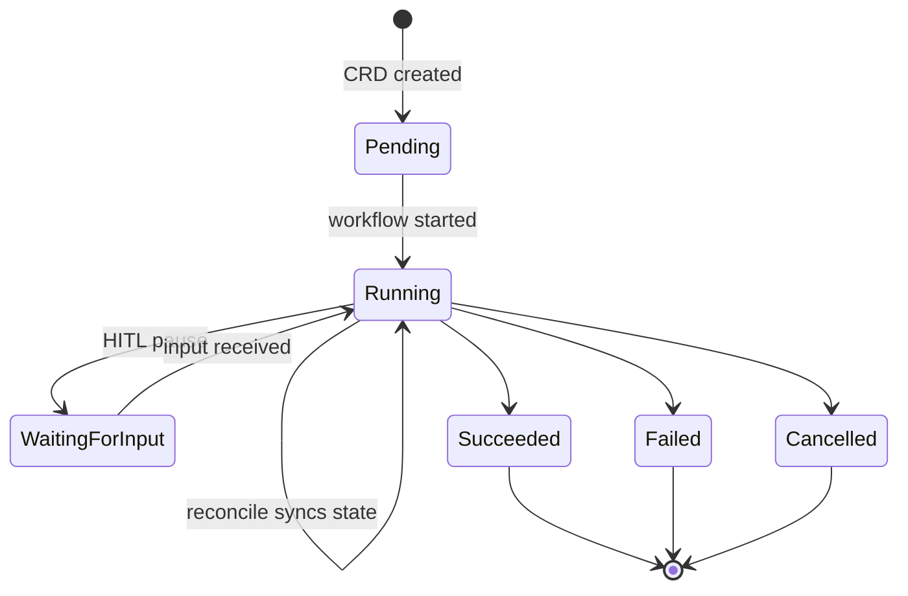

# Control plane

The control plane is three services: the API server, the controller, and the
Temporal worker. The controller stays thin, because all business logic lives in
the workflow.

## API server

The API server serves ConnectRPC and REST on `:50055`. One mux serves both. A
browser can call it directly over HTTP and JSON.

### `AOTService` RPCs

| Method | Kind | Notes |
|--------|------|-------|
| `CreateAgentRun` | unary | Creates the resource. Generates an `ar-XXXXXX` id and an LLM-derived display name |
| `GetAgentRun` | unary | Returns the resource plus live Temporal query state. Populates the children of an orchestrated run |
| `ListAgentRuns` | unary | Filters on phase, parent, spec-run, stage, project, feature, and tag. Newest first. Excludes archived runs unless the request sets `X-Include-Archived: true` |
| `WatchAgentRun` | server stream | Emits the current state, then every `AgentRunEvent` until the run is terminal |
| `CancelAgentRun` | unary | Cancels the Temporal workflow |
| `SendHumanInput` | unary | Signals the workflow with the user's answer, either to a question or to an approval |
| `GetRunGraph` | unary | Returns the parent and child run graph, grouped by `aot.uncworks.io/spec-run-id` |
| `SearchPastWork` | unary | Runs a vector similarity search over the knowledge store. Needs PostgreSQL and the embedder |

### REST endpoints

| Path | Purpose |
|------|---------|
| `GET /api/v1/runs/{id}/files` | Directory listing |
| `GET /api/v1/runs/{id}/files/content?path=` | File content |
| `GET /api/v1/runs/{id}/logs` | Plain-text `agent.log` |
| `GET /api/v1/runs/{id}/logs/structured` | `agent.jsonl` |
| `GET /api/v1/runs/{id}/logs/thinking` | Reasoning blocks extracted from JSONL |
| `GET /api/v1/runs/{id}/verification` | Verify JSON |
| `GET /api/v1/runs/{id}/traces` | Trace spans |
| `GET /api/v1/runs/{id}/traces/{spanId}/diff` | Per-span diff |
| `GET /api/v1/runs/{id}/traces/watch` | SSE stream |
| `POST /api/v1/runs/{id}/archive`, `/bulk-archive` | Archive |
| `POST/DELETE /api/v1/runs/{id}/debug` | Debug session. Scales the pod back to one replica |
| `GET /api/v1/runs/{id}/exec`, `/connect` | WebSocket shell and pod connect |
| `/api/v1/projects/...` | Project create, read, update, delete, and config repo files |
| `POST /api/v1/specs/push`, `GET /api/v1/specs/pull` | GitHub spec round trip |
| `POST /api/v1/classify` | LLM classification of project, feature, and tags |
| `POST /api/v1/webhooks/github` | GitHub webhook |

### Environment variables

| Variable | Purpose |
|----------|---------|
| `LITELLM_BASE_URL` | LiteLLM proxy. Defaults to `http://litellm.aot.svc.cluster.local:4000` |
| `AOT_API_KEY` | When set, every client call MUST carry it as a header |
| Allowed origins | CORS allowlist, configured through Helm |

## Controller

```mermaid
stateDiagram-v2
    [*] --> Pending: CRD created
    Pending --> Running: workflow started
    Running --> Running: reconcile syncs state
    Running --> WaitingForInput: HITL pause
    WaitingForInput --> Running: input received
    Running --> Succeeded
    Running --> Failed
    Running --> Cancelled
    Succeeded --> [*]
    Failed --> [*]
    Cancelled --> [*]
```

Each reconcile does one of three things.

1. A resource with no workflow annotation gets a `WorkflowInput`, a call to
   `ExecuteWorkflow`, the annotation, and phase `Running`.
2. A resource with the annotation gets a `QueryWorkflow("get-state")` call. The
   controller maps the workflow phase onto the resource status and writes it back
   when it changed. When the query fails, the controller falls back to
   `DescribeWorkflowExecution` to detect a terminal state.
3. A deleted resource runs the `aot.uncworks.io/workflow-cleanup` finalizer,
   which cancels the workflow first.

The reconcile interval is 30 seconds.

| Label or annotation | Use |
|--------------------|-----|
| `aot.uncworks.io/spec-run-id` | Groups a parent run with its children |
| `aot.uncworks.io/run-role` | Either `senior` or `junior` |
| `aot.uncworks.io/parent-run` | Links a child run to its parent |
| `aot.uncworks.io/workflow-id` | Temporal handle |

## Temporal worker

The worker serves one queue, `aot-agent-runs`, and one workflow,
`AgentRunWorkflow`. Its activities group as follows.

| Lifecycle | LLM | Sidecar | Pipeline | Persist |
|-----------|-----|---------|----------|---------|
| `CreateAgentDeployment` | `ProvisionLLMKey` | `StartAgent` | `PlanRun` | `PersistRunData` |
| `WaitForHydration` | `RevokeLLMKey` (deferred) | `GetAgentStatus` | `VerifyRun` | `EmbedRunData` |
| `ScaleDownDeployment` (deferred) | | `ForwardHumanInput` | `LLMJudgeChanges` | `HydrateContext` |
| | | `StopAgent` | | `EnrichRunTags` |

Cleanup is deferred. The workflow captures `llmKey` and `deploymentName`, then a
`defer` block on a disconnected context runs `RevokeLLMKey` and
`ScaleDownDeployment`. This happens on success, on failure, and on cancellation.
