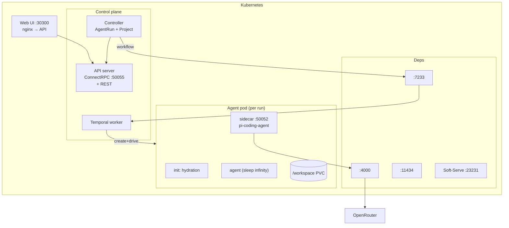

# Architecture overview

Everything runs inside one Kubernetes cluster except cloud LLM providers. One workflow drives one pod; the pod owns one PVC; the sidecar fronts `pi-coding-agent`.



## Pieces

| Layer | What |
|------|------|
| Web | React SPA, nginx-proxied to the API. Runs list, run detail (Overview, Logs, Files, Verify, Traces), project pages. |
| API server | `AOTService` over ConnectRPC + REST endpoints for files, logs, traces, projects, archives, debug, webhooks, spec push/pull. |
| Controller | Watches `AgentRun` and `Project` CRDs. Thin: starts/queries Temporal workflows; reconciles project soft-serve repos. |
| Temporal worker | All business logic. Activities: provision LLM key, create deployment, hydrate, plan, execute, verify, push, PR, persist, embed, cleanup. |
| LiteLLM | Per-run scoped virtual keys with budget caps and model allowlists. Routes to Ollama or OpenRouter. |
| Ollama | Local inference. Off by default in the `values.local.yaml` preset. |
| Soft-Serve | In-cluster git server hosting per-project config repos with OpenSpec scaffolding. |
| Hydration init | Bare-clones repos into `.bare/`, creates a worktree per repo on a new `aot/<branch>`, runs `devbox install`. |
| Sidecar | ConnectRPC (h2c) on `:50052`. Spawns `pi`, parses JSONL events, captures per-tool-call git diffs as trace spans, manages HITL via files in `.aot/input/`. |

## Run lifecycle

```mermaid
flowchart TD
    Create["API: CreateAgentRun → CRD"] --> Reconcile
    Reconcile["Controller starts Temporal workflow"] --> WF
    subgraph WF["Temporal workflow"]
        direction TB
        K["ProvisionLLMKey"] --> D["CreateDeployment"] --> H["WaitForHydration"] --> HC["HydrateContext"]
        HC --> Mode{Mode?}
        Mode -->|single| Single
        Mode -->|spec-driven| Spec
        subgraph Single
            S1["StartAgent → Poll → COMPLETED"]
        end
        subgraph Spec
            P["PLAN"] --> E["EXECUTE"] --> V["VERIFY"]
            V -->|fail + retries| E
            V -->|pass + autoPush| Push["PushChanges → PR"]
        end
        Single --> Approval
        Spec --> Approval
        Approval{Approval gate}
        Approval -->|llm-judge| Judge["LLM judge"]
        Approval -->|hitl| Human["Human approval"]
        Approval -->|hybrid (default)| Judge --> Human
        Human --> Done
        Judge -->|reject| Done
    end
    Done["Cleanup (deferred):\nPersistRunData → EmbedRunData → RevokeKey → ScaleDownDeployment"]
```

Cleanup is deferred: `llmKey` and `deploymentName` are captured in workflow scope and a `defer` runs the teardown activities on a disconnected context regardless of exit path — success, failure, cancellation. This is what guarantees we don't leak LLM keys or running pods.

## Projects

`Project` CRDs are organizational. On create the controller scaffolds a soft-serve repo `project-<name>` with OpenSpec directory structure, then sets `status.configRepoReady`. Runs reference projects via `projectRef`; empty run fields inherit from `project.defaults`. Specs in the project's config repo are addressable via `specRef`.

## CI autofix

GitHub webhook → if `check_run.completed` with `failure` on an `aot/*` branch and the run isn't out of retries (max 3, default), fetch CI logs from the Actions API, condense to error lines, create a spec-driven run that skips PLAN and pushes to the same branch. Debounced 30s to coalesce simultaneous failures. After exhaustion: a "manual intervention required" comment on the PR.

## Webhook-triggered runs

GitHub `push` events with new or modified `*.cs.md` (CodeSpeak spec) files in repos on the allowlist auto-create runs. HMAC-SHA256 validates the signature; `GITHUB_WEBHOOK_SECRET` is the secret, `GITHUB_WEBHOOK_REPOS` is the comma-separated allowlist.
