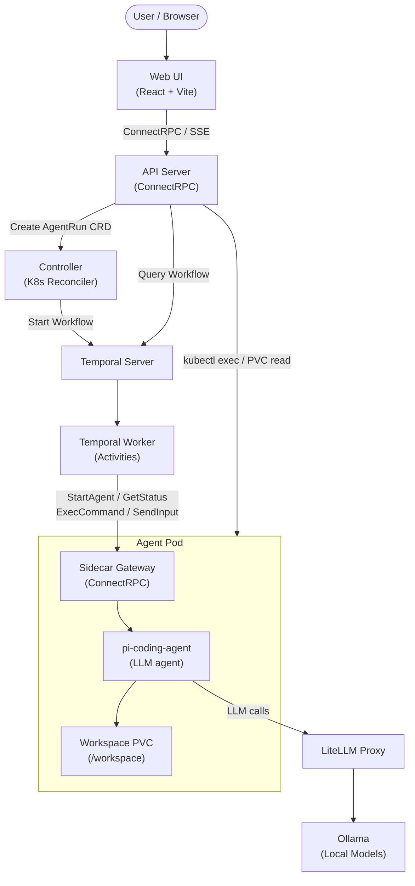

# UNCWORKS Architecture Overview

UNCWORKS (AOT) is a Kubernetes-native platform for running autonomous coding agents against software repositories. It uses a spec-driven pipeline where an LLM plans work as structured specs, a second LLM implements the code, and a third verifies the result -- all orchestrated by Temporal workflows.

## System Diagram

## Components

### Web UI (React)
Single-page application built with React, Vite, and TailwindCSS. Provides a dashboard for creating agent runs, monitoring live status via server-sent events, browsing workspace files, viewing agent logs and trace timelines, and sending human-in-the-loop input.

### API Server (ConnectRPC)
Go service exposing a ConnectRPC API (`AOTService`). Handles CRUD operations on AgentRun resources, proxies Temporal workflow queries for real-time status, serves file content from agent pods via kubectl exec, and provides SSE-based event streaming through an in-memory event bus.

### Controller (K8s Reconciler)
Kubernetes controller built with controller-runtime that watches `AgentRun` custom resources. When a new CRD appears, it starts a Temporal workflow and annotates the CRD with the workflow ID. On subsequent reconcile loops, it syncs the Temporal workflow state back to the CRD status. Deletion triggers workflow cancellation via a finalizer.

### Temporal Worker
Registers all workflow activities (LLM key provisioning, deployment creation, hydration wait, agent start/stop/status, verification, knowledge persistence). Maintains a ConnectRPC client to communicate with agent pod sidecars. Uses LiteLLM for display name generation and LLM judge evaluations.

### Temporal Server
External Temporal deployment providing durable workflow execution, task queues, signal/query support, and automatic retry with backoff. Workflows survive worker restarts and pod rescheduling.

### Agent Pods (pi + sidecar)
Each agent run gets a Kubernetes Deployment with a shared PVC. The pod contains two processes: the `pi-coding-agent` (LLM-powered coding agent) and the sidecar RPC gateway. The sidecar exposes ConnectRPC endpoints that the Temporal worker calls to start agents, poll status, execute commands, and relay human input. An init container hydrates the workspace before the agent starts.

### LiteLLM Proxy
Reverse proxy that provides a unified OpenAI-compatible API in front of multiple LLM backends. Handles API key management, rate limiting, model aliasing (e.g., `default-cloud` maps to a specific model), and budget enforcement per agent run.

### Ollama (Local Models)
Optional local model server for running open-weight models on the cluster. LiteLLM routes requests to Ollama when configured, enabling fully local operation without external API calls.

## Data Flow

1. User submits a prompt and repository URL via the Web UI.
2. API Server creates an `AgentRun` CRD in Kubernetes.
3. Controller detects the new CRD, starts a Temporal workflow, annotates the CRD.
4. Temporal Worker provisions an LLM key, creates the agent Deployment, and waits for workspace hydration.
5. The hydration init container clones repos as bare clones, creates git worktrees, sets up devbox, and writes the workspace manifest.
6. Worker starts the agent via the sidecar's `StartAgent` RPC and polls `GetStatus` until completion.
7. For spec-driven runs, the pipeline cycles through Plan, Execute, and Verify stages with retry on verification failure.
8. On completion, the worker scales down the Deployment and revokes the LLM key.
