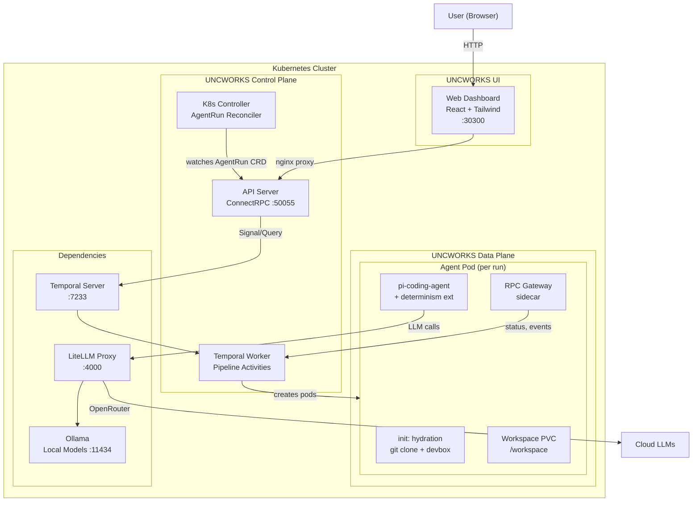

# UNCWORKS Architecture Overview

UNCWORKS is a Kubernetes-native agentic development environment. It runs AI coding agents against software repositories using a spec-driven pipeline where a manage agent plans work as structured specs, an implement agent writes the code, and the manage agent verifies the result -- all orchestrated by Temporal workflows inside Kubernetes.

## System Diagram

## Components

### UNCWORKS UI

| Component | Description |
|-----------|-------------|
| **Web Dashboard** | React + Tailwind SPA served via nginx. Activity feed, file browser, trace timeline, verification panel. Proxies API calls via nginx reverse proxy. |

### UNCWORKS Control Plane

| Component | Description |
|-----------|-------------|
| **API Server** | ConnectRPC/gRPC server. Handles CreateAgentRun, GetAgentRun, ListAgentRuns, CancelAgentRun, SendHumanInput. Also serves REST endpoints for structured logs, file browsing, and traces. |
| **K8s Controller** | Watches `AgentRun` CRDs and starts Temporal workflows. Maps CRD spec to workflow input. Updates CRD status from workflow state. |
| **Temporal Worker** | Executes pipeline activities: provision LLM keys, create agent deployments, wait for hydration, run plan/execute/verify stages, scale down pods, revoke keys. |

### UNCWORKS Data Plane

| Component | Description |
|-----------|-------------|
| **Agent Pod** | One pod per run. Three containers: hydration init (git worktree + devbox), pi-coding-agent (with determinism extension), RPC gateway sidecar. Workspace on a PVC at `/workspace`. |

### Dependencies

| Component | Description |
|-----------|-------------|
| **Temporal Server** | Orchestrates the spec-driven pipeline. Handles workflow state, signals, queries, retries, and compensation. |
| **LiteLLM Proxy** | Centralized LLM routing. Routes model requests to local Ollama or cloud providers (OpenRouter). Manages per-key budgets and fallback chains. |
| **Ollama** | Local LLM inference server. Runs qwen3:8b for zero-cost development. CPU or GPU. |

## Data Flow

1. User creates a run via the Web UI
2. API Server creates an `AgentRun` CRD
3. Controller detects the CRD and starts a Temporal workflow
4. Temporal Worker provisions an LLM key, creates an agent pod, and waits for hydration
5. Hydration init container clones repos as git worktrees and sets up devbox
6. Manage agent (plan stage) reads the repo and creates OpenSpec artifacts
7. Implement agent (execute stage) reads specs and writes code
8. Manage agent (verify stage) validates specs, checks tasks, runs LLM judge
9. On success: archive the change. On failure: retry execute with failure context.
10. Pod is scaled down, LLM key revoked.
