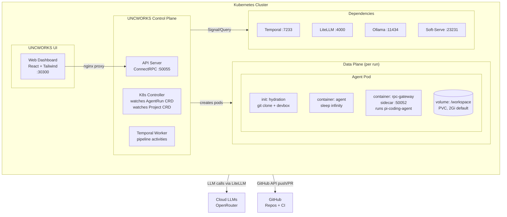
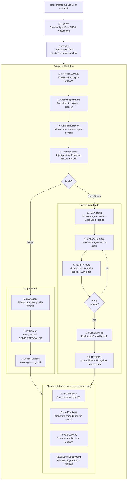
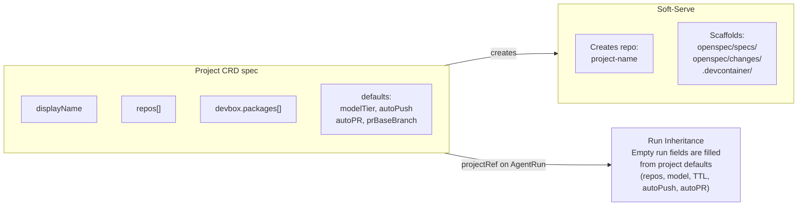
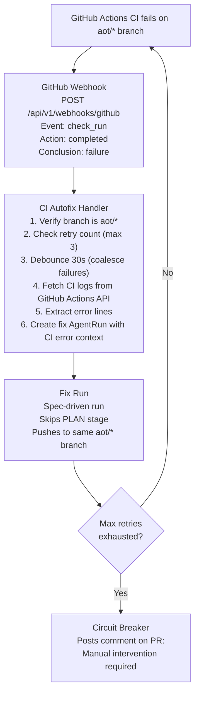
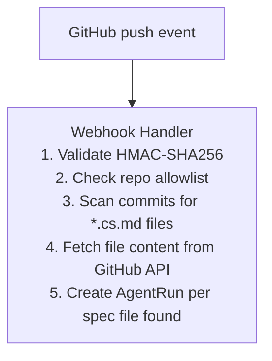

# UNCWORKS Architecture Overview

UNCWORKS is a Kubernetes-native agentic development platform. It runs AI coding agents against software repositories using a spec-driven pipeline where a manage agent plans work as structured OpenSpec artifacts, an implement agent writes code, and the manage agent verifies the result -- all orchestrated by Temporal workflows inside Kubernetes.

## System Diagram

## Components

### UNCWORKS UI

| Component | Description |
|-----------|-------------|
| **Web Dashboard** | React + Tailwind SPA served via nginx. Includes run list, run detail with activity feed, file browser, trace timeline, verification panel, and project management. Proxies API calls to the API Server via nginx reverse proxy. Port 30300 (NodePort). |
| **BFF (Nginx)** | Reverse proxy bundled in the web image. Routes `/api/` and `/connect/` to the API Server. Serves static assets for the SPA. |

### UNCWORKS Control Plane

| Component | Description |
|-----------|-------------|
| **API Server** | ConnectRPC/gRPC server on port 50055. Handles run CRUD (CreateAgentRun, GetAgentRun, ListAgentRuns, CancelAgentRun, SendHumanInput, GetRunGraph, SearchPastWork). Also serves REST endpoints for traces, files, logs, projects, archives, debug sessions, webhooks, and spec push/pull. |
| **K8s Controller** | Watches `AgentRun` CRDs and starts Temporal workflows. Maps CRD spec fields to workflow input. Updates CRD status from workflow state. Also reconciles `Project` CRDs: scaffolds soft-serve config repos, manages finalizers, tracks run counts and costs. |
| **Temporal Worker** | Executes pipeline activities: provision LLM keys via LiteLLM, create agent pods, wait for hydration, start/poll/stop agents, run plan/execute/verify stages, push changes to feature branches, create GitHub PRs, enrich run tags, persist knowledge data, scale down deployments, revoke keys. |

### UNCWORKS Data Plane

| Component | Description |
|-----------|-------------|
| **Agent Pod** | One Deployment per run with a PVC at `/workspace`. Three containers: hydration init (clones repos, installs devbox packages), agent container (holds workspace alive via `sleep infinity`), rpc-gateway sidecar (runs `pi-coding-agent`, exposes ConnectRPC on port 50052 for the Temporal Worker). PVC persists across pod restarts for debug access. |

### Dependencies

| Component | Description |
|-----------|-------------|
| **Temporal Server** | Workflow orchestration engine (:7233). Manages workflow state, signals (cancel, human-input), queries (get-state), retries, and compensation (cleanup on any exit path). |
| **LiteLLM Proxy** | Centralized LLM routing (:4000). Routes model requests to local Ollama or cloud providers (OpenRouter). Manages per-run virtual API keys with budget caps and model access control. |
| **Ollama** | Local LLM inference server (:11434). Runs models like qwen3:8b for zero-cost local development. Supports CPU or GPU. |
| **Soft-Serve** | In-cluster Git server (:23231). Hosts per-project config repositories containing OpenSpec artifacts, specs, and project configuration. Created automatically when a Project CRD is reconciled. |

## Data Flow: Run Creation to Completion

## Project System

Projects provide organizational structure and default configuration for runs.

When a Project is created:
1. The controller creates a soft-serve Git repo named `project-<name>`
2. The repo is scaffolded with OpenSpec directory structure
3. Runs referencing the project via `projectRef` inherit default configuration
4. Specs can be stored in the config repo and referenced by `specRef`
5. Project status tracks run count, last run, and aggregated cost

## CI Autofix

UNCWORKS can automatically fix CI failures on branches it created.

The autofix flow:
1. GitHub sends a `check_run` webhook when CI completes
2. Handler filters for `conclusion: failure` on `aot/*` branches
3. Multiple check_run events for the same SHA are debounced (30s window)
4. CI logs are fetched from GitHub Actions API, extracted from zip, and condensed to error-relevant lines
5. A new AgentRun is created with the CI errors as context
6. The fix run uses spec-driven mode but skips the PLAN stage
7. Changes are pushed to the same branch (AutoPush=true, AutoPR=false)
8. After 3 failed attempts, a circuit breaker comment is posted on the PR

## Webhook-Triggered Runs

Push events to repositories in the allowlist create runs automatically when `.cs.md` (CodeSpeak spec) files are added or modified.

