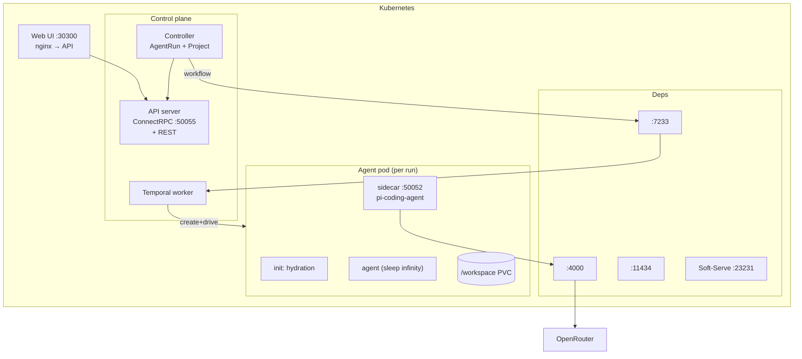

# Architecture overview

Everything runs inside one Kubernetes cluster, except the cloud LLM providers.
One workflow drives one pod. The pod owns one PVC. The sidecar fronts
`pi-coding-agent`.

```mermaid
flowchart TD
    subgraph K8s["Kubernetes"]
        subgraph CP["Control plane"]
            API["API server\nConnectRPC :50055\n+ REST"]
            Ctrl["Controller\nAgentRun + Project"]
            TW["Temporal worker"]
        end
        subgraph Deps["Deps"]
            Temporal[":7233"]
            LiteLLM[":4000"]
            Ollama[":11434"]
            Soft["Soft-Serve :23231"]
        end
        Web["Web UI :30300\nnginx → API"]
        subgraph Pod["Agent pod (per run)"]
            Init["init: hydration"]
            Agent["agent (sleep infinity)"]
            Side["sidecar :50052\npi-coding-agent"]
            PVC[("/workspace PVC")]
        end
        Web --> API
        Ctrl --> API
        Ctrl -->|workflow| Temporal
        Temporal --> TW
        TW -->|create+drive| Pod
        Side --> LiteLLM
    end
    LiteLLM --> Cloud["OpenRouter"]
```

## Pieces

| Layer | What it does |
|------|------|
| Web | React SPA that nginx proxies to the API. It serves the runs list, the run detail tabs (Overview, Logs, Files, Verify, Traces), and the project pages. |
| API server | Serves `AOTService` over ConnectRPC, plus REST endpoints for files, logs, traces, projects, archives, debug, webhooks, and spec push and pull. |
| Controller | Watches the `AgentRun` and `Project` resources. It stays thin: it starts and queries Temporal workflows, and reconciles the project's soft-serve repo. |
| Temporal worker | Holds all business logic. Its activities provision an LLM key, create the deployment, hydrate, plan, execute, verify, push, open a pull request, persist, embed, and clean up. |
| LiteLLM | Issues one scoped virtual key per run, with a budget cap and a model allowlist. Routes to Ollama or OpenRouter. |
| Ollama | Local inference. The `values.local.yaml` preset disables it. |
| Soft-Serve | In-cluster git server. It hosts one config repo per project, scaffolded with OpenSpec. |
| Hydration init container | Bare-clones each repo into `.bare/`, creates one worktree per repo on a new `aot/<branch>`, and runs `devbox install`. |
| Sidecar | Serves ConnectRPC over h2c on `:50052`. It spawns `pi`, parses the JSONL events, captures a git diff per tool call as a trace span, and handles human input through files in `.aot/input/`. |

## Run lifecycle

```mermaid
flowchart TD
    Create["API: CreateAgentRun → CRD"] --> Reconcile
    Reconcile["Controller starts Temporal workflow"] --> WF
    subgraph WF["Temporal workflow"]
        direction TB
        K["ProvisionLLMKey"] --> D["CreateDeployment"] --> H["WaitForHydration"] --> HC["HydrateContext"]
        HC --> Mode{Mode?}
        Mode -->|single| Single
        Mode -->|spec-driven| Spec
        subgraph Single
            S1["StartAgent → Poll → COMPLETED"]
        end
        subgraph Spec
            P["PLAN"] --> E["EXECUTE"] --> V["VERIFY"]
            V -->|fail + retries| E
            V -->|pass + autoPush| Push["PushChanges → PR"]
        end
        Single --> Approval
        Spec --> Approval
        Approval{Approval gate}
        Approval -->|llm-judge| Judge["LLM judge"]
        Approval -->|hitl| Human["Human approval"]
        Approval -->|hybrid (default)| Judge --> Human
        Human --> Done
        Judge -->|reject| Done
    end
    Done["Cleanup (deferred):\nPersistRunData → EmbedRunData → RevokeKey → ScaleDownDeployment"]
```

Cleanup is deferred. The workflow captures `llmKey` and `deploymentName` in its
own scope, and a `defer` runs the teardown activities on a disconnected context.
The teardown runs on every exit path: success, failure, and cancellation. This is
what stops the platform from leaking LLM keys and running pods.

## Projects

The `Project` resource is organizational. When you create one, the controller
scaffolds a soft-serve repo named `project-<name>` with the OpenSpec directory
structure, then sets `status.configRepoReady`. A run points at a project through
`projectRef`, and any empty run field inherits from `project.defaults`. A spec in
the project's config repo is addressable through `specRef`.

## CI autofix

A GitHub webhook drives the autofix loop. When a `check_run.completed` event
reports `failure` on an `aot/*` branch, and the run has retries left, the
platform fetches the CI logs from the Actions API, condenses them to the error
lines, and creates a spec-driven run that skips PLAN and pushes to the same
branch. The default retry limit is 3.

The trigger is debounced for 30 seconds so simultaneous failures coalesce into
one run. When the retries run out, the platform comments on the pull request
that manual intervention is required.

## Webhook-triggered runs

A GitHub `push` event that adds or modifies a `*.cs.md` CodeSpeak spec file
creates a run, if the repository is on the allowlist. HMAC-SHA256 validates the
signature. `GITHUB_WEBHOOK_SECRET` holds the secret, and
`GITHUB_WEBHOOK_REPOS` holds the comma-separated allowlist.
