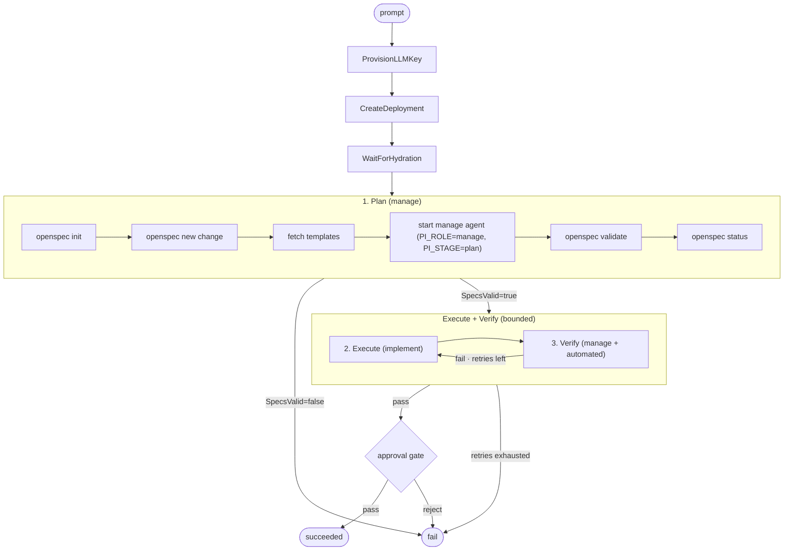

# Spec-driven pipeline



## 1. Plan

Activity `PlanRun`:

1. `openspec init --tools pi --force` in `/workspace` if not already initialized.
2. `openspec new change "<name>"` scaffolds `/workspace/openspec/changes/<name>/`.
3. `openspec status --change "<name>" --json` confirms the scaffold.
4. `openspec instructions {proposal,specs,tasks} --change "<name>" --json` for templates.
5. `StartAgent` with `stage=plan`, `PI_ROLE=manage`, prompt assembled from the user task + templates + exact file paths.
6. `openspec validate "<name>" --json` — structural validity.
7. `openspec status --change "<name>" --json` — all artifacts present.

`SpecsValid=false` terminates the pipeline immediately.

Rules enforced by the determinism extension during plan:

- Spec requirement text must contain `SHALL` or `MUST`.
- Scenarios use `WHEN/THEN`.
- `tasks.md` ≤ 30 checkboxes.
- Writes blocked outside `openspec/` and `.aot/`.

## 2. Execute

`implement` agent reads the spec, writes code, ticks `tasks.md`. Cannot use `ask_user`.

Retry prompt prefix:

```
PREVIOUS ATTEMPT FAILED VERIFICATION:
<failureReport>
```

## 3. Verify

Five gates in order:

| # | Gate | What |
|---|------|------|
| 1 | Task completion | `openspec list --json` — only enforced when the run has `openspecChange` set |
| 2 | Structural validation | `openspec validate "<name>" --json` |
| 2b | File existence | Backtick paths in `THEN ... exist` lines |
| 3 | Test commands | Backtick commands on `WHEN/THEN` lines with action keywords (run, test, build, compile, lint…) |
| 4 | LLM judge | Manage agent emits `{ pass, salvageable, criteria[] }` against git diff + specs |
| 5 | Archive | `openspec archive "<name>" --yes` (non-fatal on failure) |

The judge's `salvageable: false` ends the pipeline immediately — no retry.

## Defaults

| | Plan | Execute | Verify |
|---|---|---|---|
| Model | `default-cloud` | `default-cloud` | `default-cloud` |
| Timeout | 300s | 900s | 180s |
| Max retries | 2 | 3 | 1 |
| On failure | `fail` | `retry` | `fail` |

## VerificationResult

```json
{
  "pass": false,
  "tasksCompleted": 5,
  "tasksTotal": 7,
  "validationValid": true,
  "automatedChecks": [
    {"name": "task_completion", "pass": false, "output": "5/7 tasks complete"}
  ],
  "llmVerdict": {"pass": false, "salvageable": true, "criteria": [/* ... */]},
  "failureReport": "task completion: 5/7 tasks complete",
  "executionTimeMs": 12500
}
```

Written to the change directory; also persisted onto the CRD status as `verificationResult` for the UI.
