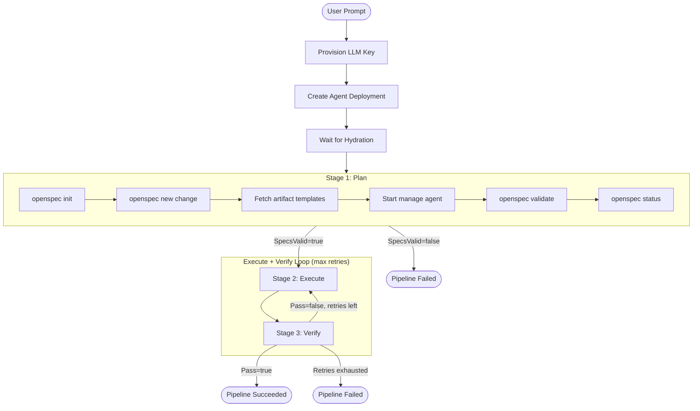

# Spec-Driven Pipeline

The spec-driven pipeline is the primary orchestration mode for UNCWORKS. It decomposes a user prompt into a structured Plan, delegates implementation to an Execute stage, and validates the result in a Verify stage. Verification failure triggers a retry loop with the failure report fed back as context.

## Pipeline Flow



## Stage 1: Plan

The planning stage uses a **manage** agent to generate OpenSpec artifacts from the user's prompt. The Temporal activity (`PlanRun`) orchestrates this through the sidecar:

1. **Initialize OpenSpec** -- Runs `openspec init --tools pi --force` in `/workspace` if not already initialized.
2. **Scaffold change** -- Runs `openspec new change "<name>"` to create the change directory structure under `/workspace/openspec/changes/<name>/`.
3. **Verify scaffold** -- Runs `openspec status --change "<name>" --json` to confirm the scaffolding succeeded.
4. **Fetch templates** -- Runs `openspec instructions proposal|specs|tasks --change "<name>" --json` to get artifact templates.
5. **Start manage agent** -- Builds a structured prompt with the user's task, templates, and exact file paths, then calls `StartAgent` with stage=`plan`. The agent reads the codebase, writes `proposal.md`, `design.md`, spec files, and `tasks.md`.
6. **Validate** -- Runs `openspec validate "<name>" --json` to check structural validity.
7. **Status check** -- Runs `openspec status --change "<name>" --json` to confirm all artifacts are complete.

If validation fails (`SpecsValid=false`), the pipeline terminates immediately with the validation errors.

### Plan Agent Rules
- Must use `SHALL` or `MUST` in spec requirement text (enforced by extension)
- Must include `WHEN/THEN` acceptance scenarios
- Must NOT implement any code (manage role blocks repo writes)
- Task count should be 3-15 for simple changes (extension blocks >30)

## Stage 2: Execute

The execute stage uses an **implement** agent to write the actual code changes:

1. The prompt instructs the agent to read the OpenSpec change artifacts and implement each task.
2. On retry, the prompt includes the previous verification failure report for context.
3. The agent reads specs at `/workspace/openspec/changes/<name>/specs/` for requirements.
4. The agent marks tasks as `[x]` in `tasks.md` as it completes them.
5. The Temporal worker polls `GetStatus` until the agent completes or fails.

### Per-Stage Configuration

Each stage has configurable parameters (with defaults):

| Parameter | Plan | Execute | Verify |
|-----------|------|---------|--------|
| Model | `default-cloud` | `default-cloud` | `default-cloud` |
| Timeout (seconds) | 300 | 900 | 180 |
| Max retries | 2 | 3 | 1 |
| On failure | `fail` | `retry` | `fail` |

## Stage 3: Verify

The verification stage evaluates the implementation against the spec's acceptance criteria through five gates:

### Gate 1: Task Completion
Runs `openspec list --json` and checks that all tasks for the change are marked complete. Fails if the change is not found, has zero tasks, or has incomplete tasks.

### Gate 2: Structural Validation
Runs `openspec validate "<name>" --json` to verify the spec structure is still valid after implementation.

### Gate 2b: File Existence
Parses spec files for `THEN ... exist` patterns with backtick-wrapped paths and checks that referenced files exist in the workspace.

### Gate 3: Automated Test Commands
Extracts backtick-wrapped commands from `WHEN/THEN` lines in spec files (matching keywords: `run`, `test`, `build`, `compile`, `lint`, etc.) and executes them. Any non-zero exit code fails the gate.

### Gate 4: LLM Judge
Starts a manage agent with the git diff summary and spec files. The agent evaluates each `WHEN/THEN` scenario and outputs a JSON verdict:
```json
{"pass": true, "criteria": [{"scenario": "...", "pass": true, "explanation": "..."}]}
```

### Gate 5: Archive
On success, runs `openspec archive "<name>" --yes` to move the change to the archive. Archive failure is logged but does not block the overall pass.

## Retry Logic

When verification fails, the pipeline retries the Execute + Verify cycle:

1. The `FailureReport` from the failed verification is captured.
2. On the next Execute attempt, the prompt is prefixed with: `PREVIOUS ATTEMPT FAILED VERIFICATION: <failure report>`.
3. The implement agent receives full context about what went wrong.
4. The retry count is bounded by `execCfg.MaxRetries` (default: 3).
5. If all retries are exhausted, the pipeline terminates with a failure containing the last failure report.

## Verification Result

Each verification produces a structured `VerificationResult` JSON written to the change directory:

```json
{
  "pass": false,
  "tasksCompleted": 5,
  "tasksTotal": 7,
  "validationValid": true,
  "automatedChecks": [
    {"name": "task_completion", "pass": false, "output": "5/7 tasks complete"}
  ],
  "failureReport": "task completion: 5/7 tasks complete",
  "executionTimeMs": 12500
}
```
