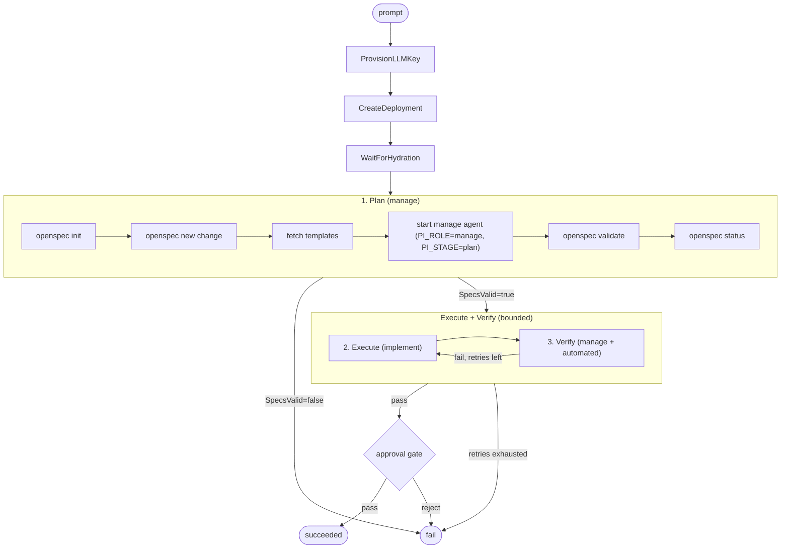

# Spec-driven pipeline


```mermaid
flowchart TD
    Start([prompt]) --> K["ProvisionLLMKey"]
    K --> D["CreateDeployment"] --> H["WaitForHydration"] --> P
    subgraph P["1. Plan (manage)"]
        P1["openspec init"] --> P2["openspec new change"] --> P3["fetch templates"]
        P3 --> P4["start manage agent (PI_ROLE=manage, PI_STAGE=plan)"]
        P4 --> P5["openspec validate"] --> P6["openspec status"]
    end
    P -->|SpecsValid=false| Fail([fail])
    P -->|SpecsValid=true| Loop
    subgraph Loop["Execute + Verify (bounded)"]
        E["2. Execute (implement)"] --> V["3. Verify (manage + automated)"]
        V -->|fail, retries left| E
    end
    Loop -->|pass| Approval
    Loop -->|retries exhausted| Fail
    Approval{approval gate} -->|pass| Done([succeeded])
    Approval -->|reject| Fail
```

## 1. Plan

Activity `PlanRun`:

1. `openspec init --tools pi --force` in `/workspace` if not already initialized.
2. `openspec new change "<name>"` scaffolds `/workspace/openspec/changes/<name>/`.
3. `openspec status --change "<name>" --json` confirms the scaffold.
4. `openspec instructions {proposal,specs,tasks} --change "<name>" --json` for templates.
5. Call `StartAgent` with `stage=plan` and `PI_ROLE=manage`. The prompt combines
   the user task, the templates, and the exact file paths.
6. Run `openspec validate "<name>" --json` to confirm structural validity.
7. Run `openspec status --change "<name>" --json` to confirm every artifact is
   present.

A `SpecsValid=false` result stops the pipeline at once.

The determinism extension enforces four rules during Plan.

- Every spec requirement MUST contain `SHALL` or `MUST`.
- Every scenario MUST use `WHEN` and `THEN`.
- `tasks.md` MUST hold no more than 30 checkboxes.
- The agent MUST NOT write outside `openspec/` and `.aot/`.

## 2. Execute

The `implement` agent reads the spec, writes the code, and checks off each
finished item in `tasks.md`. It cannot call `ask_user`.

A retry prepends the failure report to the prompt.

```
PREVIOUS ATTEMPT FAILED VERIFICATION:
<failureReport>
```

## 3. Verify

Five gates run in order.

| # | Gate | What |
|---|------|------|
| 1 | Task completion | `openspec list --json`. Runs only when the run sets `openspecChange` |
| 2 | Structural validation | `openspec validate "<name>" --json` |
| 2b | File existence | Every backtick-wrapped path on a `THEN ... exist` line resolves |
| 3 | Test commands | Every backtick-wrapped command on a `WHEN` or `THEN` line with an action keyword such as run, test, build, compile, or lint |
| 4 | LLM judge | The manage agent emits `{ pass, salvageable, criteria[] }` for the git diff and the specs |
| 5 | Archive | `openspec archive "<name>" --yes`. A failure here is logged, not fatal |

A judge verdict of `salvageable: false` ends the pipeline at once, with no
retry.

## Defaults

| | Plan | Execute | Verify |
|---|---|---|---|
| Model | `default-cloud` | `default-cloud` | `default-cloud` |
| Timeout | 300s | 900s | 180s |
| Max retries | 2 | 3 | 1 |
| On failure | `fail` | `retry` | `fail` |

## VerificationResult

```json
{
  "pass": false,
  "tasksCompleted": 5,
  "tasksTotal": 7,
  "validationValid": true,
  "automatedChecks": [
    {"name": "task_completion", "pass": false, "output": "5/7 tasks complete"}
  ],
  "llmVerdict": {"pass": false, "salvageable": true, "criteria": []},
  "failureReport": "task completion: 5/7 tasks complete",
  "executionTimeMs": 12500
}
```

The pipeline writes this to the change directory, and copies it onto the
resource status as `verificationResult` so the UI can read it.
