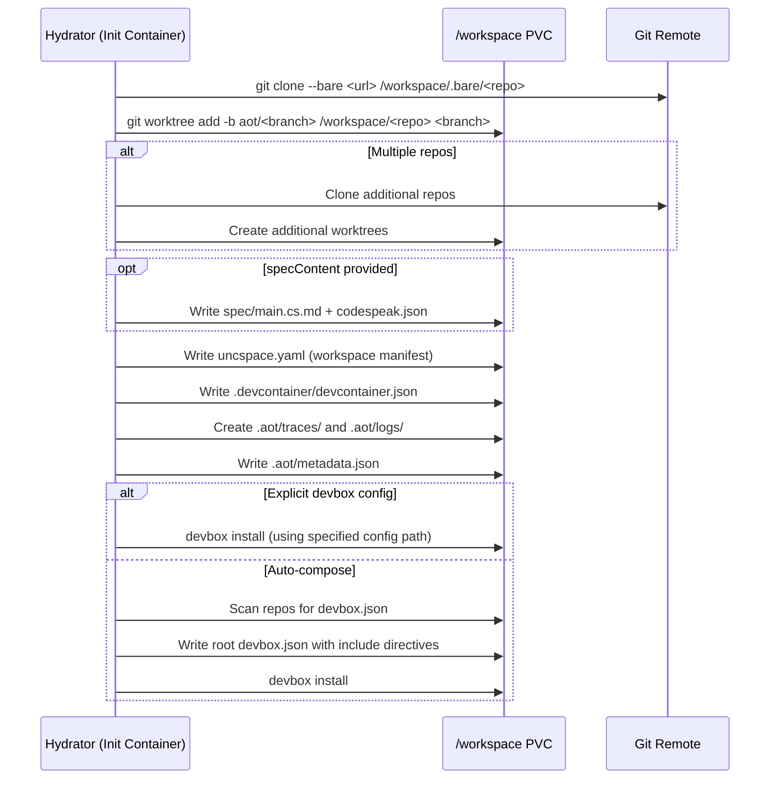

# Workspace Layout and Hydration

Each agent run gets an isolated workspace on a Kubernetes PVC mounted at `/workspace`. The workspace is provisioned by the hydration init container before the agent starts.

## Workspace Directory Structure

```
/workspace/
  <repo-name>/              # Git worktree (e.g., /workspace/myapp/)
    .git                     # Worktree link to bare repo
    src/                     # Source code
    devbox.json              # Per-repo devbox config (if present)
    ...
  .bare/
    <repo-name>/             # Bare clone of the repository
  openspec/
    config.yaml              # OpenSpec configuration
    changes/
      <change-name>/         # Active change being worked on
        .openspec.yaml
        proposal.md
        design.md
        tasks.md
        specs/
          <capability>/
            spec.md          # WHEN/THEN acceptance criteria
        verification-result.json  # Written by Verify stage
      archive/               # Completed changes
  .aot/
    metadata.json            # Run metadata (agent run ID, repos, prompt, model)
    logs/
      agent.log              # Human-readable agent output
      agent.jsonl            # Raw JSONL event stream (tool calls, responses)
    traces/
      spans.jsonl            # Trace spans for timeline visualization
    input/
      question.json          # HITL question from ask_user tool
      response.txt           # HITL response from SendInput RPC
    subagents/
      delegate-*.json        # Delegation tracking markers
    verification/
      <change>-result.json   # Fallback location for verification results
  .devcontainer/
    devcontainer.json        # VS Code Remote Containers config
  uncspace.yaml              # Workspace manifest (repos, devbox sources)
  devbox.json                # Root devbox config (includes per-repo configs)
  spec/
    main.cs.md               # CodeSpeak spec (if specContent provided)
  codespeak.json             # CodeSpeak config (if specContent provided)
```

## Hydration Process

The hydrator runs as an init container and provisions the workspace before the sidecar and agent start.



### Configuration (Environment Variables)

| Variable | Description |
|----------|-------------|
| `AOT_REPOS` | JSON array of `{url, branch, path}` objects for multi-repo support |
| `AOT_REPO_URL` | Single repo URL (fallback for backward compatibility) |
| `AOT_BRANCH` | Branch name (fallback, used with `AOT_REPO_URL`) |
| `AOT_WORKSPACE_DIR` | Workspace root (default: `/workspace`) |
| `AOT_DEVBOX_CONFIG` | Explicit path to devbox.json within the repo |
| `AOT_SPEC_CONTENT` | CodeSpeak spec content to write to the workspace |
| `AOT_AGENT_RUN_ID` | Agent run identifier for metadata |
| `AOT_PROMPT` | Original user prompt for metadata |
| `AOT_MODEL_TIER` | Model tier for metadata |

### Bare Clone + Worktree Strategy

The hydrator uses a two-step approach instead of a regular `git clone`:

1. **Bare clone** (`git clone --bare`) into `/workspace/.bare/<repo>/` -- stores only git objects, no working tree. This is the canonical repository data.
2. **Worktree** (`git worktree add -b aot/<branch>`) into `/workspace/<repo>/` -- creates a lightweight working copy linked to the bare clone on a new branch (`aot/main`, `aot/develop`, etc.).

This enables multiple worktrees from the same bare clone if needed, keeps the working directory clean, and creates an isolated branch for agent changes that does not affect the source branch.

## Devbox Integration

Devbox provides reproducible development environments by declaring system-level dependencies (compilers, runtimes, CLI tools) in `devbox.json`.

**Explicit config**: If `AOT_DEVBOX_CONFIG` is set, the hydrator runs `devbox install` using that config file path within the primary repo worktree.

**Auto-compose**: If no explicit config is set, the hydrator scans all repo worktrees for `devbox.json` files and generates a root `/workspace/devbox.json` with `include` directives pointing to each repo's config. Then it runs `devbox install` from the workspace root, installing all dependencies from all repos in one pass.

## OpenSpec Integration

OpenSpec is the structured specification framework used by the spec-driven pipeline.

The `/workspace/openspec/` directory lives at the workspace root (not inside any repo) so that spec artifacts are shared across repos in multi-repo setups. The pipeline's Plan stage initializes OpenSpec (`openspec init`), scaffolds a change (`openspec new change`), and directs the manage agent to populate the artifacts. The Verify stage uses `openspec validate`, `openspec status`, `openspec list`, and `openspec archive` to evaluate and finalize the change.

The workspace manifest (`uncspace.yaml`) records the mapping between repos and their worktree paths, enabling OpenSpec specs to reference files across repos using workspace-relative paths.
