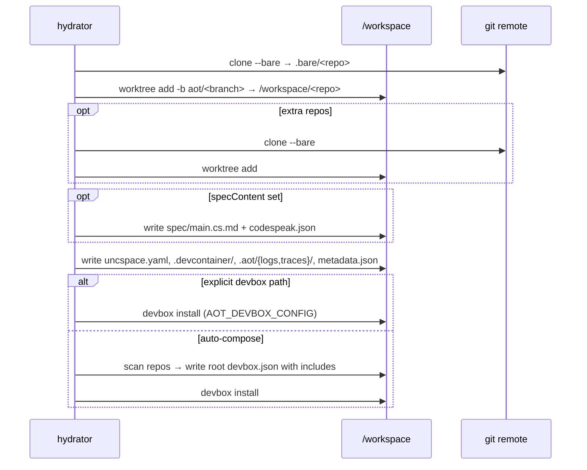

# Workspace and hydration

One PVC per run, mounted at `/workspace`. The hydration init container provisions it before the sidecar and agent start.

## Layout

```
/workspace/
  <repo>/                          worktree, checked out on aot/<branch>
    .git                           worktree link file (not a real .git dir)
  .bare/<repo>/                    bare clone (canonical objects)
  openspec/
    config.yaml
    changes/<change>/
      proposal.md  design.md  tasks.md
      specs/<capability>/spec.md
      verification-result.json
    changes/archive/
  .aot/
    metadata.json                  run id, repos, prompt, model
    logs/agent.log                 human-readable
    logs/agent.jsonl               raw pi events
    traces/spans.jsonl             tool-call + stage spans
    input/question.json            HITL question
    input/response.txt             HITL response
    subagents/delegate-*.json      delegation markers
    verification/<change>-result.json   fallback location
  .devcontainer/devcontainer.json
  uncspace.yaml                    workspace manifest (repos ↔ paths)
  devbox.json                      root config; auto-composed if not explicit
  spec/main.cs.md                  CodeSpeak spec (when specContent provided)
  codespeak.json                   ditto
```

## Hydration



### Env

| Var | Purpose |
|-----|---------|
| `AOT_REPOS` | JSON `[{url, branch, path}, ...]` for multi-repo |
| `AOT_REPO_URL`, `AOT_BRANCH` | Single-repo fallback |
| `AOT_WORKSPACE_DIR` | Workspace root (default `/workspace`) |
| `AOT_DEVBOX_CONFIG` | Path inside repo to a specific devbox.json |
| `AOT_SPEC_CONTENT` | CodeSpeak spec body |
| `AOT_AGENT_RUN_ID` | Run id |
| `AOT_PROMPT` | Original prompt (metadata only) |
| `AOT_MODEL_TIER` | Model tier (metadata only) |

## Bare + worktree

`git clone --bare` puts objects in `.bare/<repo>/`. `git worktree add -b aot/<branch>` creates the working copy at `/workspace/<repo>/` on a fresh branch.

This isolates agent changes from source branches (pushes go to `aot/<run-id>`) and lets multiple worktrees share one bare clone if multi-worktree flows are added later.

## Devbox

- **Explicit**: `AOT_DEVBOX_CONFIG` → `devbox install` against that path in the primary repo.
- **Auto-compose**: scan all repos for `devbox.json`, generate a root `/workspace/devbox.json` with `include` directives, then `devbox install` once from the root.

## OpenSpec

`/workspace/openspec/` lives at the workspace root, not inside any repo — spec artifacts are shared across repos in multi-repo runs. Plan stage runs `openspec init` (idempotent) and `openspec new change`. Verify uses `openspec validate`, `status`, `list`, and `archive`.

`uncspace.yaml` records the repo → worktree-path mapping so specs can reference files across repos with workspace-relative paths.
