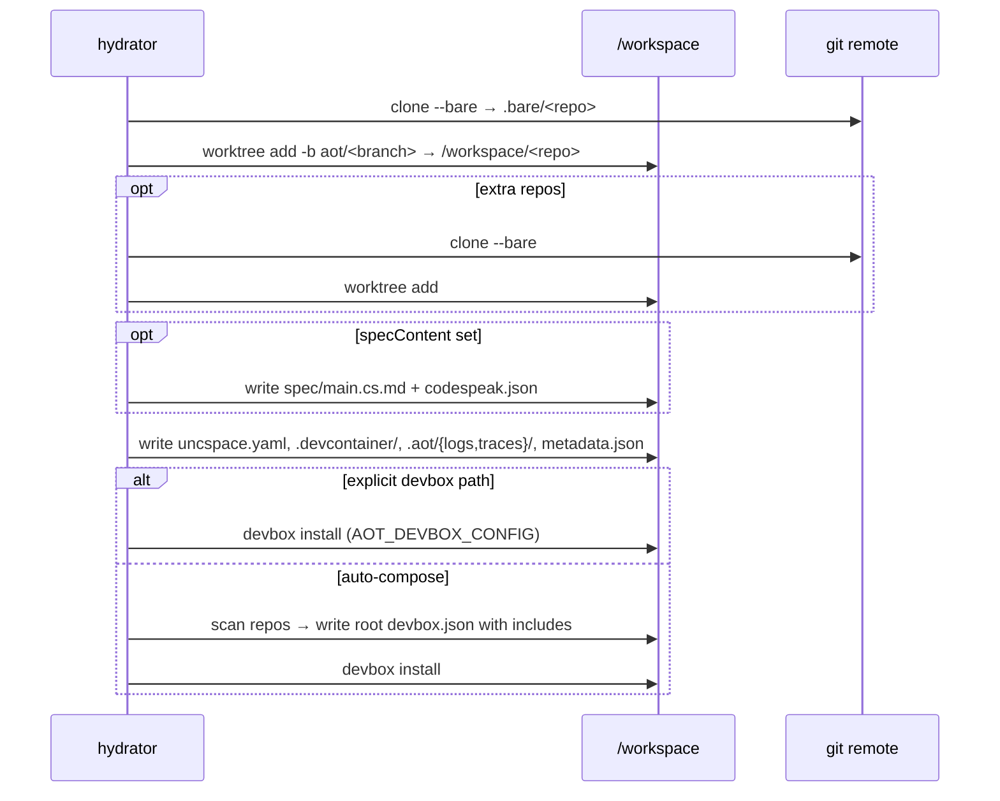

# Workspace and hydration

Each run gets one PVC, mounted at `/workspace`. The hydration init container
provisions it before the sidecar and the agent start.

## Layout

```
/workspace/
  <repo>/                          worktree, checked out on aot/<branch>
    .git                           worktree link file (not a real .git dir)
  .bare/<repo>/                    bare clone (canonical objects)
  openspec/
    config.yaml
    changes/<change>/
      proposal.md  design.md  tasks.md
      specs/<capability>/spec.md
      verification-result.json
    changes/archive/
  .aot/
    metadata.json                  run id, repos, prompt, model
    logs/agent.log                 human-readable
    logs/agent.jsonl               raw pi events
    traces/spans.jsonl             tool-call + stage spans
    input/question.json            HITL question
    input/response.txt             HITL response
    subagents/delegate-*.json      delegation markers
    verification/<change>-result.json   fallback location
  .devcontainer/devcontainer.json
  uncspace.yaml                    workspace manifest, repo to path
  devbox.json                      root config; auto-composed if not explicit
  spec/main.cs.md                  CodeSpeak spec (when specContent provided)
  codespeak.json                   ditto
```

## Hydration


```mermaid
sequenceDiagram
    participant H as hydrator
    participant PVC as /workspace
    participant Git as git remote

    H->>Git: clone --bare → .bare/<repo>
    H->>PVC: worktree add -b aot/<branch> → /workspace/<repo>
    opt extra repos
        H->>Git: clone --bare
        H->>PVC: worktree add
    end
    opt specContent set
        H->>PVC: write spec/main.cs.md + codespeak.json
    end
    H->>PVC: write uncspace.yaml, .devcontainer/, .aot/{logs,traces}/, metadata.json
    alt explicit devbox path
        H->>PVC: devbox install (AOT_DEVBOX_CONFIG)
    else auto-compose
        H->>PVC: scan repos → write root devbox.json with includes
        H->>PVC: devbox install
    end
```

### Environment variables

| Variable | Purpose |
|-----|---------|
| `AOT_REPOS` | JSON array of `{url, branch, path}` for a multi-repo run |
| `AOT_REPO_URL`, `AOT_BRANCH` | Fallback for a single-repo run |
| `AOT_WORKSPACE_DIR` | Workspace root. Defaults to `/workspace` |
| `AOT_DEVBOX_CONFIG` | Path inside the repo to a specific `devbox.json` |
| `AOT_SPEC_CONTENT` | CodeSpeak spec body |
| `AOT_AGENT_RUN_ID` | Run id |
| `AOT_PROMPT` | The original prompt. Metadata only |
| `AOT_MODEL_TIER` | The model tier. Metadata only |

## Bare + worktree

`git clone --bare` puts the objects in `.bare/<repo>/`.
`git worktree add -b aot/<branch>` creates the working copy at
`/workspace/<repo>/` on a fresh branch.

This isolates the agent's changes from the source branches, because every push
goes to `aot/<run-id>`. It also lets several worktrees share one bare clone, so a
multi-worktree flow stays cheap to add later.

## Devbox

Set `AOT_DEVBOX_CONFIG` to run `devbox install` against that path in the primary
repo.

Leave it unset to compose the config automatically. The hydrator scans every repo
for a `devbox.json`, writes a root `/workspace/devbox.json` with `include`
directives, and runs `devbox install` once from the root.

## OpenSpec

`/workspace/openspec/` sits at the workspace root rather than inside a repo, so
the spec artifacts are shared across every repo in a multi-repo run. The Plan
stage runs `openspec init`, which is idempotent, and then `openspec new change`.
The Verify stage runs `openspec validate`, `status`, `list`, and `archive`.

`uncspace.yaml` records which worktree path belongs to which repo, so a spec can
reference a file in another repo through a workspace-relative path.
