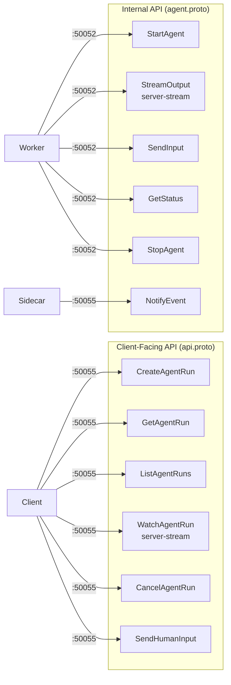
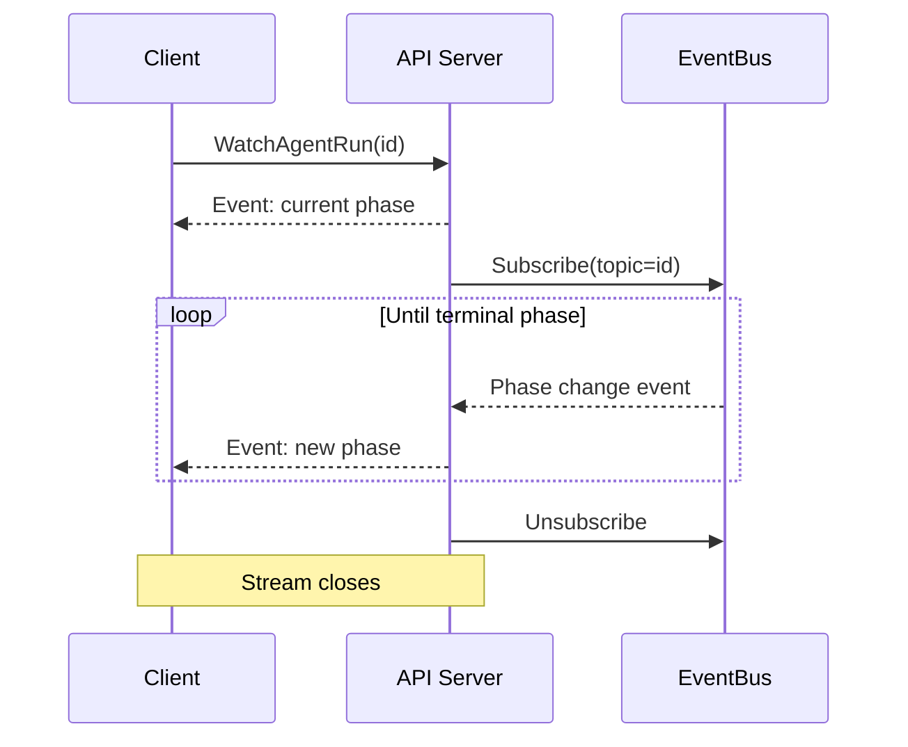
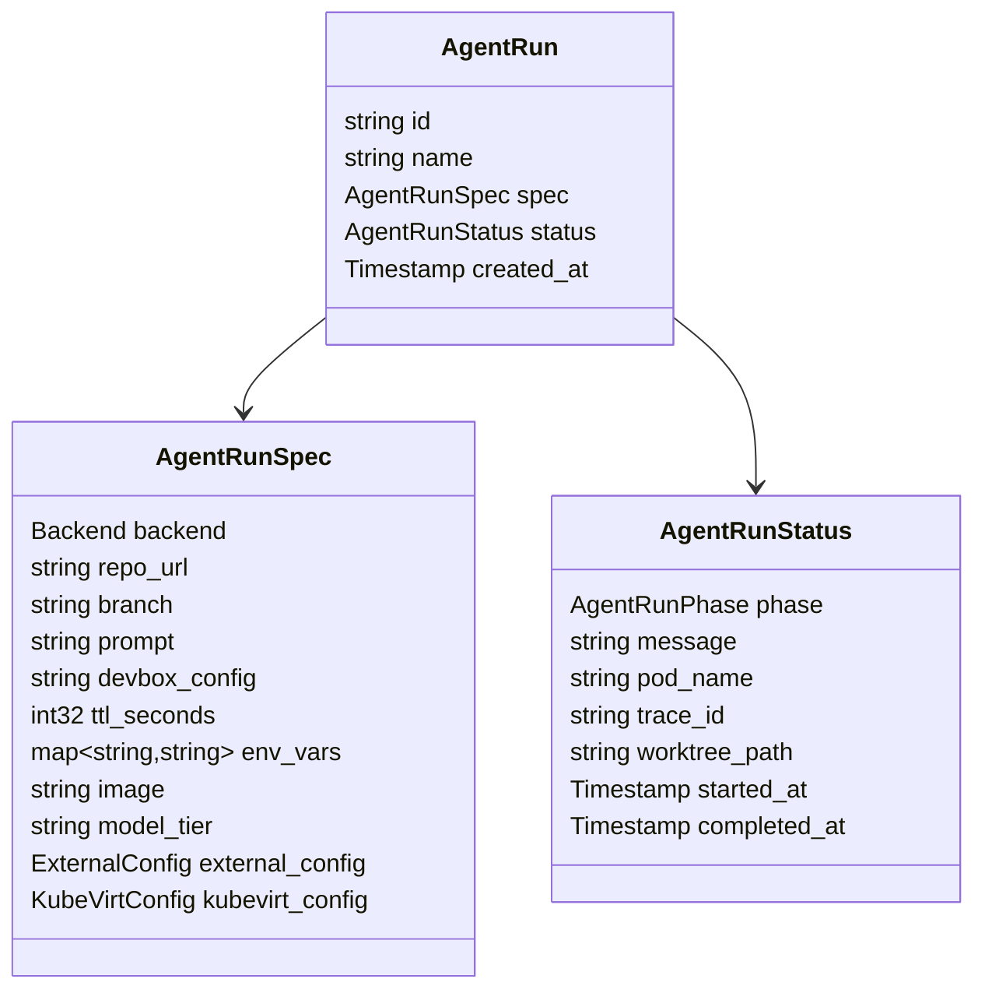

# gRPC API Reference

AOT exposes two gRPC services defined in Protocol Buffers and served via ConnectRPC. The API server supports three wire protocols simultaneously: gRPC, gRPC-Web, and Connect (HTTP/1.1 JSON).

## Service Overview



## Client API: `aot.api.v1.AOTService`

**Proto**: `proto/aot/api/v1/api.proto`
**Server**: API Server (`:50055`)
**Consumers**: Web Dashboard, TUI, CLI, any gRPC client

### CreateAgentRun

Creates a new agent run. The control plane provisions a pod, hydrates the workspace, and starts the agent.

```
rpc CreateAgentRun(CreateAgentRunRequest) returns (CreateAgentRunResponse)
```

**Request:**

| Field | Type | Required | Description |
|-------|------|----------|-------------|
| `spec.backend` | Backend enum | Yes | `BACKEND_POD`, `BACKEND_KUBEVIRT`, `BACKEND_EXTERNAL` |
| `spec.repo_url` | string | Yes | Git repository URL |
| `spec.branch` | string | No | Branch to check out (default: repo default) |
| `spec.prompt` | string | Yes | Task description for the agent |
| `spec.devbox_config` | string | No | Path to devbox.json |
| `spec.ttl_seconds` | int32 | No | Max lifetime (default: 3600) |
| `spec.env_vars` | map | No | Additional environment variables |
| `spec.model_tier` | string | No | `default`, `default-cloud`, `premium` |

**Response:** `CreateAgentRunResponse` containing the full `AgentRun` message with generated `id` and initial status (phase: `Pending`).

### GetAgentRun

Retrieves the current state of an agent run. When connected to Temporal, the response is enriched with real-time workflow state.

```
rpc GetAgentRun(GetAgentRunRequest) returns (AgentRun)
```

**Request:**

| Field | Type | Required | Description |
|-------|------|----------|-------------|
| `id` | string | Yes | Agent run ID |

### ListAgentRuns

Lists agent runs with optional filtering and pagination.

```
rpc ListAgentRuns(ListAgentRunsRequest) returns (ListAgentRunsResponse)
```

**Request:**

| Field | Type | Required | Description |
|-------|------|----------|-------------|
| `phase_filter` | AgentRunPhase | No | Filter by phase |
| `limit` | int32 | No | Max results to return |
| `cursor` | string | No | Pagination cursor |

**Response:** `ListAgentRunsResponse` containing `runs[]` and `next_cursor`.

### WatchAgentRun

Server-streaming RPC for real-time updates. Sends an initial event with the current phase, then streams subsequent events until the run reaches a terminal phase.

```
rpc WatchAgentRun(WatchAgentRunRequest) returns (stream AgentRunEvent)
```



**Request:**

| Field | Type | Required | Description |
|-------|------|----------|-------------|
| `id` | string | Yes | Agent run ID to watch |

**Event types:**

| Type | Description |
|------|-------------|
| `PHASE_CHANGED` | Run transitioned to a new phase |
| `LOG` | Log line from the agent |
| `TOOL_CALL` | Agent invoked a tool |
| `WAITING_FOR_INPUT` | Agent is paused for HITL (payload contains the question) |
| `COMPLETED` | Run finished (success or failure) |

### CancelAgentRun

Requests cancellation of a running agent. Sends a cancel signal to the Temporal workflow which triggers graceful shutdown (SIGINT).

```
rpc CancelAgentRun(CancelAgentRunRequest) returns (CancelAgentRunResponse)
```

**Request:**

| Field | Type | Required | Description |
|-------|------|----------|-------------|
| `id` | string | Yes | Agent run ID to cancel |

### SendHumanInput

Sends human input to an agent that is in the `WaitingForInput` phase. The input is delivered via a Temporal signal and forwarded to the agent's stdin through the sidecar.

```
rpc SendHumanInput(SendHumanInputRequest) returns (SendHumanInputResponse)
```

**Request:**

| Field | Type | Required | Description |
|-------|------|----------|-------------|
| `agent_run_id` | string | Yes | Agent run ID |
| `input` | string | Yes | Human response text |

**Errors:**
- Returns an error if the run is not in `WaitingForInput` phase.

## Internal API: `aot.agent.v1.AgentSidecarService`

**Proto**: `proto/aot/agent/v1/agent.proto`
**Server**: RPC Gateway Sidecar (`:50052`, per pod)
**Consumers**: Temporal Worker (via activities)

These RPCs are called by the Temporal worker's activities to control the agent process inside each pod.

### StartAgent

Launches the agent harness process inside the pod.

```
rpc StartAgent(StartAgentRequest) returns (StartAgentResponse)
```

The sidecar spawns: `devbox run -- agent --prompt <prompt>`

Sets up stdin/stdout/stderr pipes and transitions process state to Running.

### StreamOutput

Server-streaming RPC that returns agent stdout/stderr in real-time.

```
rpc StreamOutput(StreamOutputRequest) returns (stream AgentOutput)
```

**AgentOutput fields:**

| Field | Type | Description |
|-------|------|-------------|
| `type` | OutputType | `STDOUT`, `STDERR`, `TOOL_CALL`, `LLM_RESPONSE` |
| `data` | bytes | Output content |
| `timestamp` | Timestamp | When the output was produced |

Supports multiple concurrent subscribers (broadcast pattern).

### SendInput

Writes data to the agent process's stdin. Used for HITL responses.

```
rpc SendInput(SendInputRequest) returns (SendInputResponse)
```

### GetStatus

Returns the current state of the agent process.

```
rpc GetStatus(GetStatusRequest) returns (AgentStatus)
```

**AgentProcessState enum:**

| Value | Description |
|-------|-------------|
| `STARTING` | Process is being spawned |
| `RUNNING` | Process is actively executing |
| `WAITING_FOR_INPUT` | Process is blocked on stdin (HITL) |
| `COMPLETED` | Process exited successfully |
| `FAILED` | Process exited with error |

### StopAgent

Terminates the agent process.

```
rpc StopAgent(StopAgentRequest) returns (StopAgentResponse)
```

| Field | Type | Description |
|-------|------|-------------|
| `force` | bool | `false` = SIGINT (graceful), `true` = SIGKILL |

## Internal API: `aot.agent.v1.AgentNotificationService`

**Server**: API Server (`:50055`)
**Consumers**: Sidecar (pushes events from pod to control plane)

### NotifyEvent

Async notification from the sidecar to the control plane when something noteworthy happens in the agent pod.

```
rpc NotifyEvent(NotifyEventRequest) returns (NotifyEventResponse)
```

## Data Types

### AgentRun



### Enums

**AgentRunPhase:**
`PENDING` | `RUNNING` | `WAITING_FOR_INPUT` | `SUCCEEDED` | `FAILED` | `CANCELLED`

**Backend:**
`BACKEND_POD` | `BACKEND_KUBEVIRT` | `BACKEND_EXTERNAL`

### AgentRunEvent

| Field | Type | Description |
|-------|------|-------------|
| `agent_run_id` | string | Parent agent run |
| `type` | EventType | Event classification |
| `payload` | string | Event-specific data (JSON) |
| `timestamp` | Timestamp | When the event occurred |

## Connecting

### gRPC (Go, Python, etc.)

```bash
grpcurl -plaintext localhost:50055 aot.api.v1.AOTService/ListAgentRuns
```

### gRPC-Web (Browser)

The web dashboard uses `@connectrpc/connect-web` with the `createGrpcWebTransport`:

```typescript
import { createGrpcWebTransport } from "@connectrpc/connect-web";
import { createClient } from "@connectrpc/connect";
import { AOTService } from "../gen/ts/aot/api/v1/api_pb";

const transport = createGrpcWebTransport({ baseUrl: "http://localhost:50055" });
const client = createClient(AOTService, transport);
const runs = await client.listAgentRuns({});
```

In development, the Vite dev server proxies `/aot.api.v1.AOTService/*` to the API server to avoid CORS issues.

### Connect (HTTP/1.1 JSON)

ConnectRPC also supports plain HTTP POST with JSON bodies:

```bash
curl -X POST http://localhost:50055/aot.api.v1.AOTService/ListAgentRuns \
  -H "Content-Type: application/json" \
  -d '{}'
```

## Validation

All requests are validated using [protovalidate](https://github.com/bufbuild/protovalidate) via a ConnectRPC interceptor. Invalid requests return `INVALID_ARGUMENT` errors with field-level details before reaching handler logic.
