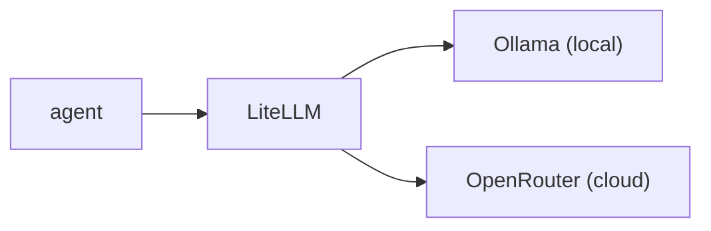

# Models

Every LLM call routes through LiteLLM on port 4000. The agent selects a model by
name. LiteLLM handles authentication, routing, retries, and fallbacks. The config
is `deploy/litellm/litellm-config.yaml`.



## Built-in models

### Local, served by Ollama

| Name | Backend |
|------|---------|
| `qwen3:8b` | Default local model |
| `llama3.1:8b` | Alternative |
| `qwen2.5:0.5b` | CI only |
| `default` | Alias for `qwen3:8b` |
| `ci` | Alias for `qwen2.5:0.5b` |

### Cloud, served by OpenRouter

| Name | Provider | USD per million in and out | Context |
|------|----------|-------------:|--------:|
| `deepseek-v3.1` | DeepSeek | 0.15 / 0.75 | 32K |
| `deepseek-v3.2` | DeepSeek | 0.26 / 0.38 | 164K |
| `qwen3-coder` | Qwen | 0.22 / 1.00 | 262K |
| `mistral-medium` | Mistral | 0.40 / 2.00 | 131K |
| `default-cloud` | DeepSeek | alias for `deepseek-v3.2` | |
| `premium` | Qwen | alias for `qwen3-coder` | |
| `llm-judge` | DeepSeek | alias for `deepseek-v3.1` | |

### Free tier

| Name | Provider |
|------|----------|
| `qwen3-coder-free` | Qwen through OpenRouter |
| `mistral-small-free` | Mistral through OpenRouter |
| `gpt-oss-120b-free` | OpenRouter |

Free models are rate limited. `uncworks runs credits` marks them with `(free)`.

## Fallbacks

LiteLLM falls through to the next model when a provider fails.

- `qwen3-coder` falls back to `deepseek-v3.2`, then `deepseek-v3.1`, then
  `qwen3:8b`.
- `deepseek-v3.2` falls back to `qwen3-coder`, then `deepseek-v3.1`, then
  `qwen3:8b`.
- `default-cloud` falls back to `deepseek-v3.2`, then `qwen3:8b`.

## Adding a model

Edit `deploy/litellm/litellm-config.yaml`.

```yaml
- model_name: "my-model"
  litellm_params:
    model: "openrouter/provider/model-name"
```

An Ollama model needs the `ollama_chat/` prefix and an `api_base`.

```yaml
- model_name: "my-local-model"
  litellm_params:
    model: "ollama_chat/model:tag"
    api_base: "http://ollama:11434"
```

## OpenRouter

```
OPENROUTER_API_KEY=sk-or-...
```

Set the key during `uncworks setup`, or pass it through Helm values. LiteLLM
holds the key and the agent never sees it. Each agent pod gets a scoped LiteLLM
virtual key with a budget cap and a per-key model allowlist.

## Selecting a model per run and per stage

`modelTier` on the `AgentRun` spec selects the model for the run. A spec-driven
run can override each stage through
`pipelineConfig.{plan,execute,verify}.model`. The LLM judge always uses
`deepseek-v3.1`, so judge cost stays independent of agent cost.
