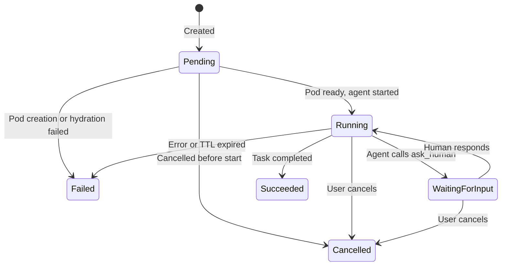
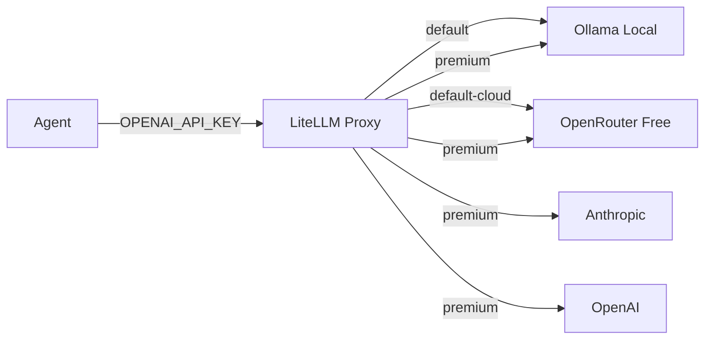

# AOT Reference: States, Enums & Configuration

Quick reference for every variable, status, and option you'll see in the AOT dashboard and API.

---

## Agent Run Phases

Every agent run has a **phase** that represents where it is in its lifecycle. The phase is the primary status indicator throughout the UI.



| Phase | UI Color | Meaning | What to do |
|-------|----------|---------|------------|
| **Pending** | Amber | Run created. Pod is being provisioned or workspace is hydrating (git clone + devbox install). | Wait. If stuck for more than 10 minutes, check pod events with `kubectl describe`. |
| **Running** | Blue (pulsing) | Agent is actively working on the task. | Monitor progress in the status message. |
| **Waiting for Input** | Purple | Agent is paused and asking the human operator a question (HITL). | Read the status message, type your response in the Human Input box, and send. |
| **Succeeded** | Green | Agent completed the task. | Review the results. Check for a PR link if one was created. |
| **Failed** | Red | Something went wrong — agent error, git push rejected, TTL expired, init container failed, etc. | Read the status message for the error. Check pod logs with `kubectl logs`. |
| **Cancelled** | Gray | A user explicitly cancelled the run. | No action needed. Create a new run if you want to retry. |

### Terminal vs Active

- **Active phases**: Pending, Running, WaitingForInput — the run is still in progress, the Cancel button is available.
- **Terminal phases**: Succeeded, Failed, Cancelled — the run is finished, the pod has been cleaned up, the LLM key has been revoked.

---

## Backends

The **backend** determines how and where the agent process executes.

| Backend | UI Color | Isolation Level | Status | Description |
|---------|----------|----------------|--------|-------------|
| **Pod** | Blue | Container (shared kernel) | Implemented | Default. Agent runs in a Kubernetes pod with 3 containers (init, agent, sidecar). Fast startup, low overhead. |
| **KubeVirt** | Violet | VM (dedicated kernel) | Planned | Agent runs in a KubeVirt virtual machine. Full OS-level isolation for untrusted workloads or when the agent needs root access. |
| **External** | Teal | SSH to remote host | Planned | Agent runs on an existing machine via SSH. For local development or using pre-provisioned infrastructure. |

### Pod Backend (default)

No additional configuration needed. The system creates a pod with:
- **Init container**: Clones the repo + runs devbox install
- **Agent container**: Runs the AI coding agent
- **Sidecar**: RPC gateway for control plane communication

### KubeVirt Backend (planned)

Requires `kubeVirtConfig` in the spec:

| Field | Type | Default | Description |
|-------|------|---------|-------------|
| `cpus` | int | 2 | Number of vCPUs |
| `memoryMB` | int | 4096 | RAM in megabytes |
| `diskGB` | int | 20 | Disk size in gigabytes |

### External Backend (planned)

Requires `externalConfig` in the spec:

| Field | Type | Default | Description |
|-------|------|---------|-------------|
| `host` | string | — | SSH host address |
| `port` | int | 22 | SSH port |
| `user` | string | — | SSH username |
| `sshKeySecret` | string | — | Name of Kubernetes Secret containing the SSH private key |

---

## Model Tiers

The **model tier** controls which LLM providers the agent can access. All LLM traffic is routed through a LiteLLM proxy which enforces tier restrictions and tracks spend per run.

| Tier | UI Label | UI Color | Models Available | Cost |
|------|----------|----------|-----------------|------|
| **`default`** | Local | Gray | Ollama local models only (e.g. `llama3.1:8b`) | Free |
| **`default-cloud`** | Cloud | Sky blue | Ollama local + OpenRouter free tier | Free |
| **`premium`** | Premium | Amber | All of the above + Anthropic Claude, OpenAI GPT-4 | Pay-per-use |

### How it works



Each agent run gets a **scoped virtual API key** that:
- Restricts which models the agent can call based on the tier
- Enforces a per-run budget cap
- Tracks cumulative spend
- Is automatically revoked when the run completes (any terminal phase)

---

## Agent Run Spec Fields

These are the fields you set when creating a new agent run. In the UI, these map to the "New Agent Run" form.

| Field | Type | Required | Default | UI Control | Description |
|-------|------|----------|---------|------------|-------------|
| `name` | string | Yes | — | Text input | Human-readable name (e.g. `fix-auth-middleware`) |
| `backend` | Backend | Yes | `Pod` | Dropdown | Where to run the agent |
| `repoURL` | string | Yes | — | Dropdown (repos) | Git repository URL |
| `branch` | string | No | repo default | Text input | Git branch to check out |
| `prompt` | string | Yes | — | Textarea | Task description for the agent |
| `modelTier` | ModelTier | No | `default` | Dropdown | LLM access level |
| `ttlSeconds` | int | No | 3600 | Number input | Maximum run duration in seconds |
| `devboxConfig` | string | No | — | — | Path to devbox.json for environment setup |
| `envVars` | map | No | — | — | Additional environment variables injected into the agent container |
| `image` | string | No | system default | — | Override for agent container image |

---

## Agent Run Status Fields

These are read-only fields set by the system as the run progresses. In the UI, they appear in the detail panel.

| Field | Type | Description | When set |
|-------|------|-------------|----------|
| `phase` | AgentRunPhase | Current lifecycle phase | Always |
| `message` | string | Human-readable status or error message | Updated throughout lifecycle |
| `podName` | string | Kubernetes pod name | After pod is created |
| `traceID` | string | OpenTelemetry trace ID for distributed tracing | After agent starts |
| `worktreePath` | string | Path to the git worktree on the agent | After hydration |
| `startedAt` | timestamp | When the agent process started | Phase → Running |
| `completedAt` | timestamp | When the run reached a terminal phase | Phase → Succeeded/Failed/Cancelled |

---

## Event Types

Events are streamed in real-time via `WatchAgentRun`. They appear in the Events view in the sidebar.

| Type | Description | Payload |
|------|-------------|---------|
| `PHASE_CHANGED` | Run transitioned to a new phase | New phase value |
| `LOG` | Log line from the agent process | Log text |
| `TOOL_CALL` | Agent invoked a tool (e.g. file edit, shell command) | Tool name + arguments |
| `WAITING_FOR_INPUT` | Agent paused for human input | The question being asked |
| `COMPLETED` | Run finished | Final phase + message |

---

## TTL (Time-to-Live)

Every run has a TTL that caps how long it can execute. This prevents runaway agents from consuming resources indefinitely.

| Value | Duration | Use case |
|-------|----------|----------|
| 300 | 5 minutes | Quick, scoped fixes |
| 1800 | 30 minutes | Typical tasks |
| 3600 | 1 hour | Default. Complex tasks. |
| 7200 | 2 hours | Large refactors |
| 86400 | 24 hours | Maximum allowed |

When the TTL expires:
1. The workflow sends SIGINT to the agent (graceful shutdown)
2. The phase transitions to **Failed** with message "Exceeded TTL"
3. The pod is cleaned up and the LLM key is revoked

---

## Kubernetes Labels

Agent run pods are labeled for easy querying with `kubectl`:

| Label | Value | Description |
|-------|-------|-------------|
| `app.kubernetes.io/name` | `aot-agent` | All agent pods |
| `aot.uncworks.io/agentrun` | `<run-name>` | Links pod to its AgentRun CRD |
| `aot.uncworks.io/parent` | `<parent-name>` | Set on junior agents (multi-agent) |
| `aot.uncworks.io/role` | `junior` | Marks child agent runs |
| `aot.uncworks.io/managed` | `true` | Marks system-managed child runs |

### Examples

```bash
# All agent pods
kubectl get pods -l app.kubernetes.io/name=aot-agent

# Pods for a specific run
kubectl get pods -l aot.uncworks.io/agentrun=fix-auth-middleware

# All junior agents spawned by a senior
kubectl get agentruns -l aot.uncworks.io/parent=my-senior-run
```

---

## Kubernetes Annotations

| Annotation | Value | Description |
|------------|-------|-------------|
| `aot.uncworks.io/workflow-id` | Temporal workflow ID | Links CRD to its Temporal workflow. Set by the controller. |

---

## Environment Variables (Operator)

These configure the AOT control plane components, not the agent itself.

### API Server

| Variable | Default | Description |
|----------|---------|-------------|
| `LISTEN_ADDR` | `:50055` | gRPC server bind address |
| `TEMPORAL_HOST` | `localhost:7233` | Temporal frontend address |
| `TEMPORAL_NAMESPACE` | `default` | Temporal namespace |

### Controller

| Variable | Default | Description |
|----------|---------|-------------|
| `TEMPORAL_HOST` | `localhost:7233` | Temporal frontend address |
| `TEMPORAL_NAMESPACE` | `default` | Temporal namespace |
| `TEMPORAL_TASK_QUEUE` | `aot-agent-runs` | Temporal task queue |
| `METRICS_ADDR` | `:8090` | Metrics server bind address |

### Temporal Worker

| Variable | Default | Description |
|----------|---------|-------------|
| `TEMPORAL_HOST` | `localhost:7233` | Temporal frontend address |
| `TEMPORAL_NAMESPACE` | `default` | Temporal namespace |
| `TEMPORAL_TASK_QUEUE` | `aot-agent-runs` | Temporal task queue |
| `LITELLM_BASE_URL` | `http://litellm:4000` | LiteLLM proxy URL |
| `LITELLM_MASTER_KEY` | — (required) | Master key for LiteLLM Admin API |
| `AOT_AGENT_IMAGE` | system default | Agent container image |
| `AOT_SIDECAR_IMAGE` | system default | Sidecar container image |
| `AOT_INIT_IMAGE` | system default | Init (hydration) container image |

### Sidecar (per pod)

| Variable | Default | Description |
|----------|---------|-------------|
| `AOT_SIDECAR_PORT` | `50052` | RPC gateway listen port |

### Hydration Init Container (per pod)

| Variable | Default | Description |
|----------|---------|-------------|
| `AOT_REPO_URL` | — (required) | Git repository to clone |
| `AOT_BRANCH` | repo default | Branch to check out |
| `AOT_WORKSPACE_DIR` | `/workspace` | Root workspace directory |
| `AOT_DEVBOX_CONFIG` | — | Path to devbox.json |
