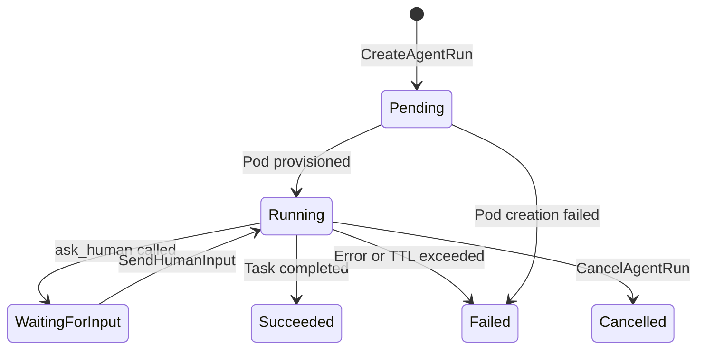
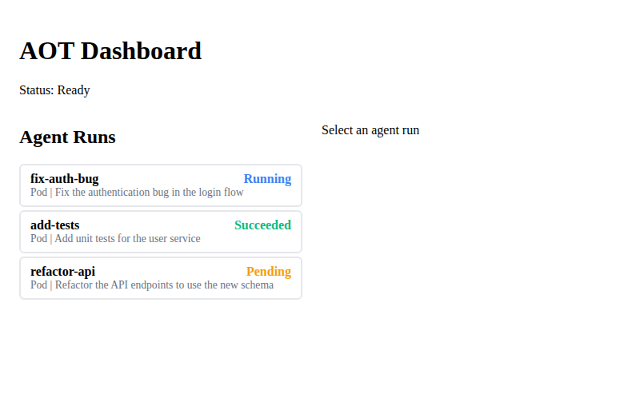
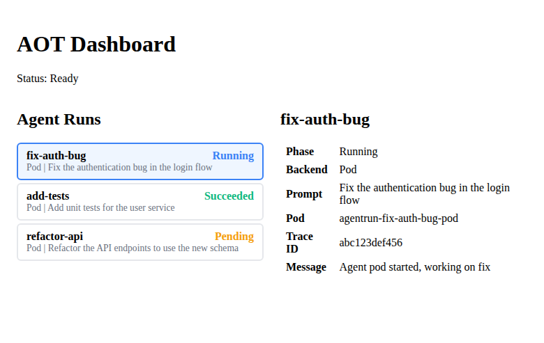
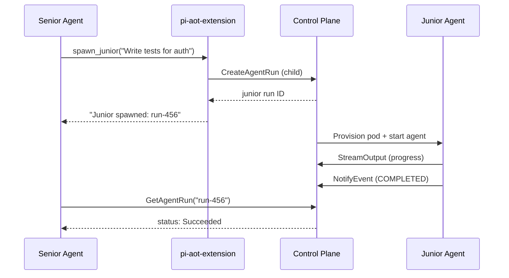
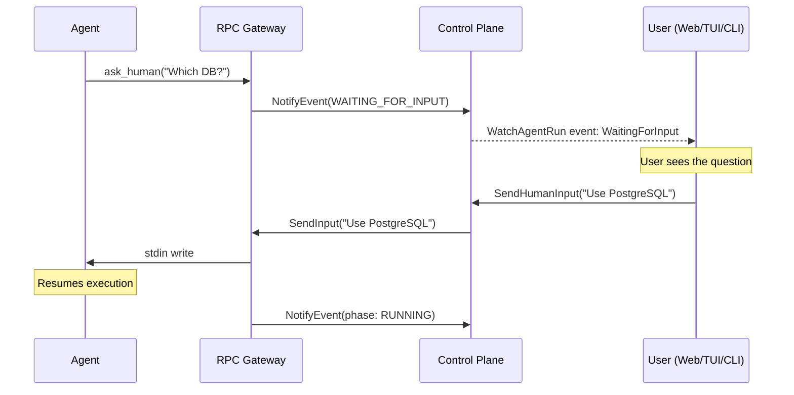

# AOT User Guide

This guide covers all typical user paths: setting up a local cluster, creating and monitoring agent runs, using multi-agent workflows, and working with human-in-the-loop interactions.

---

## Table of Contents

1. [Getting Started](#getting-started)
2. [Creating an AgentRun](#creating-an-agentrun)
3. [Monitoring Agents](#monitoring-agents)
4. [Multi-Agent Workflows](#multi-agent-workflows)
5. [Human-in-the-Loop (HITL)](#human-in-the-loop-hitl)
6. [Local Development with k0s](#local-development-with-k0s)
7. [The aot CLI](#the-aot-cli)

---

## Getting Started

### 1. Install Devbox

AOT uses [Devbox](https://www.jetify.com/devbox) to manage development dependencies via Nix. Install it first:

```bash
curl -fsSL https://get.jetify.com/devbox | bash
```

### 2. Enter the Development Shell

```bash
cd uncworks
devbox shell
```

This installs and activates:
- Go (latest)
- Node.js 22
- protobuf + protoc-gen-go + protoc-gen-go-grpc
- k0sctl + kubectl
- PostgreSQL 16

### 3. Install Dependencies

```bash
task install
```

This runs `go mod tidy` and `npm install` in the web dashboard, shared package, pi-aot-extension, and TUI.

### 4. Set Up the Local Cluster

```bash
task k0s:setup    # initializes a local k0s Kubernetes cluster (requires sudo)
task k0s:crd      # applies the AgentRun CRD to the cluster
```

### 5. Build Binaries

```bash
task build
```

This produces five binaries in `./bin/`:
- `apiserver` -- gRPC API server + WebSocket hub
- `controller` -- Kubernetes controller for AgentRun reconciliation
- `hydration` -- init-container that clones repos and runs devbox
- `sidecar` -- RPC Gateway that bridges agent containers to the control plane
- `aot` -- CLI tool

### 6. Verify the Setup

```bash
kubectl get crd agentruns.aot.uncworks.io
```

You should see the AgentRun CRD registered.

---

## Creating an AgentRun

An AgentRun is the fundamental unit of work in AOT. It represents a single agent execution with a prompt, a git repo, and a backend.

### Option A: Via gRPC

Use a gRPC client (such as `grpcurl` or a custom client) to call `CreateAgentRun`:

```bash
grpcurl -plaintext -d '{
  "spec": {
    "backend": "BACKEND_POD",
    "repo_url": "https://github.com/your-org/your-repo.git",
    "branch": "main",
    "prompt": "Add unit tests for the auth module",
    "ttl_seconds": 1800,
    "env_vars": {
      "ANTHROPIC_API_KEY": "sk-ant-..."
    }
  }
}' localhost:50051 aot.api.v1.AOTService/CreateAgentRun
```

The response includes the created `AgentRun` with its `id`, which you will use to monitor, cancel, or send input.

### Option B: Via kubectl

Apply an AgentRun manifest directly:

```yaml
apiVersion: aot.uncworks.io/v1alpha1
kind: AgentRun
metadata:
  name: my-agent-run
  namespace: default
spec:
  backend: Pod
  repoURL: https://github.com/your-org/your-repo.git
  branch: main
  prompt: "Add unit tests for the auth module"
  ttlSeconds: 1800
  envVars:
    ANTHROPIC_API_KEY: "sk-ant-..."
```

```bash
kubectl apply -f agentrun.yaml
```

### Option C: Via the Web Dashboard

1. Start the dev server: `task dev:web`
2. Open http://localhost:5173 in your browser.
3. The dashboard shows the list of existing agent runs. Use the UI to create new ones (when the creation form is available).

### What Happens After Creation

1. The controller detects the new `AgentRun` resource.
2. It creates a Pod with three containers:
   - **hydration** (init-container): clones the git repo into `/workspace` and runs `devbox install` if a `devboxConfig` is specified.
   - **agent**: executes the AI coding agent with the given prompt inside the provisioned workspace.
   - **rpc-gateway** (sidecar): exposes a gRPC service on port 50052 that bridges the agent to the control plane.
3. The `AgentRun` status transitions: `Pending` -> `Running`.
4. When the agent completes: `Running` -> `Succeeded` or `Failed`.
5. If the TTL expires before completion: `Running` -> `Failed` with message "Exceeded TTL".

### AgentRun Spec Fields

| Field           | Required | Default  | Description                                       |
|-----------------|----------|----------|---------------------------------------------------|
| `backend`       | yes      | `Pod`    | Execution backend (`Pod`, `KubeVirt`, `External`) |
| `repoURL`       | yes      | --       | Git repository URL                                |
| `branch`        | no       | --       | Git branch to check out                           |
| `prompt`        | yes      | --       | Task description for the agent                    |
| `devboxConfig`  | no       | --       | Path to devbox.json for environment setup          |
| `ttlSeconds`    | no       | 3600     | Maximum lifetime in seconds                       |
| `envVars`       | no       | --       | Map of additional environment variables           |
| `image`         | no       | (default)| Override for agent container image                |
| `externalConfig`| no       | --       | SSH config for External backend                   |
| `kubeVirtConfig`| no       | --       | VM config for KubeVirt backend                    |

### AgentRun Phases



| Phase             | Meaning                                         |
|-------------------|------------------------------------------------|
| `Pending`         | AgentRun created, pod not yet provisioned       |
| `Running`         | Agent is actively executing                     |
| `WaitingForInput` | Agent paused, waiting for human input (HITL)    |
| `Succeeded`       | Agent completed the task successfully           |
| `Failed`          | Agent failed or exceeded TTL                    |
| `Cancelled`       | Agent was cancelled by a user                   |

---

## Monitoring Agents

### Web Dashboard

The SolidJS web dashboard provides a real-time view of all agent runs.

```bash
task dev:web
# Open http://localhost:5173
```

**Agent Run List** -- see all runs at a glance with phase badges:



**Agent Run Detail** -- click a run to see full details:



**Features:**
- **AgentRunList**: shows all runs with their phase, backend, and age.
- **AgentRunDetail**: shows full details for a selected run, including live-streamed logs and events.
- **WebSocket**: the dashboard connects to the API server's WebSocket endpoint for real-time updates without polling.

### TUI

The terminal UI is a SolidJS application that renders to ANSI terminal output.

```
═══ AOT Dashboard ═══
  ● fix-login-css [Running] - Fix the login page CSS layout issues
▸ ◎ add-auth-tests [WaitingForInput] - Add unit tests for auth module
  ✓ refactor-db [Succeeded] - Refactor database connection pooling
  ✗ deploy-staging [Failed] - Deploy to staging environment
  ○ update-deps [Pending] - Update all dependencies to latest versions
─── Detail ───
  Agent: add-auth-tests
  Phase: ◎ WaitingForInput
  Backend: Pod
  Prompt: Add unit tests for auth module
q: quit | ↑/↓: navigate | Enter: select
```

Phase indicators: ○ Pending, ● Running, ◎ WaitingForInput, ✓ Succeeded, ✗ Failed, ⊘ Cancelled

The TUI package is at `packages/tui/` and provides:
- A reactive renderer (`renderer.ts`) that outputs ANSI escape sequences.
- Views (`views.ts`) for displaying agent run status in the terminal.

### gRPC Streaming

For programmatic monitoring, use the `WatchAgentRun` RPC:

```bash
grpcurl -plaintext -d '{"id": "my-agent-run"}' \
  localhost:50051 aot.api.v1.AOTService/WatchAgentRun
```

This returns a stream of `AgentRunEvent` messages with types:
- `PHASE_CHANGED` -- the run transitioned to a new phase.
- `LOG` -- a log line from the agent.
- `TOOL_CALL` -- the agent invoked a tool.
- `WAITING_FOR_INPUT` -- the agent is paused for HITL.
- `COMPLETED` -- the run finished.

### kubectl

```bash
# List all agent runs
kubectl get agentruns

# Watch for changes
kubectl get agentruns -w

# Get details for a specific run
kubectl describe agentrun my-agent-run

# Check the agent pod logs
kubectl logs agentrun-my-agent-run -c agent
kubectl logs agentrun-my-agent-run -c rpc-gateway
```

---

## Multi-Agent Workflows

AOT supports hierarchical multi-agent execution through the `spawn_junior` mechanism.

### How It Works



1. A "senior" agent is running inside its pod.
2. The agent harness (via the pi-aot-extension) exposes a `spawn_junior` tool.
3. When the senior agent calls `spawn_junior` with a task description, the extension sends a request to the control plane.
4. The control plane creates a new child `AgentRun` that inherits the parent's configuration (backend, repo, branch, image, TTL).
5. The child `AgentRun` is labeled with:
   - `aot.uncworks.io/parent: <parent-name>`
   - `aot.uncworks.io/role: junior`
   - `aot.uncworks.io/managed: true`
6. The child runs independently in its own pod.
7. The senior agent receives the junior's run ID and can monitor its progress.

### spawn_junior Tool

From the agent's perspective, the tool accepts:

| Parameter | Required | Description                              |
|-----------|----------|------------------------------------------|
| `task`    | yes      | Task description for the junior agent    |
| `context` | no      | Additional context from the senior agent |

The tool returns the junior agent's run ID on success.

### Listing Junior Agents

Via kubectl:

```bash
kubectl get agentruns -l aot.uncworks.io/parent=my-senior-run
```

Via gRPC, use `ListAgentRuns` and inspect labels in the response.

### Example Use Case

A senior agent is asked to "refactor the payment module and add tests." It might:
1. Analyze the payment module structure.
2. Call `spawn_junior` with task "Write unit tests for payment/processor.go".
3. Call `spawn_junior` with task "Write integration tests for payment/gateway.go".
4. Continue refactoring while juniors work on tests in parallel.

---

## Human-in-the-Loop (HITL)

HITL allows agents to pause and request clarification from a human operator.

### How It Works



1. The agent harness exposes an `ask_human` tool via the pi-aot-extension.
2. When the agent calls `ask_human` with a question, the agent's process state transitions to `WAITING_FOR_INPUT`.
3. The sidecar notifies the control plane via the `AgentNotificationService.NotifyEvent` RPC.
4. The `AgentRun` phase changes to `WaitingForInput`.
5. Clients (Web Dashboard, TUI, or gRPC client) see the phase change and the question.
6. A human sends a response via `SendHumanInput`:

```bash
grpcurl -plaintext -d '{
  "agent_run_id": "my-agent-run",
  "input": "Use the Stripe API for payment processing"
}' localhost:50051 aot.api.v1.AOTService/SendHumanInput
```

7. The response is routed through the sidecar's `SendInput` RPC to the agent's stdin.
8. The agent resumes execution with the human's answer.

### ask_human Tool

From the agent's perspective:

| Parameter  | Required | Description                    |
|------------|----------|--------------------------------|
| `question` | yes      | The question to ask the human  |

The tool blocks until the human provides a response, then returns the answer as a string.

### Monitoring HITL State

Watch for the `WaitingForInput` phase:

```bash
# kubectl
kubectl get agentruns -w
# Look for Phase=WaitingForInput

# gRPC streaming
# WatchAgentRun events with type WAITING_FOR_INPUT include the question in the payload
```

---

## Local Development with k0s

k0s is a lightweight, certified Kubernetes distribution that AOT uses for local development.

### Setting Up

```bash
# Initialize the cluster (downloads k0s, starts the control plane and worker)
task k0s:setup

# Apply the AgentRun CRD
task k0s:crd
```

The setup script is at `hack/k0s-setup.sh` and uses the config at `hack/k0s-config.yaml`.

### Running the Control Plane Components

After building (`task build`), run the components:

```bash
# Terminal 1: API Server (gRPC + WebSocket)
./bin/apiserver

# Terminal 2: Controller (watches AgentRun CRDs, creates pods)
./bin/controller

# Terminal 3: Web Dashboard dev server
task dev:web
```

### Running the Full Test Suite

```bash
# Unit + integration tests (no cluster required)
task test

# E2E tests (requires running k0s cluster + components)
task test:e2e
```

### Rebuilding After Changes

```bash
# Go changes
task build

# Protobuf changes
task proto:gen
task build

# TypeScript type checking
task lint

# Web dashboard
task build:web
```

### Tearing Down

```bash
task k0s:teardown
```

### PostgreSQL (Brain)

The shared state store requires PostgreSQL. Devbox includes PostgreSQL 16. To start it locally:

```bash
# Initialize a data directory (first time only)
initdb -D .pgdata

# Start PostgreSQL
pg_ctl -D .pgdata -l .pgdata/logfile start

# Create the database
createdb aot

# The brain store auto-migrates on startup (creates tables if missing)
```

### Docker Images

Build the container images for agent pods:

```bash
docker build -f docker/Dockerfile.agent-base -t ghcr.io/uncworks/aot-agent:latest .
docker build -f docker/Dockerfile.hydration -t ghcr.io/uncworks/aot-init:latest .
docker build -f docker/Dockerfile.sidecar -t ghcr.io/uncworks/aot-sidecar:latest .
```

---

## The aot CLI

The `aot` CLI provides developer-facing commands for working with AOT workspaces.

### aot open

Lists and opens git worktrees created by AOT (branches prefixed with `aot/`):

```bash
# List AOT worktrees in the current directory
./bin/aot open

# List AOT worktrees in a specific directory
./bin/aot open /path/to/repo
```

If only one AOT worktree is found, it opens directly in your `$EDITOR` (falls back to `vi`).

This is useful when an agent has created a worktree for its changes and you want to review the work locally.

---

## Observability

The pi-aot-extension includes OpenTelemetry tracing support (`packages/pi-aot-extension/src/tracing.ts`). Each `AgentRun` status includes a `traceID` field that can be used to correlate agent activity with distributed traces in your observability backend (Jaeger, Grafana Tempo, etc.).

---

## Cancelling an Agent Run

### Via gRPC

```bash
grpcurl -plaintext -d '{"id": "my-agent-run"}' \
  localhost:50051 aot.api.v1.AOTService/CancelAgentRun
```

### Via kubectl

```bash
kubectl delete agentrun my-agent-run
```

This triggers the controller to clean up the associated pod.

---

## Listing Agent Runs

### Via gRPC

```bash
# List all
grpcurl -plaintext -d '{}' localhost:50051 aot.api.v1.AOTService/ListAgentRuns

# Filter by phase
grpcurl -plaintext -d '{"phase_filter": "AGENT_RUN_PHASE_RUNNING"}' \
  localhost:50051 aot.api.v1.AOTService/ListAgentRuns

# Paginate
grpcurl -plaintext -d '{"limit": 10, "cursor": ""}' \
  localhost:50051 aot.api.v1.AOTService/ListAgentRuns
```

### Via kubectl

```bash
kubectl get agentruns
kubectl get agentruns -o wide
```

The CRD includes custom print columns for Backend, Phase, and Age.
