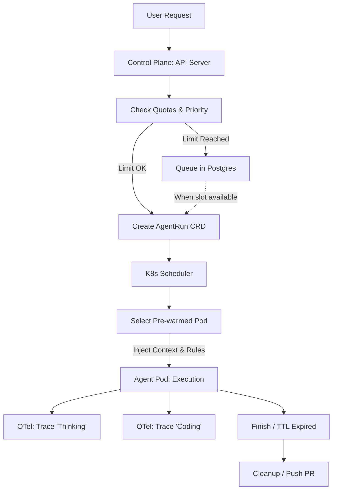

# Design: AOT Resource Management, Queuing & Scheduling

## 1. The Scheduling Strategy (K8s + Knative)

To avoid "Agent Sprawl" and ensure predictable costs, AOT implements a **Tiered Resource Management** strategy.

### A. The AgentRun Lifecycle
1.  **Submission:** User submits a task via the Client.
2.  **Hydration (The "Stripe Pattern"):** Before spinning up a Pod, the Control Plane gathers context (using MCP or direct Git analysis) to decide which "Toolshed" and "Ruleset" to provide.
3.  **Scheduling:** The task is represented as a `Job` (standard K8s) or an `AgentRun` CRD. 
4.  **Priority Queuing:** Tasks are assigned a priority (e.g., `Urgent`, `Normal`, `Background`). 
5.  **Execution:** The Pod is scheduled on a Node. If using Knative, the "Cold Start" is mitigated by keeping a small pool of **Pre-warmed "Blank" Pods** (Sidecars running, waiting for context injection).

---

## 2. Resource Limits & Quotas

### A. Global & Namespace Quotas
*   **Max Workers:** A configurable hard limit on the total number of simultaneous `AgentRun` pods allowed in the cluster (e.g., `max_parallel_agents: 50`).
*   **Per-User/Project Quota:** Prevents a single engineer from consuming the entire fleet's compute.
*   **Time-to-Live (TTL):** Every agent pod has a `deadman_switch`. If an agent hasn't emitted a trace or log in X minutes, or if the total execution exceeds Y hours, the Control Plane forcefully terminates it.

### B. Intelligent Job Queuing
*   **The Waitlist:** If the `max_parallel_agents` limit is reached, new `AgentRun` requests enter a `Pending` state in the Shared Brain (Postgres).
*   **Dynamic Scaling:** If running on a cloud provider (EKS/GKE), the Control Plane can signal the Cluster Autoscaler to spin up more nodes if the queue exceeds a certain threshold.

---

## 3. Intelligent Reuse & Pre-warming

### A. Environment Snapshots
Instead of running `devbox install` every time (which can take minutes), AOT implements an **Image/Volume Caching** strategy:
*   **Base Image Caching:** Frequently used `devbox` environments are built into container images and cached on nodes.
*   **Persistent Volume (PVC) Warm-up:** For large repositories, a "Shadow Pod" can periodically pull the latest `main` branch to a shared Read-Only-Many volume, which Junior agents then mount and "overlay" (using `overlayfs`) for their own ephemeral work.

### B. Session Resume
Since we use `pi-mono`'s JSONL tree structure:
*   An agent can be "paused" (Pod terminated) and "resumed" later on a different node.
*   The Control Plane stores the session JSONL in Postgres/S3. When resuming, a new Pod is spun up, the session is hydrated, and the agent continues from the last known state.

---

## 4. Intelligent Scaling Improvements (Beyond Stripe)

While Stripe uses a 2-retry limit, we can build a more granular **"Failure Classification"** system:
1.  **Lint/Format Failure:** Automatic fix, no penalty.
2.  **Test Failure (New):** If the agent's *own* new tests fail, provide feedback loop.
3.  **Test Failure (Regression):** If existing tests fail, escalate to "Senior Agent" pod or Human.
4.  **Compute/Token Limit:** If an agent is "spinning its wheels" (high token usage, low file changes), the Orchestrator pauses it and requests human intervention.

---

## 5. Interaction Diagram: Queuing & Execution

