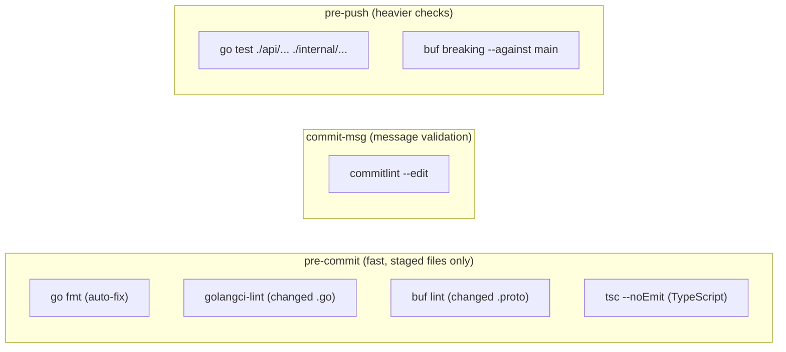

## Context

AOT is a polyglot Go + TypeScript + protobuf project using devbox for environment management and Taskfile for commands. There are currently no git hooks, no commit message standards, no release automation, and devbox.json only declares 8 of the ~15+ tools needed for development. The project is on GitHub with no CI workflows beyond what developers run locally.

## Goals / Non-Goals

**Goals:**
- Zero-setup developer onboarding: `devbox shell` provides every tool needed.
- Automatic quality enforcement: formatting, linting, and type checks run before every commit; tests and breaking-change detection run before every push.
- Conventional commit messages enforced by tooling, enabling automated changelog and semver.
- Automated release workflow: push to main → Release PR → merge → GitHub Release with tag and changelog.
- golangci-lint replaces bare `go vet` for deeper static analysis.

**Non-Goals:**
- CI pipeline definition beyond release-please (CI for tests, builds, etc. is a separate change).
- Container image publishing as part of the release flow (future enhancement).
- Enforcing hooks on the server side (pre-receive hooks require GitHub Enterprise or similar).
- npm workspace configuration (commitlint is the only root-level npm dependency).

## Decisions

### 1. Lefthook over Husky/pre-commit framework

Lefthook is a single Go binary with no runtime dependency on Node.js or Python. It supports parallel execution, staged-file awareness, and polyglot configs in YAML. Husky requires Node.js and is JS-centric. The pre-commit framework requires Python. Since AOT is Go-first with TypeScript as a secondary concern, lefthook is the natural fit. It's available as a Nix package (`lefthook`).

### 2. Hook distribution: what runs where

**Rationale**: Pre-commit hooks MUST be fast (<5s) to avoid frustrating developers. Formatting and linting on staged files only. Tests and breaking-change detection are slower, so they run at pre-push -- still before code leaves the developer's machine but without slowing every commit.

### 3. golangci-lint configuration

Use golangci-lint with a `.golangci.yml` config. Enable these linters beyond the default set:
- `govet`, `errcheck`, `staticcheck` (defaults)
- `unused`, `gosimple`, `ineffassign` (defaults)
- `gocritic` (opinionated but catches real bugs)
- `gofmt` (enforce formatting)
- `misspell` (catch typos in comments/strings)

Disable `exhaustive` (enum exhaustiveness) for now -- the CRD types use enums extensively and exhaustive checks would be noisy until the API stabilizes.

### 4. Conventional commits with commitlint

Use `@commitlint/cli` with `@commitlint/config-conventional`. Install as a dev dependency in a root-level `package.json` (minimal -- just commitlint). Valid types: `feat`, `fix`, `docs`, `style`, `refactor`, `perf`, `test`, `build`, `ci`, `chore`, `revert`. Scopes are optional but encouraged (e.g., `feat(controller): ...`, `fix(proto): ...`).

### 5. Release Please configuration

Use `googleapis/release-please-action@v4` with `release-type: go`. Single package at root (`.`). Changelog sections:

| Commit Type | Changelog Section | Visible |
|---|---|---|
| `feat` | Features | Yes |
| `fix` | Bug Fixes | Yes |
| `perf` | Performance | Yes |
| `refactor` | Code Refactoring | Yes |
| `docs` | Documentation | No |
| `chore` | Miscellaneous | No |
| `test` | Testing | No |
| `ci` | CI | No |
| `build` | Build | No |

Initial version: `0.1.0` (pre-1.0, signals early development).

### 6. Complete devbox.json packages

Current packages (8) plus additions:

| Package | Nix Name | Why |
|---|---|---|
| go@latest | (existing) | Go compiler |
| nodejs@22 | (existing) | Node.js runtime |
| protobuf@latest | (existing) | protoc compiler |
| go-protobuf@latest | (existing) | protoc-gen-go |
| protoc-gen-go-grpc@latest | (existing) | protoc-gen-go-grpc |
| k0sctl@latest | (existing) | k0s cluster management |
| kubectl@latest | (existing) | Kubernetes CLI |
| postgresql@16 | (existing) | PostgreSQL server + client |
| **lefthook@latest** | lefthook | Git hook manager |
| **golangci-lint@latest** | golangci-lint | Go linter aggregator |
| **buf@latest** | buf | Protobuf toolchain (lint, breaking, generate) |
| **grpcurl@latest** | grpcurl | gRPC CLI client for testing |
| **kubernetes-helm@latest** | kubernetes-helm | Helm chart deployment |
| **temporal-cli@latest** | temporal-cli | Temporal dev server |
| **go-task@latest** | go-task | Taskfile runner |
| **setup-envtest@latest** | setup-envtest | K8s envtest binary manager |

Note: `go-task` is the Nix package name for the `task` binary (Taskfile runner). This removes the implicit dependency on the developer having `task` installed globally.

### 7. Lefthook auto-install via devbox init_hook

Add `lefthook install` to devbox.json's `init_hook`. When a developer enters `devbox shell`, hooks are automatically installed -- no manual step required. If hooks are already installed, `lefthook install` is a no-op.

## Risks / Trade-offs

- **[Pre-commit hook speed]** golangci-lint on staged files takes 2-5s on first run (cache cold) but <1s on subsequent runs. Acceptable for pre-commit. If it becomes too slow, restrict to `govet` + `gofmt` at pre-commit and run full golangci-lint at pre-push.
- **[Conventional commits friction]** Developers unfamiliar with conventional commits will have commits rejected until they learn the format. Mitigation: commitlint error messages are descriptive, and the format is simple (`type: message` or `type(scope): message`).
- **[Release Please token]** The default `GITHUB_TOKEN` won't trigger downstream workflows on the Release PR. A PAT stored as `RELEASE_PLEASE_TOKEN` secret is needed if CI should run on the Release PR.
- **[golangci-lint false positives]** Some linters (especially gocritic) can be opinionated. Mitigated by starting with a conservative set and a `.golangci.yml` that allows per-file/per-line `//nolint` directives.
- **[Devbox package version drift]** Using `@latest` for most packages means the environment can change between `devbox shell` invocations. Mitigated by devbox.lock which pins resolved versions. The lock file is committed.
