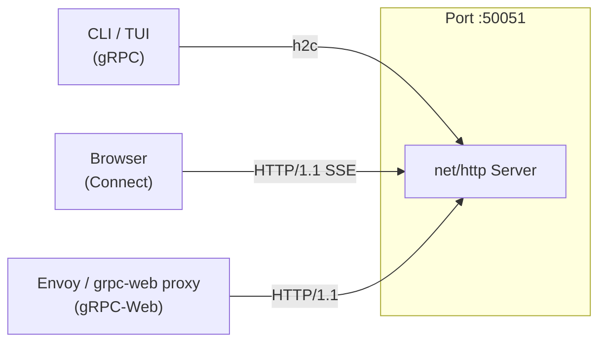

## Context

AOT currently uses raw `protoc` invocations via `hack/proto-gen.sh` with no linting, no breaking change detection, and no TypeScript code generation. The web dashboard uses a hand-rolled WebSocket hub (`internal/server/websocket.go`) alongside the gRPC server, creating two separate API surfaces that drift independently. This change replaces the proto toolchain with `buf`, adopts ConnectRPC as the unified transport, adds `protovalidate` for schema-level validation, and standardizes all documentation diagrams on Mermaid.

## Goals / Non-Goals

### Goals

- Single declarative proto toolchain (`buf`) for linting, breaking change detection, and multi-language code generation.
- Single server port (`:50051`) serving gRPC, gRPC-Web, and Connect protocols via ConnectRPC.
- Browser clients consume server-streaming RPCs natively via Connect (SSE over HTTP/1.1) without WebSocket.
- Schema-level field validation via `protovalidate` annotations, enforced by a server-side Connect interceptor.
- Generated TypeScript clients replace the hand-written `@aot/shared/grpc/client.ts`.
- All architecture and flow diagrams use Mermaid syntax exclusively.

### Non-Goals

- Changing the proto service definitions themselves (RPCs, message shapes). The API contract is unchanged.
- Migrating TUI or CLI clients away from standard gRPC. They continue working because Connect is wire-compatible with gRPC.
- Introducing a proto registry or Buf Schema Registry (BSR). Builds remain local.
- Changing the Kubernetes operator or CRD definitions.

## Decisions

### buf.yaml: v2 format with strict rules

Use buf v2 config format. Set breaking rule set to `FILE` (the strictest preset -- any per-file change, including moving messages between files, is a breaking change). Set lint rules to `DEFAULT`. This catches virtually all backward-compatibility violations during CI before they reach consumers.

### buf.gen.yaml: dual Go + TypeScript generation

Generate Go code with `protoc-gen-go` and `protoc-gen-go-grpc` plugins. Generate TypeScript code with `protoc-gen-es` and `protoc-gen-connect-es` plugins. Both plugin sets run from a single `buf generate` invocation, ensuring Go and TypeScript stubs are always in sync with the same proto source.

### Generated code output directories

Go generated code goes to `gen/go/`. TypeScript generated code goes to `gen/ts/`. Both directories are committed to version control so that downstream consumers (Go modules, npm packages) can import them without running code generation themselves.

### ConnectRPC server on single port :50051

Use `connectrpc.com/connect` with Go's `net/http` server. A single listener on `:50051` serves all three protocols simultaneously:

This eliminates the separate `:8080` HTTP server and the WebSocket hub entirely.

### WebSocket deletion

`internal/server/websocket.go` and the `:8080` HTTP listener are deleted. The `/ws` path no longer exists. Browser clients migrate from the WebSocket connection to Connect server-streaming on the `WatchAgentRun` RPC. This is a breaking change for web clients.

### protovalidate for field-level validation

Use `buf.build/bufbuild/protovalidate` for field annotations in `.proto` files. Validation rules (required, format, bounds) are declared in the schema and enforced at the server handler boundary via a Connect interceptor. This replaces scattered hand-written validation in Go handler code with a single enforcement point.

### Migration path for existing gRPC clients

ConnectRPC is wire-compatible with the gRPC protocol. Existing clients (TUI, CLI) that use `google.golang.org/grpc` client stubs continue to work against the ConnectRPC server without any code changes. Migration to Connect client stubs is optional and can happen independently.

### Mermaid for all diagrams

All architecture, sequence, and state diagrams in markdown files use Mermaid syntax (fenced `mermaid` code blocks). ASCII box-drawing characters (`+`, `-`, `|` used for diagrams) are prohibited in documentation. Terminal UI mock outputs are exempt because they represent actual terminal rendering, not architectural diagrams.

## Risks / Trade-offs

- **Breaking change for web clients.** Removing the WebSocket endpoint forces the web dashboard to migrate to Connect streaming in the same release. There is no gradual rollout -- both changes must ship together.
- **Connect ecosystem maturity.** ConnectRPC is younger than the core gRPC ecosystem. Some third-party middleware or observability tools may not yet have Connect interceptor equivalents. Mitigation: Connect interceptors are simple `func` wrappers, and the community is active.
- **FILE-level breaking detection is aggressive.** The `FILE` rule set will flag moves of messages between files as breaking changes, even if the wire format is unchanged. This is intentional -- it forces explicit decisions about proto file organization -- but it may slow down early-stage proto refactoring.
- **Generated code in version control.** Committing `gen/go/` and `gen/ts/` increases repo size and creates merge conflicts when proto files change. The trade-off is that consumers never need `buf` installed to build. CI validates that generated code is up to date.
- **Single port means shared TLS.** Serving gRPC and Connect on the same port means they share TLS configuration. If browser clients require different cert handling than internal gRPC clients, a reverse proxy or separate listener may be needed later.
